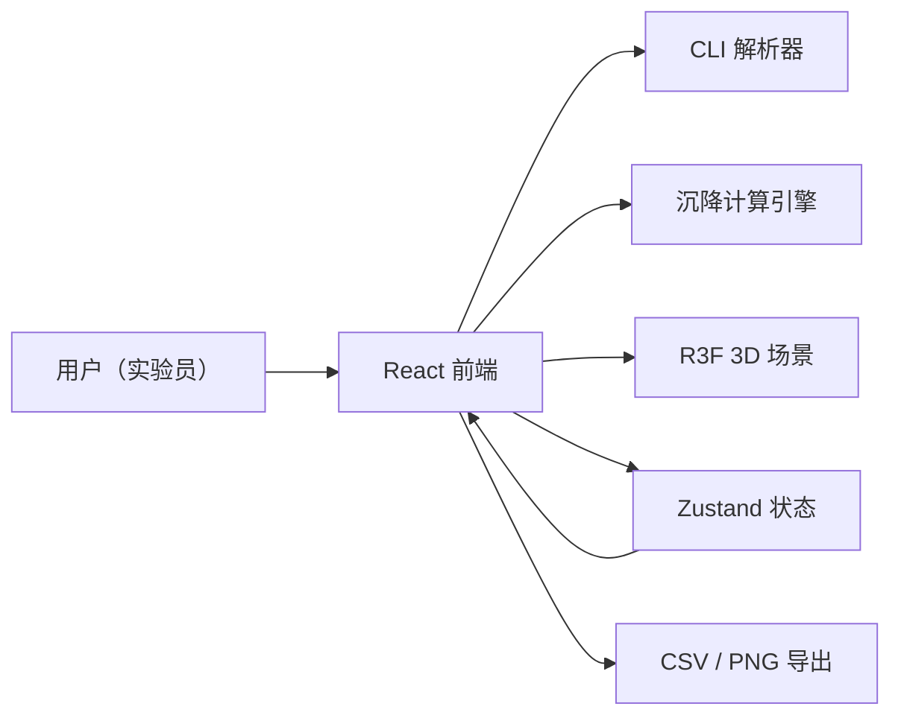
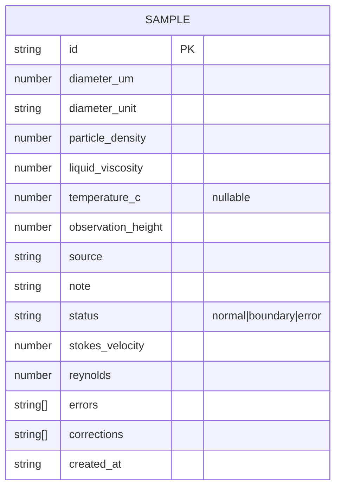

# 颗粒沉降速度 CLI · 技术架构

## 1. 架构设计


## 2. 技术说明
- 前端：React@18 + TypeScript + Vite
- 样式：Tailwind CSS 3
- 3D：three + @react-three/fiber + @react-three/drei + @react-three/postprocessing
- 状态：Zustand
- 后端：无（纯前端计算）
- 数据库：无（浏览器内存 + 可选 localStorage 持久化）

## 3. 路由定义
| 路由 | 用途 |
| --- | --- |
| `/` | 主界面（CLI + 列表 + 3D + 导出） |

## 4. 数据模型
### 4.1 数据模型定义


### 4.2 样本结构（TypeScript）
```ts
type SampleStatus = 'normal' | 'boundary' | 'error';
interface Sample {
  id: string;
  diameter: { value: number; unit: 'um' | 'mm' | 'cm' };
  particleDensity: number;           // kg/m³
  liquidViscosity: number;           // Pa·s
  temperature: number | null;        // ℃
  observationHeight: number;         // m
  source: string;
  note: string;
  corrections: string[];
  status: SampleStatus;
  errors: string[];
  stokesVelocity: number | null;     // m/s
  reynolds: number | null;
  createdAt: string;
}
```

## 5. 核心计算规则
- **Stokes 沉降速度**：`v = (g · d² · (ρp - ρl)) / (18 · μ)`，默认 `ρl=1000 kg/m³`、`g=9.81`
- **雷诺数**：`Re = (ρl · v · d) / μ`
- **适用范围**：`Re < 1` 正常；`1 ≤ Re < 2` 边界警告；`Re ≥ 2` 异常
- **温度缺失**：视为异常，不参与速度计算
- **单位换算**：输入支持 `um / mm / cm`，内部统一为米

## 6. CLI 命令集
- `add d=100μm ρp=2650 μ=0.001 T=25 H=0.2 src="批次A" note="已校正黏度"`
- `list [--status normal|boundary|error]`
- `filter status=normal`
- `select <id>`
- `export csv`
- `export png`
- `clear`
- `help`
