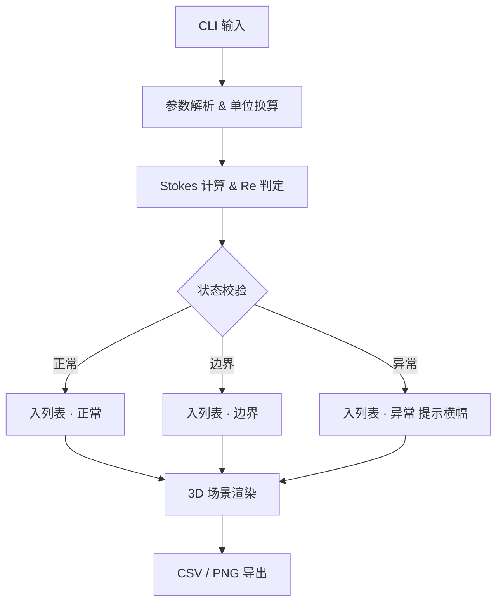

# 颗粒沉降速度 CLI · 产品需求文档 (PRD)

## 1. 产品概述
面向环保实验室批量沉降实验场景的 Web3D 计算与可视化工具，通过 CLI 风格交互录入颗粒样本参数，基于 Stokes 近似估算沉降速度，结合三维场景直观呈现液体柱、颗粒沉降轨迹与悬浮信息，并提供 CSV 导出与截图留存。解决老办法"掉链子"的核心问题：单位混乱、雷诺数超范围、温度缺失静默混入正常结果。

- 目标用户：环保实验员、水质分析员
- 核心价值：在单页面完成"录入 → 计算 → 可视化 → 筛选 → 导出"闭环，保留每条记录的来源与修正痕迹

## 2. 核心功能

### 2.1 功能模块
1. **CLI 输入区**：命令行风格的参数录入（粒径、颗粒密度、液体黏度、温度、观测高度、来源、备注/修正）
2. **计算引擎**：Stokes 近似、雷诺数判定、适用范围校验、单位换算
3. **样本列表与筛选**：按状态（正常/边界/异常）筛选，显示修正痕迹
4. **Web3D 可视化**：液体柱、颗粒球、悬浮标签、沉降轨迹动画
5. **导出中心**：CSV 导出（含来源与修正列）、场景截图 PNG 导出

### 2.2 页面细节
| 页面 | 模块 | 功能描述 |
| --- | --- | --- |
| 主页（单页） | CLI 输入区 | 命令行风格输入框，支持 `add / list / filter / export / clear` 类命令，回车提交，保留历史 |
| 主页 | 样本列表 | 行显示状态徽章（正常/边界/异常）、粒径/密度/温度/速度、修正标记，点击选中驱动 3D |
| 主页 | 3D 场景 | 玻璃量筒液体柱，选中样本颗粒按估算速度下沉，悬浮标签显示 v、Re、单位 |
| 主页 | 导出面板 | CSV 下载（含来源、修正列）、截图按钮（导出当前 3D 帧 PNG） |
| 主页 | 异常提示条 | 温度缺失、单位错、Re 超范围时醒目黄色/红色横幅，不静默 |

## 3. 核心流程
1. 用户在 CLI 输入 `add d=100μm ρp=2650 μ=0.001 T=25 H=0.2 src="批次A" note="已校正黏度"`
2. 解析器提取参数并执行单位换算与校验
3. 计算 Stokes 沉降速度与雷诺数；超出适用范围或缺失温度则标记异常
4. 记录来源与修正入历史栈，推入样本列表
5. 选中记录驱动 3D 场景动画，悬浮信息同步
6. 批量筛选后导出 CSV；点击截图导出当前 3D 帧

## 4. 界面设计

### 4.1 设计风格
- 主色：深墨蓝 `#0b1020`（背景）、青绿 `#3fd3c7`（强调）、琥珀 `#f5a524`（边界）、玫红 `#ef4444`（异常）
- 按钮：扁平矩形，1px 描边，hover 时发光
- 字体：JetBrains Mono（CLI/代码）+ Inter Tight（UI）
- 布局：左右两栏，左侧 CLI + 列表，右侧 3D 场景，顶部状态栏
- 图标：Lucide 线性图标，避免 emoji

### 4.2 页面设计概览
| 页面 | 模块 | UI 元素 |
| --- | --- | --- |
| 主页 | 顶部状态栏 | 品牌标识 · 当前样本数 · 异常数 · 导出按钮 |
| 主页 | 左栏 CLI | 等宽字体、命令回显、提示高亮、历史可滚轮 |
| 主页 | 左栏 列表 | 表格化，行 hover 高亮，状态徽章彩色 |
| 主页 | 右栏 3D | 玻璃量筒 + 颗粒下落，角落悬浮信息卡 |
| 主页 | 异常横幅 | 顶部下滑出现，红/黄色，可关闭 |

### 4.3 响应式
- 桌面优先（≥1200px 左右分栏）
- 平板/小屏：上下堆叠，3D 占满宽度

### 4.4 3D 场景指引
- 环境：深色室内，柔和方向光模拟实验台灯光
- 光照：主光 + 补光，颗粒用标准材质，量筒半透明
- 相机：Perspective，初始 45° 俯视，可拖拽旋转
- 交互：点击列表项切换颗粒，轨迹线留痕 2 秒
- 后期：轻微 Bloom 让液体柱边缘发光
- 资产：程序化几何，无外部模型
