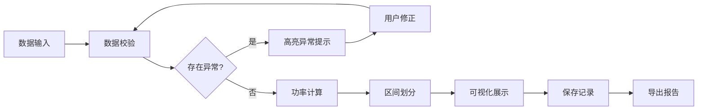

## 1. 产品概述

自行车齿比功率计算工具，为骑行教练和学员提供专业的功率估算与训练复盘解决方案。通过导入齿比、踏频、坡度等骑行数据，自动计算功率输出、标记异常数据、生成功率区间报告，帮助教练高效分析训练效果。

- **核心价值**：将复杂的骑行物理参数转换为直观的功率区间，降低训练分析门槛
- **目标用户**：骑行教练、专业/业余骑行爱好者
- **解决痛点**：手动计算繁琐、异常数据难发现、训练复盘缺乏标准化工具

## 2. 核心功能

### 2.1 用户角色
| 角色 | 注册方式 | 核心权限 |
|------|----------|----------|
| 教练用户 | 无需注册，本地使用 | 数据导入、功率计算、异常检测、报告导出、历史管理 |

### 2.2 功能模块
1. **数据导入模块**：样例数据加载、手动输入、批量导入
2. **功率计算模块**：齿比转速度、功率估算、区间划分
3. **异常检测模块**：单位错误检测、超范围检测、数据一致性校验
4. **报告生成模块**：可视化图表、异常标注、路线片段分析
5. **历史管理模块**：记录保存、版本追溯、数据来源追踪

### 2.3 页面详情
| 页面名称 | 模块名称 | 功能描述 |
|----------|----------|----------|
| 主计算页 | 数据输入区 | 齿比、踏频、车重、坡度、风速等参数输入，支持批量录入 |
| 主计算页 | 计算结果区 | 实时显示功率值、功率区间、速度、卡路里消耗 |
| 主计算页 | 异常提示区 | 醒目标注坡度单位错误、逆风漏算、齿比超范围等问题 |
| 主计算页 | 可视化图表区 | 功率曲线、区间分布饼图、路线片段功率热力图 |
| 历史记录页 | 记录列表 | 历史训练记录卡片，显示时间、来源、修正次数 |
| 历史记录页 | 版本追溯 | 查看每次修正前后的数据对比，保留修改痕迹 |
| 报告导出页 | 报告预览 | 完整报告预览，包含数据表格、图表、异常说明 |
| 报告导出页 | 导出功能 | 支持PDF、CSV、PNG多种格式导出 |

## 3. 核心流程

用户打开应用 → 选择导入样例/手动输入数据 → 系统自动校验数据完整性 → 检测异常并高亮提示 → 用户修正异常数据 → 执行功率计算 → 生成功率区间与可视化图表 → 保存训练记录 → 导出分析报告

## 4. 用户界面设计

### 4.1 设计风格
- **主色调**：深邃蓝 (#165DFF) 作为品牌色，代表专业与速度
- **辅助色**：橙红色 (#FF4D4F) 用于异常提示，绿色 (#52C41A) 用于正常状态，黄色 (#FAAD14) 用于边界警告
- **背景**：深色主题 (#0F172A)，降低长时间使用的视觉疲劳
- **字体**：JetBrains Mono 作为数据显示字体，Inter 作为界面字体
- **设计语言**：科技感、数据驱动、卡片式布局、清晰的视觉层级

### 4.2 页面设计概述
| 页面名称 | 模块名称 | UI元素 |
|----------|----------|--------|
| 主计算页 | 数据输入区 | 分组表单卡片、数字输入框带单位选择、实时校验反馈 |
| 主计算页 | 结果展示区 | 大字号功率数值、区间徽章、速度/卡路里次要数据卡片 |
| 主计算页 | 异常提示区 | 可展开的警告面板、问题描述、修正建议、一键修复按钮 |
| 主计算页 | 图表区 | 交互式折线图、饼图、热力图，支持悬停查看详情 |
| 历史记录页 | 记录列表 | 时间线布局、记录卡片、来源标签、修正标记 |
| 报告导出页 | 报告预览 | 模拟A4纸布局、可滚动预览、导出格式选择器 |

### 4.3 响应式
- 桌面端：三栏布局，左侧输入、中间结果、右侧图表
- 平板端：上下布局，输入区折叠可展开
- 移动端：单列流式布局，核心功能优先展示

### 4.4 交互细节
- 数据输入时实时校验，异常输入框震动反馈
- 异常提示卡片滑入动画
- 图表加载时骨架屏占位
- 保存成功后轻微的成功动效
