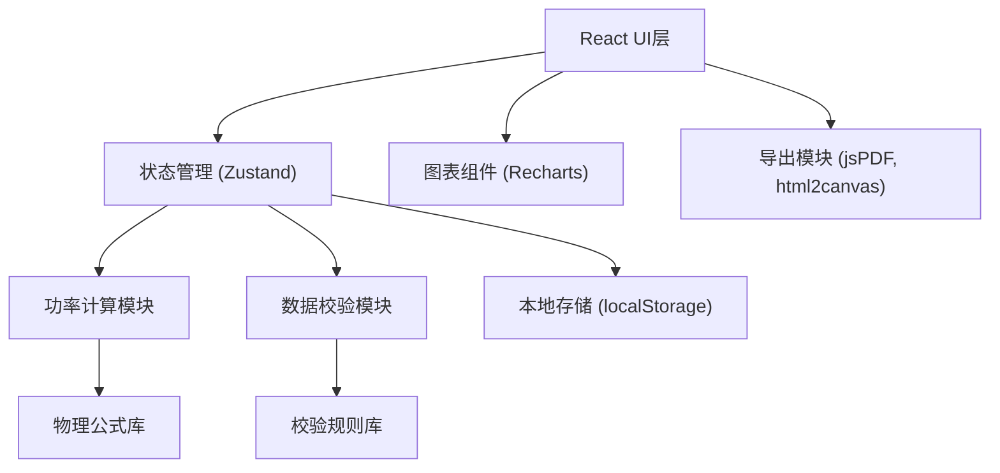

## 1. 架构设计

纯前端单页应用，所有计算和数据存储在本地完成，无需后端服务。使用浏览器 localStorage 持久化历史记录，采用模块化架构分离计算逻辑、UI组件和数据管理。



## 2. 技术描述

- **前端框架**：React 18 + TypeScript
- **构建工具**：Vite 5
- **样式方案**：TailwindCSS 3
- **状态管理**：Zustand
- **图表库**：Recharts
- **导出功能**：jsPDF (PDF导出) + html2canvas (图片导出)
- **图标**：Lucide React
- **数据存储**：localStorage (历史记录持久化)

## 3. 路由定义

| 路由 | 页面 | 功能 |
|------|------|------|
| / | 主计算页 | 数据输入、实时计算、结果展示、异常提示、图表可视化 |
| /history | 历史记录页 | 训练记录列表、版本追溯、数据来源查看 |
| /report/:id | 报告导出页 | 单条记录的完整报告预览与导出 |

## 4. 数据模型

### 4.1 骑行数据输入 (RideInput)
```typescript
interface RideInput {
  id: string;
  timestamp: number;
  source: 'manual' | 'import' | 'sample';
  sourceNote?: string;
  
  // 核心参数
  chainringTeeth: number;      // 牙盘齿数
  cogTeeth: number;            // 飞轮齿数
  cadence: number;             // 踏频 (RPM)
  riderWeight: number;         // 骑手体重 (kg)
  bikeWeight: number;          // 车重 (kg)
  slope: number;               // 坡度
  slopeUnit: 'percent' | 'degree';  // 坡度单位
  windSpeed: number;           // 风速 (m/s)
  windDirection: 'head' | 'tail' | 'cross';  // 风向
  temperature?: number;        // 温度 (摄氏度)
  elevation?: number;          // 海拔 (m)
  
  // 元数据
  segmentName?: string;        // 路线片段名称
  duration?: number;           // 持续时间 (秒)
  notes?: string;              // 备注
}
```

### 4.2 计算结果 (RideResult)
```typescript
interface RideResult {
  inputId: string;
  calculatedAt: number;
  
  // 计算输出
  gearRatio: number;           // 齿比
  speed: number;               // 速度 (km/h)
  power: number;               // 功率 (W)
  powerPerKg: number;          // 功体比 (W/kg)
  powerZone: number;           // 功率区间 (1-7)
  calories: number;            // 卡路里消耗 (kcal)
  distance?: number;           // 距离 (km)
  
  // 阻力分解
  rollingResistance: number;   // 滚动阻力功率
  gravityResistance: number;   // 重力阻力功率
  aerodynamicDrag: number;     // 空气阻力功率
}
```

### 4.3 异常检测 (ValidationResult)
```typescript
interface ValidationResult {
  isValid: boolean;
  errors: ValidationIssue[];
  warnings: ValidationIssue[];
}

interface ValidationIssue {
  id: string;
  type: 'error' | 'warning';
  field: string;
  code: string;               // 如 SLOPE_UNIT_ERROR, GEAR_RATIO_OUT_OF_RANGE
  message: string;
  suggestion: string;
  autoFix?: () => Partial<RideInput>;
}
```

### 4.4 历史记录 (HistoryRecord)
```typescript
interface HistoryRecord {
  id: string;
  createdAt: number;
  updatedAt: number;
  input: RideInput;
  result: RideResult;
  validation: ValidationResult;
  versions: HistoryVersion[];  // 修正历史
}

interface HistoryVersion {
  version: number;
  timestamp: number;
  changes: Partial<RideInput>;
  previousValues: Partial<RideInput>;
  note?: string;
}
```

### 4.5 功率区间配置
```typescript
const POWER_ZONES = [
  { zone: 1, name: '主动恢复', min: 0, max: 0.55, color: '#52C41A' },
  { zone: 2, name: '耐力', min: 0.55, max: 0.75, color: '#165DFF' },
  { zone: 3, name: ' tempo', min: 0.75, max: 0.90, color: '#FAAD14' },
  { zone: 4, name: '乳酸阈值', min: 0.90, max: 1.05, color: '#FF7A45' },
  { zone: 5, name: 'VO2Max', min: 1.05, max: 1.20, color: '#F5222D' },
  { zone: 6, name: '无氧能力', min: 1.20, max: 1.50, color: '#EB2F96' },
  { zone: 7, name: '神经肌肉', min: 1.50, max: Infinity, color: '#722ED1' },
];
```

## 5. 核心算法

### 5.1 齿比与速度计算
```
齿比 = 牙盘齿数 / 飞轮齿数
速度(km/h) = 齿比 × 踏频 × 轮径 × π × 60 / 1000
轮径默认值: 2.105m (700c公路车)
```

### 5.2 功率计算 (简化物理模型)
```
总功率 = (滚动阻力 + 坡度阻力 + 空气阻力) × 速度 / 传动效率

滚动阻力 = 总质量 × 重力加速度 × 滚动阻力系数
坡度阻力 = 总质量 × 重力加速度 × sin(坡度角)
空气阻力 = 0.5 × 空气密度 × 阻力系数×迎风面积 × (速度 + 风速)^2

传动效率: 0.95 (默认)
滚动阻力系数: 0.005 (公路车默认)
阻力系数×迎风面积: 0.32 m² (默认)
空气密度: 1.225 kg/m³ (标准条件)
```

### 5.3 异常检测规则
- **齿比超范围**: 齿比 < 1.0 或 > 5.0 触发警告
- **坡度单位错误**: 坡度百分比 > 30% 或 角度 > 15° 触发错误
- **逆风漏算**: 速度 > 25 km/h 但风速 = 0 触发警告
- **踏频异常**: 踏频 < 30 或 > 180 RPM 触发警告
- **数据一致性**: 高坡度但低功率输出触发警告

## 6. 样例数据

预置3条样例数据，覆盖正常、边界、异常三种场景：

1. **正常记录**：平路巡航，齿比3.5，踏频90，坡度0%，风速0
2. **边界记录**：陡坡爬坡，齿比1.2，踏频60，坡度12%，逆风3m/s
3. **异常记录**：数据错误，齿比0.8（超范围），坡度45°（单位错误），风速0（可能漏算逆风）
