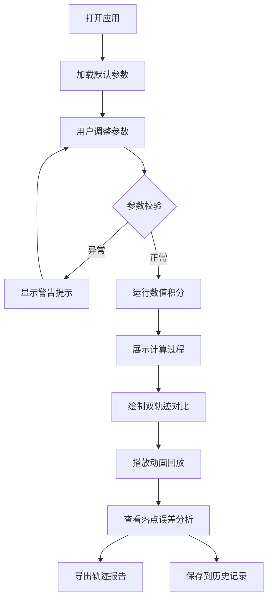

## 1. 产品概述

射箭弹道空气阻力对比工具是一个面向射箭社团教练和学生的交互式物理模拟应用，用于对比有无空气阻力下箭矢飞行轨迹的差异，帮助学生理解空气动力学对射箭运动的影响。

- **核心目标**：将抽象的物理概念可视化，通过数值积分计算真实箭矢轨迹，让学生直观理解空气阻力的影响
- **目标用户**：射箭教练、物理教师、射箭社团学生
- **核心价值**：替代传统表格和截图对比方式，提供交互式、可解释的弹道模拟体验

## 2. 核心功能

### 2.1 用户角色
| 角色 | 注册方式 | 核心权限 |
|------|---------|---------|
| 教练/学生 | 无需注册（本地存储） | 调整参数、运行模拟、查看轨迹、导出报告 |

### 2.2 功能模块
1. **参数控制面板**：初速度、发射角、阻力系数、箭重、靶距调节
2. **轨迹对比画布**：同时展示有/无空气阻力两条轨迹
3. **数值积分过程展示**：显示计算步骤和中间结果
4. **异常状态提示**：角度越界、数值不稳、落点外推等警告
5. **动画回放**：箭矢飞行过程动态演示
6. **轨迹报告导出**：生成包含详细数据的报告
7. **历史记录**：本地保存模拟历史，支持回溯

### 2.3 页面详情
| 页面名称 | 模块名称 | 功能描述 |
|---------|---------|---------|
| 主页面 | 参数控制区 | 滑块+输入框双模式调节参数，实时参数校验 |
| 主页面 | 轨迹对比画布 | SVG/Canvas 绘制双轨迹，关键点标注（最高点、落点） |
| 主页面 | 数值过程区 | 展示积分步长、各时刻位置速度、计算方法说明 |
| 主页面 | 动画控制区 | 播放/暂停/快进/重置动画，速度调节 |
| 主页面 | 报告面板 | 落点误差对比、能量损耗分析、异常警告说明 |
| 主页面 | 历史记录栏 | 时间线展示历史模拟，支持一键复现 |

## 3. 核心流程

### 3.1 主流程描述
用户打开应用 → 调整物理参数（系统实时校验）→ 点击运行模拟 → 系统执行数值积分计算（显示过程）→ 绘制双轨迹对比 → 用户可播放动画查看飞行过程 → 查看落点误差和异常提示 → 导出轨迹报告或保存到历史记录

### 3.2 流程图

## 4. 用户界面设计

### 4.1 设计风格
- **主色调**：深森林绿 (#1B5E20) 代表射箭运动的自然属性，搭配琥珀橙 (#FF8F00) 作为强调色
- **次色调**：深灰背景 (#1A1A2E) 营造科技感，浅灰文字 (#EAEAEA) 保证可读性
- **按钮风格**：圆角 8px，悬停有轻微上浮效果，危险警告按钮使用红色边框高亮
- **字体**：标题使用 Orbitron（科技感无衬线），正文使用 Roboto Mono（等宽字体便于数值阅读）
- **布局风格**：三栏卡片式布局，左侧参数、中间画布、右侧数据面板
- **图标风格**：线性图标，射箭相关元素（弓、箭、靶心）作为装饰元素

### 4.2 页面设计概述
| 页面名称 | 模块名称 | UI 元素 |
|---------|---------|---------|
| 主页面 | 参数控制区 | 卡片容器、滑块组件、数值输入框、单位标签、警告图标 |
| 主页面 | 轨迹画布 | 坐标网格、轨迹曲线（绿/橙双色）、数据点标注、靶心标记 |
| 主页面 | 数值过程区 | 可折叠面板、步长表格、计算公式高亮 |
| 主页面 | 动画控制 | 播放条、时间轴、速度切换器（0.5x/1x/2x） |
| 主页面 | 报告面板 | 数据对比卡片、误差条可视化、异常提示框 |
| 主页面 | 历史记录 | 侧边抽屉、时间线列表、复现按钮 |

### 4.3 响应式设计
- **桌面端优先**：三栏布局（参数 25%、画布 50%、报告 25%）
- **平板适配**：上下两栏，画布居上，参数和报告并排居下
- **移动端**：单栏滚动，画布全屏，参数和报告可折叠切换
- **触摸优化**：滑块增加触摸区域，按钮最小 44px

## 5. 异常处理设计

### 5.1 角度越界
- 当发射角 < 0° 或 > 90° 时，输入框边框变红，显示警告："发射角度超出物理合理范围，请调整至 0°-90°"
- 模拟按钮禁用，直到参数修正

### 5.2 数值不稳定
- 当阻力系数过大导致数值积分发散时，显示："警告：当前参数组合可能导致数值不稳定，建议减小阻力系数或增大积分步长"
- 提供一键恢复默认参数按钮

### 5.3 落点外推
- 当靶距设置超出箭矢最大射程时，显示："注意：当前射程超过箭矢最大飞行距离，落点将外推计算"
- 外推结果用虚线区别于正常轨迹
