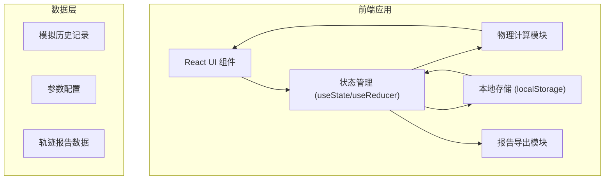

## 1. 架构设计



## 2. 技术选型

| 层级 | 技术栈 | 说明 |
|-----|--------|------|
| 前端框架 | React 18 + TypeScript | 类型安全，组件化开发 |
| 构建工具 | Vite 5 | 快速开发体验，热更新 |
| 样式方案 | TailwindCSS 3 | 原子化 CSS，快速开发 |
| 图表绘制 | Canvas API | 高性能轨迹绘制 |
| 本地存储 | localStorage | 保存历史记录和用户配置 |
| 报告导出 | jsPDF + html2canvas | 生成 PDF 报告 |
| 动画 | requestAnimationFrame | 平滑轨迹回放 |

## 3. 核心模块设计

### 3.1 物理计算模块 (physics/)
| 文件 | 功能 |
|-----|------|
| types.ts | 类型定义：轨迹点、参数、警告类型 |
| constants.ts | 物理常量：重力加速度、空气密度、默认参数 |
| integrator.ts | 数值积分器：欧拉法、龙格-库塔法 |
| trajectory.ts | 轨迹计算：有/无空气阻力弹道计算 |
| validator.ts | 参数校验：角度越界、数值稳定性检测 |

### 3.2 UI 组件 (components/)
| 组件 | 功能 |
|-----|------|
| ParamControl.tsx | 参数控制面板：滑块+输入框 |
| TrajectoryCanvas.tsx | 轨迹画布：Canvas 绘制双轨迹 |
| AnimationControl.tsx | 动画控制：播放/暂停/速度调节 |
| ReportPanel.tsx | 报告面板：落点误差、能量分析 |
| WarningBanner.tsx | 警告横幅：异常状态提示 |
| HistoryPanel.tsx | 历史记录：时间线展示与复现 |
| ProcessPanel.tsx | 计算过程：数值积分步骤展示 |

### 3.3 工具模块 (utils/)
| 文件 | 功能 |
|-----|------|
| storage.ts | 本地存储：读写历史记录 |
| export.ts | 报告导出：生成 JSON/PDF |
| format.ts | 数值格式化：单位转换、精度控制 |

## 4. 数据模型

### 4.1 类型定义

```typescript
// 物理参数
interface SimulationParams {
  initialVelocity: number;      // 初速度 (m/s)
  launchAngle: number;          // 发射角 (度)
  dragCoefficient: number;      // 阻力系数
  arrowMass: number;            // 箭重 (g)
  targetDistance: number;       // 靶距 (m)
  timeStep: number;             // 积分步长 (s)
}

// 轨迹点
interface TrajectoryPoint {
  time: number;                 // 时间 (s)
  x: number;                    // 水平位置 (m)
  y: number;                    // 垂直位置 (m)
  vx: number;                   // 水平速度 (m/s)
  vy: number;                   // 垂直速度 (m/s)
  acceleration?: number;        // 加速度 (m/s²)
}

// 模拟结果
interface SimulationResult {
  id: string;
  timestamp: number;
  params: SimulationParams;
  noDragTrajectory: TrajectoryPoint[];
  withDragTrajectory: TrajectoryPoint[];
  warnings: Warning[];
  metrics: SimulationMetrics;
}

// 落点指标
interface SimulationMetrics {
  noDragLanding: { x: number; y: number; time: number };
  withDragLanding: { x: number; y: number; time: number };
  landingError: number;          // 落点误差 (m)
  maxHeight: { noDrag: number; withDrag: number };
  isExtrapolated: boolean;       // 是否外推
}

// 警告类型
interface Warning {
  type: 'ANGLE_OUT_OF_RANGE' | 'NUMERICAL_INSTABILITY' | 'RANGE_EXCEEDED';
  message: string;
  severity: 'warning' | 'error';
}
```

### 4.2 物理公式

**无空气阻力轨迹：**
- x(t) = v₀ · cos(θ) · t
- y(t) = v₀ · sin(θ) · t - ½ g t²

**有空气阻力轨迹（数值积分）：**
- 阻力 Fd = ½ ρ v² Cd A
- 加速度 a = Fd / m
- 使用 4 阶龙格-库塔法 (RK4) 进行数值积分

## 5. 数值积分算法说明

### 5.1 积分方法选择
- **默认方法**：4 阶龙格-库塔法 (RK4)，精度高，稳定性好
- **备选方法**：欧拉法，计算快但精度低，用于对比展示

### 5.2 稳定性检测
- 监控速度变化率，当 |Δv/Δt| 超过阈值时触发不稳定警告
- 自动调整积分步长以保证数值稳定性

## 6. 存储设计

### 6.1 localStorage 结构
```json
{
  "trajectory_history": [
    {
      "id": "uuid",
      "timestamp": 1234567890,
      "params": { ... },
      "metrics": { ... },
      "warnings": [ ... ]
    }
  ],
  "user_preferences": {
    "defaultParams": { ... },
    "animationSpeed": 1,
    "showGrid": true
  }
}
```

### 6.2 数据导出格式
- **JSON**：完整数据导出，便于后续分析
- **PDF**：可视化报告，包含轨迹图、参数表、误差分析
- **CSV**：轨迹点数据导出，可导入 Excel

## 7. 路由定义

| 路由 | 页面 | 说明 |
|-----|------|------|
| / | 主页 | 完整模拟界面 |
| /history/:id | 历史详情 | 查看历史模拟详情 |

## 8. 性能优化策略

1. **Canvas 分层渲染**：静态网格和动态轨迹分离绘制
2. **轨迹点抽稀**：绘制时对轨迹点进行 Ramer-Douglas-Peucker 抽稀
3. **Web Worker 计算**：物理计算在 Worker 线程执行，不阻塞 UI
4. **requestAnimationFrame 动画**：保证 60fps 流畅度
5. **虚拟滚动**：历史记录较多时使用虚拟列表
