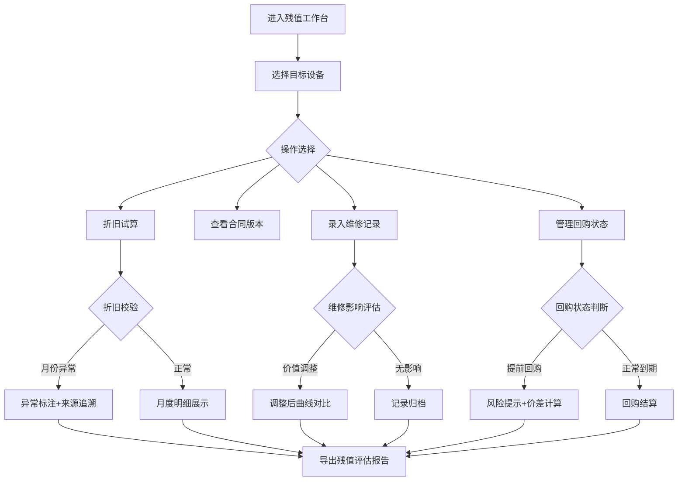

## 1. 产品概述

融资租赁设备残值风控系统，面向租赁公司年底设备残值评估场景。核心解决维修记录、折旧口径、回购条款数据分散导致的反复出错问题。

- 主要目的：将设备残值计算所需的多源数据收敛到统一工作台，实现折旧试算、合同版本追踪、维修影响评估、回购状态管理、报告导出全流程闭环
- 目标用户：租赁公司风控专员、资产评估师
- 核心价值：杜绝折旧月份错位、维修后价值漏调、提前回购混算等隐蔽错误，所有计算过程可追溯、可解释

## 2. 核心功能

### 2.1 用户角色

| 角色 | 注册方式 | 核心权限 |
|------|----------|----------|
| 风控专员 | 系统录入 | 录入/编辑设备与合同数据、执行折旧试算、查看异常提示 |
| 评估师 | 系统录入 | 查看残值报告、导出评估报告、审核异常项 |

### 2.2 功能模块

1. **残值工作台**：设备卡片总览、折旧曲线、异常告警、快速操作入口
2. **折旧试算**：参数配置、实时计算、月度折旧明细、异常标注
3. **合同中心**：合同版本列表、版本差异对比、条款提取展示
4. **维修记录**：维修历史、价值调整、影响评估
5. **回购管理**：回购状态追踪、提前回购风险提示、回购结算
6. **报告导出**：残值评估报告生成、PDF/Excel导出、导出历史

### 2.3 页面详情

| 页面名称 | 模块名称 | 功能描述 |
|----------|----------|----------|
| 残值工作台 | 设备卡片总览 | 展示核心设备残值、折旧进度、状态标签，点击进入详情 |
| 残值工作台 | 折旧曲线图 | 展示设备折旧趋势，标记维修调整点和回购事件点 |
| 残值工作台 | 异常告警面板 | 集中展示折旧月份异常、维修价值异常、回购状态异常 |
| 残值工作台 | 快速操作入口 | 折旧试算、新增合同、录入维修记录、导出报告 |
| 折旧试算页 | 参数配置面板 | 设备原值、残值率、折旧方法、起止月份、维修调整参数 |
| 折旧试算页 | 月度折旧明细表 | 逐月展示折旧额、累计折旧、账面净值、异常月份高亮 |
| 折旧试算页 | 实时计算引擎 | 参数变更即时计算，异常结果醒目标注 |
| 合同中心 | 合同版本列表 | 展示同一设备的所有合同版本，含版本号、签订日期、状态 |
| 合同中心 | 版本差异对比 | 高亮展示版本间折旧条款、回购条款变更 |
| 维修记录页 | 维修历史时间线 | 按时间展示维修事件、维修费用、维修后价值调整 |
| 维修记录页 | 影响评估面板 | 展示维修对折旧曲线的影响对比 |
| 回购管理页 | 回购状态追踪 | 展示回购状态流转：正常→待回购→已回购/取消 |
| 回购管理页 | 提前回购风险提示 | 标记提前回购设备，计算回购价格与账面净值差异 |
| 报告导出页 | 报告生成器 | 选择设备、时间范围、导出格式，生成残值评估报告 |
| 报告导出页 | 导出历史 | 展示历史导出记录，含版本、导出时间、操作人 |

## 3. 核心流程

用户从残值工作台进入，选择目标设备后可执行折旧试算、查看合同版本、录入维修记录、管理回购状态，最终导出残值评估报告。系统在每个关键节点自动校验数据一致性，异常项不可静默处理，必须有明确标注和来源追溯。

## 4. 用户界面设计

### 4.1 设计风格

- 主色调：深海军蓝 `#1e3a5f`（专业、稳重）
- 辅助色：琥珀金 `#d4a843`（金融属性）、警示红 `#e74c3c`（异常高亮）
- 按钮风格：圆角矩形，主按钮实色填充，次按钮描边风格
- 字体：系统无衬线字体，数字使用等宽字体
- 布局风格：卡片式布局，左侧导航 + 主内容区，信息密度适中
- 图标风格：线性图标，来自 lucide-react

### 4.2 页面设计概览

| 页面名称 | 模块名称 | UI 元素 |
|----------|----------|----------|
| 残值工作台 | 设备卡片总览 | 网格卡片布局，设备编号、残值、折旧进度条、状态标签 |
| 残值工作台 | 折旧曲线图 | SVG 折线图，异常点红色标记，悬停显示详情 |
| 残值工作台 | 异常告警面板 | 时间线式告警列表，红色图标+黄色边框 |
| 折旧试算页 | 参数配置面板 | 表格式参数输入，下拉选择折旧方法，日期选择器 |
| 折旧试算页 | 月度折旧明细表 | 数据表格，异常行高亮背景，可折叠 |
| 合同中心 | 版本差异对比 | 双栏对比布局，差异项高亮背景色 |
| 维修记录页 | 维修历史时间线 | 垂直时间线，节点点击展开详情 |
| 回购管理页 | 回购状态追踪 | 状态流转指示器，提前回购红色警告标签 |
| 报告导出页 | 报告生成器 | 表单式配置，设备多选，格式选择，导出按钮 |

### 4.3 响应式

桌面端优先，适配 1440px 以上屏幕；中等屏幕自适应列数；触控设备优化按钮点击区域。