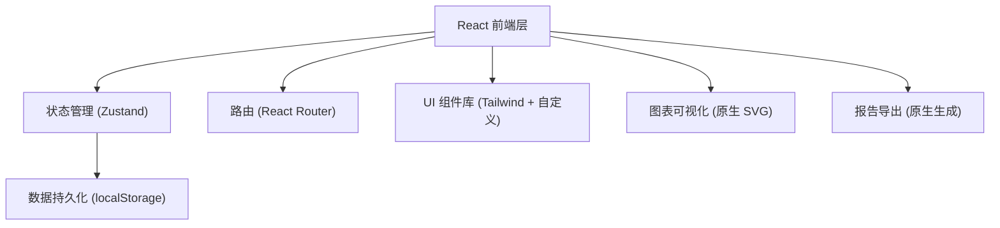
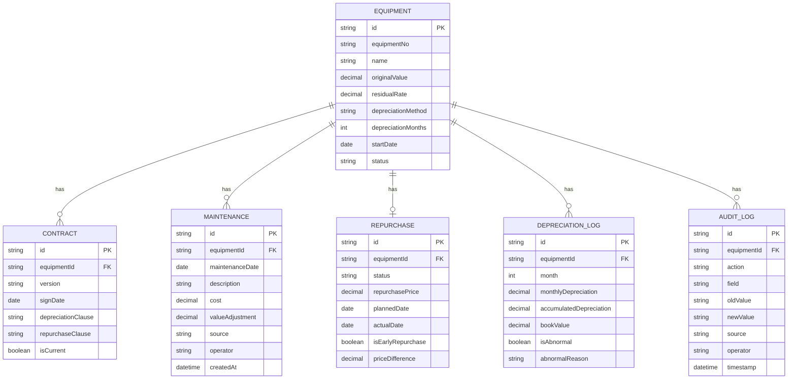

## 1. 架构设计

纯前端应用，数据存储于浏览器 localStorage，支持刷新后数据恢复。

## 2. 技术说明

- 前端：React@18 + TypeScript + Vite
- 状态管理：Zustand（含 persist 中间件实现 localStorage 持久化）
- 路由：React Router v6
- 样式：Tailwind CSS 3 + 自定义 CSS 变量
- 图标：lucide-react
- 初始化工具：vite-init
- 后端：无（纯前端应用，数据存 localStorage）
- 数据库：无（localStorage 模拟）

## 3. 路由定义

| 路由 | 用途 |
|------|------|
| `/` | 残值工作台 - 设备总览、折旧曲线、异常告警 |
| `/depreciation` | 折旧试算页 - 参数配置、月度明细、实时计算 |
| `/contracts` | 合同中心 - 合同版本列表、差异对比 |
| `/maintenance` | 维修记录页 - 维修历史、影响评估 |
| `/repurchase` | 回购管理页 - 状态追踪、风险提示 |
| `/report` | 报告导出页 - 报告生成、导出历史 |

## 4. 数据模型

### 4.1 数据模型定义

### 4.2 初始数据

通过 TypeScript 类型定义 + Zustand store 初始状态实现，包含示例设备数据、合同版本、维修记录、回购记录。

## 5. 核心计算逻辑

### 5.1 折旧计算

- 直线法：月折旧额 = (原值 - 预计残值) / 折旧月份
- 双倍余额递减法：月折旧率 = 2 / 折旧月份，月折旧额 = 账面净值 × 月折旧率
- 年数总和法：月折旧额 = (原值 - 预计残值) × 剩余尚可使用月数 / 月数总和

### 5.2 维修后价值调整

- 维修增值：账面净值 += 维修增值金额，剩余月份内重新分摊
- 维修减值：账面净值 -= 维修减值金额，不影响后续折旧（作为一次性调整）

### 5.3 提前回购处理

- 回购价差 = 回购价格 - 当前账面净值
- 提前回购标记：实际回购日期 < 合同约定回购日期
- 异常提示：价差超过阈值时高亮显示