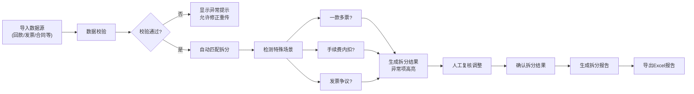

# 保理回款拆分系统 - 产品需求文档

## 1. 产品概述

保理回款拆分系统是一款专为保理专员设计的业务处理工具，解决人工拆分回款效率低下、容易出错的问题。系统支持批量导入多源数据，智能匹配拆分，并对异常情况进行高亮提示，最终生成可下载的详细报告。

- **核心问题**：一笔回款对应多张发票和多个卖方时，人工拆分速度慢、易出错
- **目标用户**：保理专员、财务人员
- **产品价值**：提升拆分效率80%，降低错误率，保留完整审计痕迹

## 2. 核心功能

### 2.1 用户角色

| 角色 | 登录方式 | 核心权限 |
|------|----------|----------|
| 保理专员 | 账号密码 | 数据导入、拆分计算、异常处理、报告导出 |

### 2.2 功能模块

1. **数据导入页**：支持6类数据源导入，展示导入预览和校验结果
2. **拆分工作台**：核心拆分处理界面，包含匹配结果、异常列表、操作面板
3. **报告预览页**：展示拆分报告详情，支持分类筛选和Excel导出

### 2.3 页面详情

| 页面名称 | 模块名称 | 功能描述 |
|----------|----------|----------|
| 数据导入页 | 文件上传区 | 拖拽上传6类文件，显示上传进度和状态 |
| 数据导入页 | 数据预览表 | 展示导入数据前10行，标注重复和缺失项 |
| 数据导入页 | 校验结果区 | 显示数据校验统计，高亮异常数据行 |
| 拆分工作台 | 回款列表 | 展示所有待拆分回款，支持搜索和筛选 |
| 拆分工作台 | 拆分详情 | 展示单条回款的发票匹配、金额分配明细 |
| 拆分工作台 | 异常警示区 | 醒目标识"一款多票""手续费内扣""发票争议" |
| 拆分工作台 | 操作面板 | 手动调整、确认拆分、标记争议、余额重算 |
| 报告预览页 | 统计概览 | 展示处理总数、正常、异常、待确认等分类统计 |
| 报告预览页 | 分类明细 | 未处理、已修正、需人工确认三类数据分开展示 |
| 报告预览页 | 操作痕迹 | 完整记录每次修改的时间、人员、前后值 |
| 报告预览页 | 导出按钮 | 支持Excel格式导出，包含全部数据和审计痕迹 |

## 3. 核心流程

## 4. 用户界面设计

### 4.1 设计风格

- **主色调**：深蓝 #1e3a5f（专业、稳重），搭配亮橙 #f97316（警示、强调）
- **辅助色**：绿色 #10b981（正常）、红色 #ef4444（错误）、黄色 #f59e0b（警告）
- **按钮风格**：微圆角（4px），轻微阴影，hover时有状态变化
- **字体**：标题使用 Noto Sans SC Bold，正文使用 Noto Sans SC Regular
- **布局风格**：卡片式布局，清晰的区域分隔，充足留白
- **图标风格**：线性图标，统一24px尺寸，颜色与状态对应

### 4.2 页面设计概述

| 页面名称 | 模块名称 | UI元素 |
|----------|----------|--------|
| 数据导入页 | 文件上传区 | 虚线边框上传框，文件图标动画，进度条 |
| 数据导入页 | 数据预览表 | 斑马纹表格，悬浮高亮，异常行红色背景 |
| 拆分工作台 | 异常警示区 | 橙色背景警告卡片，大号感叹号图标，醒目边框 |
| 拆分工作台 | 拆分详情 | 可折叠面板，金额对齐显示，来源标注小标签 |
| 报告预览页 | 统计概览 | 彩色数据卡片，大字号数字，趋势小图标 |
| 报告预览页 | 分类明细 | Tab切换，数据可展开查看详情，操作痕迹时间轴 |

### 4.3 响应式设计

- 桌面端优先（1280px+），优化保理专员办公场景
- 支持平板横向（1024px），表格可横向滚动
- 不强制支持移动端，保持功能完整性优先

### 4.4 交互细节

- 数据导入时有进度动画，失败时抖动反馈
- 异常项进入视野时有轻微高亮动画
- 金额调整时实时刷新计算结果
- 重要操作（如确认拆分）有二次确认弹窗
- 报告导出显示生成进度，完成后自动下载
