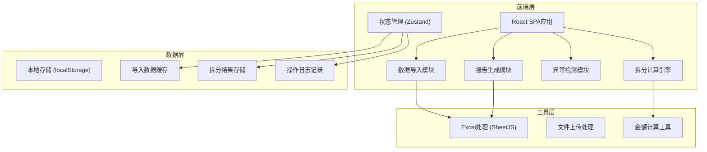
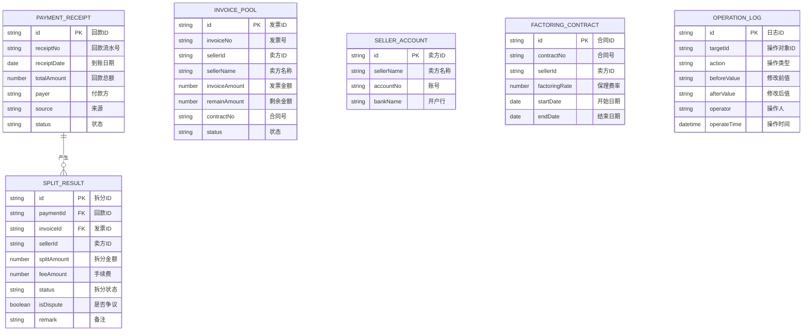

# 保理回款拆分系统 - 技术架构文档

## 1. 架构设计



## 2. 技术栈说明

- **前端框架**：React@18 + TypeScript
- **构建工具**：Vite@5
- **样式方案**：TailwindCSS@3
- **状态管理**：Zustand（轻量、简洁）
- **Excel处理**：xlsx (SheetJS)
- **图标库**：Lucide React
- **后端**：无（纯前端应用，数据本地处理）
- **数据存储**：localStorage + 内存状态

## 3. 路由定义

| 路由 | 页面 | 功能说明 |
|------|------|----------|
| / | 数据导入页 | 文件上传、数据预览、校验 |
| /workspace | 拆分工作台 | 回款列表、拆分处理、异常管理 |
| /report | 报告预览页 | 报告展示、分类筛选、导出 |

## 4. 数据模型定义

### 4.1 核心数据结构



### 4.2 TypeScript 类型定义

```typescript
// 回款流水
interface PaymentReceipt {
  id: string;
  receiptNo: string;
  receiptDate: string;
  totalAmount: number;
  payer: string;
  source: string;
  status: 'pending' | 'processing' | 'completed' | 'exception';
  unmatchedAmount?: number;
}

// 发票
interface Invoice {
  id: string;
  invoiceNo: string;
  sellerId: string;
  sellerName: string;
  invoiceAmount: number;
  remainAmount: number;
  contractNo: string;
  status: 'normal' | 'disputed' | 'closed';
}

// 卖方账号
interface SellerAccount {
  id: string;
  sellerName: string;
  accountNo: string;
  bankName: string;
}

// 保理合同
interface FactoringContract {
  id: string;
  contractNo: string;
  sellerId: string;
  factoringRate: number;
  startDate: string;
  endDate: string;
}

// 手续费配置
interface FeeConfig {
  id: string;
  name: string;
  rate: number;
  type: 'deduct_inner' | 'deduct_outer';
}

// 拆分结果
interface SplitResult {
  id: string;
  paymentId: string;
  invoiceId: string;
  sellerId: string;
  sellerName: string;
  invoiceNo: string;
  splitAmount: number;
  feeAmount: number;
  actualAmount: number;
  status: 'normal' | 'adjusted' | 'disputed' | 'pending_confirm';
  isDispute: boolean;
  disputeReason?: string;
  remark?: string;
  source: string;
}

// 操作日志
interface OperationLog {
  id: string;
  targetId: string;
  targetType: 'payment' | 'split' | 'invoice';
  action: 'create' | 'update' | 'delete' | 'confirm' | 'dispute';
  beforeValue: string;
  afterValue: string;
  operator: string;
  operateTime: string;
}

// 异常类型
type ExceptionType = 'multi_invoice' | 'fee_deduct_inner' | 'invoice_dispute' | 'amount_mismatch';

interface SplitException {
  id: string;
  paymentId: string;
  type: ExceptionType;
  level: 'warning' | 'error' | 'info';
  message: string;
  resolved: boolean;
}
```

## 5. 核心算法说明

### 5.1 回款匹配算法

1. **按合同匹配**：根据付款方和合同关系匹配发票
2. **按卖方匹配**：根据卖方信息匹配对应发票
3. **按金额优先**：优先匹配金额接近的发票
4. **比例拆分**：一笔款对应多张发票时，按发票剩余金额比例分配

### 5.2 异常检测规则

| 异常类型 | 触发条件 | 处理方式 |
|----------|----------|----------|
| 一款多票 | 单笔回款匹配≥2张发票 | 高亮显示，展示拆分比例 |
| 手续费内扣 | 手续费类型为内扣 | 单独计算，明确标注扣除明细 |
| 发票争议 | 发票状态为争议 | 隔离处理，不参与自动拆分 |
| 金额不匹配 | 拆分总额≠回款总额 | 标记余额，支持手动重算 |

### 5.3 报告生成逻辑

- **未处理**：状态为 pending 的回款/拆分
- **已修正**：存在操作日志的调整记录
- **需人工确认**：标记为 pending_confirm 的拆分项
- **操作痕迹**：按时间倒序展示所有变更记录

## 6. 目录结构

```
src/
├── pages/
│   ├── ImportPage.tsx      # 数据导入页
│   ├── WorkspacePage.tsx   # 拆分工作台
│   └── ReportPage.tsx      # 报告预览页
├── components/
│   ├── FileUpload.tsx      # 文件上传组件
│   ├── DataPreview.tsx     # 数据预览表格
│   ├── PaymentList.tsx     # 回款列表
│   ├── SplitDetail.tsx     # 拆分详情
│   ├── ExceptionAlert.tsx  # 异常警示
│   ├── OperationLog.tsx    # 操作日志
│   └── ReportExport.tsx    # 报告导出
├── store/
│   └── useSplitStore.ts    # 状态管理
├── utils/
│   ├── splitEngine.ts      # 拆分计算引擎
│   ├── exceptionDetector.ts # 异常检测
│   ├── excelHandler.ts     # Excel处理
│   └── amountCalc.ts       # 金额计算
├── types/
│   └── index.ts            # 类型定义
├── mock/
│   └── sampleData.ts       # 样例数据
└── App.tsx
```
