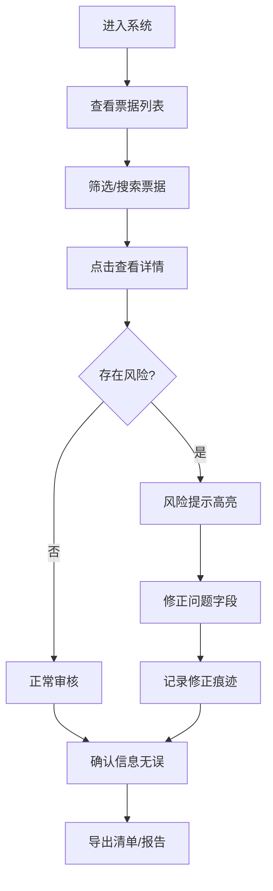

## 1. 产品概述

供应链票据贴现Web工具，为财务共享中心提供票据贴现申请的集中审核与管理平台。解决当前票据贴现流程中背书链断裂、到期日临近、贴现率版本错误等反复出错的问题，实现票据验真、背书追踪、利息计算、风险提示和导出清单的一体化管理。

- 目标用户：财务共享中心审核人员
- 核心价值：收住反复出错的流程，保留所有修改痕迹，风险场景清晰提示

## 2. 核心功能

### 2.1 用户角色

| 角色 | 注册方式 | 核心权限 |
|------|----------|----------|
| 财务审核员 | 系统内置账号 | 票据查询、审核、修正、导出、查看历史记录 |

### 2.2 功能模块

1. **票据列表页**：筛选查询、批量操作、风险高亮、快捷导出
2. **票据详情页**：票据信息、背书链路可视化、利息计算、修正记录、风险提示
3. **数据导入/导出**：支持批量导入票据数据，导出审核清单

### 2.3 页面详情

| 页面名称 | 模块名称 | 功能描述 |
|----------|----------|----------|
| 票据列表页 | 筛选区域 | 按票据号码、申请人、到期日范围、风险等级筛选 |
| 票据列表页 | 数据表格 | 展示票据核心信息，风险项红色高亮，支持排序 |
| 票据列表页 | 批量操作 | 全选/反选、批量导出、批量标记状态 |
| 票据详情页 | 票据信息卡 | 展示票据基本信息，支持字段级修正 |
| 票据详情页 | 背书链路 | 可视化展示背书链条，断裂处醒目提示 |
| 票据详情页 | 利息计算 | 基于贴现率自动计算，显示计算过程和版本 |
| 票据详情页 | 修正历史 | 记录每次修改的字段、前后值、操作人、时间 |
| 票据详情页 | 风险提示 | 集中展示所有风险项，标注严重程度 |

## 3. 核心流程

## 4. 界面设计

### 4.1 设计风格
- **主色调**：深蓝(#1e3a5f)专业稳重，适合金融财务场景
- **辅助色**：红色(#dc2626)标注高风险，橙色(#f59e0b)标注中等风险，绿色(#059669)标注正常
- **按钮风格**：圆角4px，简洁扁平，悬停有微妙阴影
- **字体**：使用系统等宽字体展示票据号码和金额，确保数字对齐易读
- **布局风格**：左右分栏，左侧导航+右侧内容，卡片式信息分组
- **图标风格**：线性简洁图标，避免花哨装饰

### 4.2 页面设计概览

| 页面名称 | 模块名称 | UI元素 |
|----------|----------|--------|
| 票据列表页 | 筛选区域 | 下拉选择、日期范围、搜索框、重置按钮 |
| 票据列表页 | 数据表格 | 斑马纹行、风险行背景色、悬停高亮、操作列 |
| 票据详情页 | 信息卡 | 标题栏、字段网格、可编辑标识、修正历史时间线 |
| 票据详情页 | 背书链路 | 横向时间轴、节点卡片、箭头连接、断裂处红色虚线 |

### 4.3 响应式
- 桌面端优先设计（1280px+），主要在办公电脑使用
- 平板端适配：筛选区域折叠，表格横向滚动
- 移动端：列表单列展示，详情页垂直堆叠

## 5. 风险提示规则

| 风险类型 | 触发条件 | 严重程度 | 提示方式 |
|----------|----------|----------|----------|
| 背书链断裂 | 背书记录不连续，前一手被背书人与后一手背书人不一致 | 高 | 红色背景+感叹号图标，阻断正常导出 |
| 到期日临近 | 距离到期日≤7天 | 中 | 橙色标签，醒目提醒 |
| 贴现率版本错 | 使用的贴现率不是最新版本 | 高 | 红色弹窗提示，显示最新版本号 |
| 票据验真失败 | 票据号码格式错误或校验不通过 | 高 | 红色边框，禁止进入下一步 |
| 利息计算异常 | 计算结果超出合理阈值范围 | 中 | 黄色背景，提示人工复核 |
