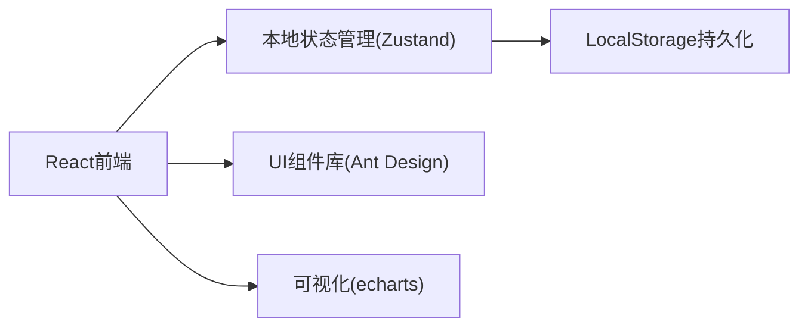

## 1. 架构设计



## 2. 技术选型

- **前端框架**：React@18 + TypeScript
- **构建工具**：Vite@5
- **状态管理**：Zustand（轻量级，适合本地持久化）
- **UI组件**：Ant Design@5
- **数据可视化**：echarts（背书链路图）
- **样式方案**：TailwindCSS@3 + CSS变量
- **数据持久化**：LocalStorage（浏览器本地存储，无需后端）
- **导出功能**：SheetJS (xlsx)

## 3. 路由定义

| 路由 | 页面 | 说明 |
|------|------|------|
| / | 票据列表页 | 首页，展示所有票据列表 |
| /bill/:id | 票据详情页 | 查看和编辑单张票据详情 |

## 4. 数据模型

### 4.1 票据(Bill)数据结构

```typescript
interface Bill {
  id: string;                    // 唯一标识
  billNumber: string;            // 票据号码
  amount: number;                // 票面金额
  issueDate: string;             // 出票日期
  dueDate: string;               // 到期日
  applicant: string;             // 申请人
  discountRate: number;          // 贴现率
  discountRateVersion: string;   // 贴现率版本号
  status: 'pending' | 'approved' | 'rejected' | 'modified';
  source: string;                // 数据来源
  createdAt: string;
  updatedAt: string;
  endorsements: Endorsement[];   // 背书记录
  calculation: CalculationResult; // 利息计算结果
  risks: RiskItem[];             // 风险项
  auditLogs: AuditLog[];         // 修正历史
}

interface Endorsement {
  id: string;
  sequence: number;              // 背书顺序
  endorser: string;              // 背书人
  endorsee: string;              // 被背书人
  date: string;
  isBroken?: boolean;            // 是否断裂
}

interface CalculationResult {
  discountAmount: number;        // 贴现利息
  actualAmount: number;          // 实付金额
  days: number;                  // 计息天数
  formula: string;               // 计算公式
  version: string;               // 计算版本
}

interface RiskItem {
  type: string;
  level: 'high' | 'medium' | 'low';
  message: string;
  resolved: boolean;
}

interface AuditLog {
  id: string;
  field: string;
  oldValue: string;
  newValue: string;
  operator: string;
  timestamp: string;
  reason: string;
}
```

### 4.2 贴现率配置

```typescript
interface DiscountRateConfig {
  version: string;
  effectiveDate: string;
  rate: number;
  isActive: boolean;
}
```

## 5. 核心模块说明

### 5.1 状态管理 Store

```typescript
// store/billStore.ts
interface BillStore {
  bills: Bill[];
  currentBill: Bill | null;
  filters: FilterParams;
  discountRates: DiscountRateConfig[];
  
  // Actions
  loadBills: () => void;
  saveBills: () => void;
  addBill: (bill: Bill) => void;
  updateBill: (id: string, updates: Partial<Bill>) => void;
  deleteBill: (id: string) => void;
  setCurrentBill: (id: string) => void;
  setFilters: (filters: Partial<FilterParams>) => void;
  exportBills: (ids: string[]) => Blob;
}
```

### 5.2 风险检测服务

```typescript
// services/riskService.ts
- validateBillNumber(billNumber: string): RiskItem | null
- checkEndorsementChain(endorsements: Endorsement[]): RiskItem[]
- checkDueDate(dueDate: string, thresholdDays?: number): RiskItem | null
- checkDiscountRateVersion(usedVersion: string, latestVersion: string): RiskItem | null
- validateCalculation(result: CalculationResult): RiskItem | null
```

### 5.3 利息计算服务

```typescript
// services/calculationService.ts
- calculateDiscountInterest(
    amount: number,
    discountRate: number,
    discountDate: string,
    dueDate: string
  ): CalculationResult
```

## 6. 持久化方案

- 使用 LocalStorage 存储所有票据数据
- Key: `supply_chain_bills_v1`
- 数据变更后自动同步到 LocalStorage
- 支持导出 JSON 备份和导入恢复

## 7. 初始化数据

内置 Mock 数据包含：
- 10-15 张示例票据
- 包含正常票据、背书断裂票据、到期日临近票据、贴现率版本错误票据
- 完整的修正历史记录示例
