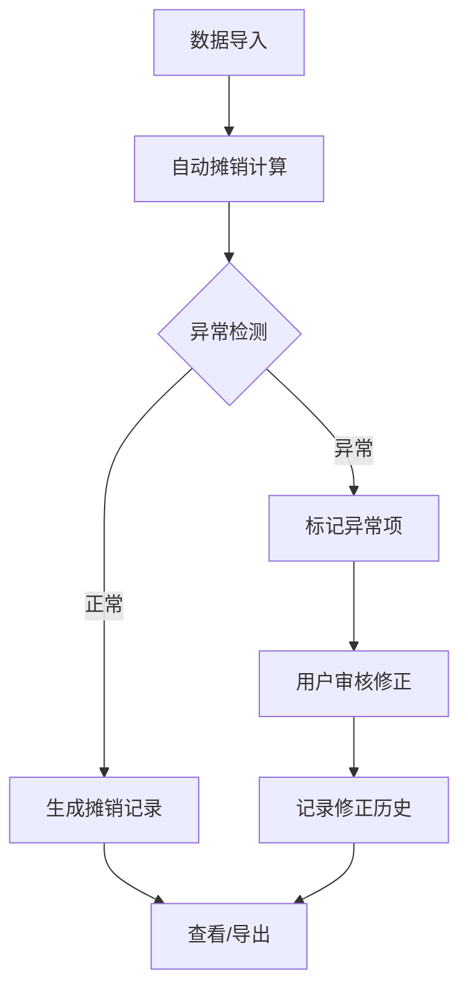

## 1. 产品概述

云资源成本摊销系统——面向技术负责人，将云账单精确分摊到各项目，替代手工分摊的痛点。
- 解决预留实例抵扣、共享网关分摊、异常峰值识别等手工难以处理的问题
- 目标用户：技术负责人、财务、DevOps 工程师

## 2. 核心功能

### 2.1 用户角色

| 角色 | 注册方式 | 核心权限 |
|------|----------|----------|
| 技术负责人 | 系统预置 | 全部功能：导入、编辑、导出、审核 |
| 财务 | 系统预置 | 查看、导出、审核确认 |
| DevOps | 系统预置 | 数据导入、标签维护、查看摊销结果 |

### 2.2 功能模块

1. **仪表盘**: 成本趋势概览、异常峰值提醒、待处理事项、快速入口
2. **摊销列表**: 按月/项目查看摊销记录，支持筛选、排序、批量操作
3. **摊销详情**: 单条摊销的完整明细，含来源追溯、修正历史、异常标注
4. **摊销编辑**: 手动调整分摊规则、修正异常、添加备注
5. **历史记录**: 全量操作审计日志，按时间线展示每次修正
6. **数据导入**: 支持多来源导入，冲突处理策略（忽略/覆盖/追加）
7. **导出报告**: 按月导出 Excel/CSV，含完整明细和汇总

### 2.3 页面详情

| 页面名称 | 模块名称 | 功能描述 |
|----------|----------|----------|
| 仪表盘 | 成本趋势卡片 | 近6个月总成本趋势折线图，环比同比标注 |
| 仪表盘 | 异常峰值提醒 | 醒目列出本月异常峰值项目，点击跳转详情 |
| 仪表盘 | 待处理事项 | 标签缺失、抵扣异常、重复分摊待确认数 |
| 仪表盘 | 快速入口 | 一键导入、新建摊销、导出报告 |
| 摊销列表 | 筛选栏 | 月份、项目、状态（正常/异常/待修正）筛选 |
| 摊销列表 | 数据表格 | 项目、成本、预留抵扣、共享分摊、净额列 |
| 摊销列表 | 批量操作 | 批量导出、批量标记已审核 |
| 摊销详情 | 来源追溯面板 | 展示该条摊销关联的云账单、资源标签、预留实例、共享网关来源 |
| 摊销详情 | 修正历史面板 | 时间线展示每次修正操作、操作人、修正前后值 |
| 摊销详情 | 异常标注面板 | 标签缺失、抵扣错误、重复分摊的明确提示 |
| 摊销编辑 | 规则编辑 | 分摊比例调整、抵扣金额修正 |
| 摊销编辑 | 异常处理 | 标记异常类型、添加修正说明 |
| 摊销编辑 | 预览对比 | 修正前后数值对比 |
| 历史记录 | 操作时间线 | 所有导入、编辑、导出操作的完整日志 |
| 数据导入 | 来源选择 | 云账单、资源标签、预留实例、共享网关、项目清单 |
| 数据导入 | 冲突处理 | 忽略/覆盖/追加，预览差异后确认 |
| 数据导入 | 导入预览 | 展示导入数据摘要，异常数据高亮 |
| 导出报告 | 格式选择 | Excel / CSV |
| 导出报告 | 范围选择 | 按月/按项目/全量 |

## 3. 核心流程

### 3.1 数据导入流程
用户选择数据来源 → 上传文件或连接数据源 → 系统预览导入数据 → 用户选择冲突处理策略（忽略/覆盖/追加）→ 预览差异 → 确认导入 → 系统记录导入日志

### 3.2 摊销计算流程
导入完成后自动触发摊销计算 → 标签归因匹配 → 预留抵扣分摊 → 共享网关分摊 → 异常检测（标签缺失、重复分摊、抵扣错误）→ 生成摊销记录 → 标记异常项 → 通知用户待处理

### 3.3 修正审核流程
用户查看异常项 → 进入编辑页 → 调整分摊规则/修正异常 → 预览对比 → 确认提交 → 系统记录修正历史 → 更新摊销结果

## 4. 用户界面设计

### 4.1 设计风格
- **主色调**: 深蓝 `#1e3a5f`（专业、稳重）
- **辅助色**: 琥珀 `#f59e0b`（异常提醒）、翠绿 `#10b981`（正常/确认）、玫红 `#f43f5e`（严重异常）
- **中性色**: `#f8fafc` 背景、`#334155` 主文字、`#94a3b8` 次要文字
- **按钮风格**: 圆角 8px，扁平化微阴影，hover 时轻微上浮
- **字体**: 标题用 "Noto Serif SC"（中文衬线，专业感），正文用 "Noto Sans SC"（中文无衬线，可读性）
- **布局风格**: 卡片式布局，卡片圆角 12px，阴影柔和
- **图标风格**: 线性图标，统一 1.5px 线宽，Lucide 图标库
- **动效**: 页面切换淡入 300ms，卡片 hover 上浮 2px，异常项脉冲呼吸效果

### 4.2 页面设计概览

| 页面名称 | 模块名称 | UI 元素 |
|----------|----------|---------|
| 仪表盘 | 成本趋势卡片 | 折线图带渐变填充，数据点 hover 显示详情 |
| 仪表盘 | 异常峰值提醒 | 琥珀色背景卡片 + 脉冲动画，醒目但不刺眼 |
| 仪表盘 | 待处理事项 | 图标 + 数字徽标，点击展开详情 |
| 摊销列表 | 数据表格 | 斑马纹行，异常行高亮，列宽可拖拽 |
| 摊销详情 | 来源追溯面板 | 折叠式卡片，展开显示来源明细 |
| 摊销详情 | 修正历史面板 | 时间线样式，左侧圆点 + 右侧内容 |
| 摊销详情 | 异常标注面板 | 彩色标签，红色=严重、橙色=警告、蓝色=信息 |
| 摊销编辑 | 预览对比 | 左右分栏对比，差异数值高亮 |
| 数据导入 | 冲突处理 | 三选一卡片式选择，选中态高亮边框 |
| 导出报告 | 格式选择 | Tab 切换式，展示格式预览缩略图 |

### 4.3 响应式设计
- 桌面端优先（1280px+），主要用户在桌面办公
- 1024px 适配：侧边栏折叠为图标模式
- 768px 以下：表格转为卡片堆叠，图表简化
