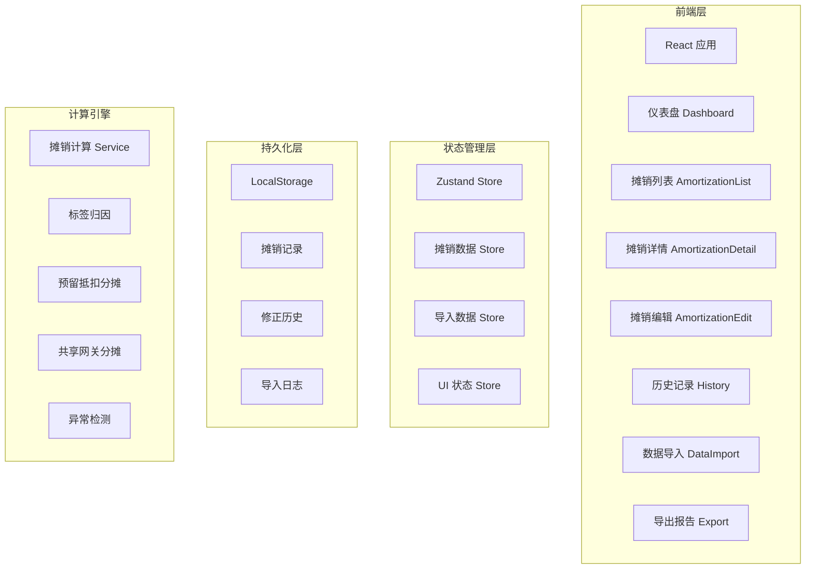
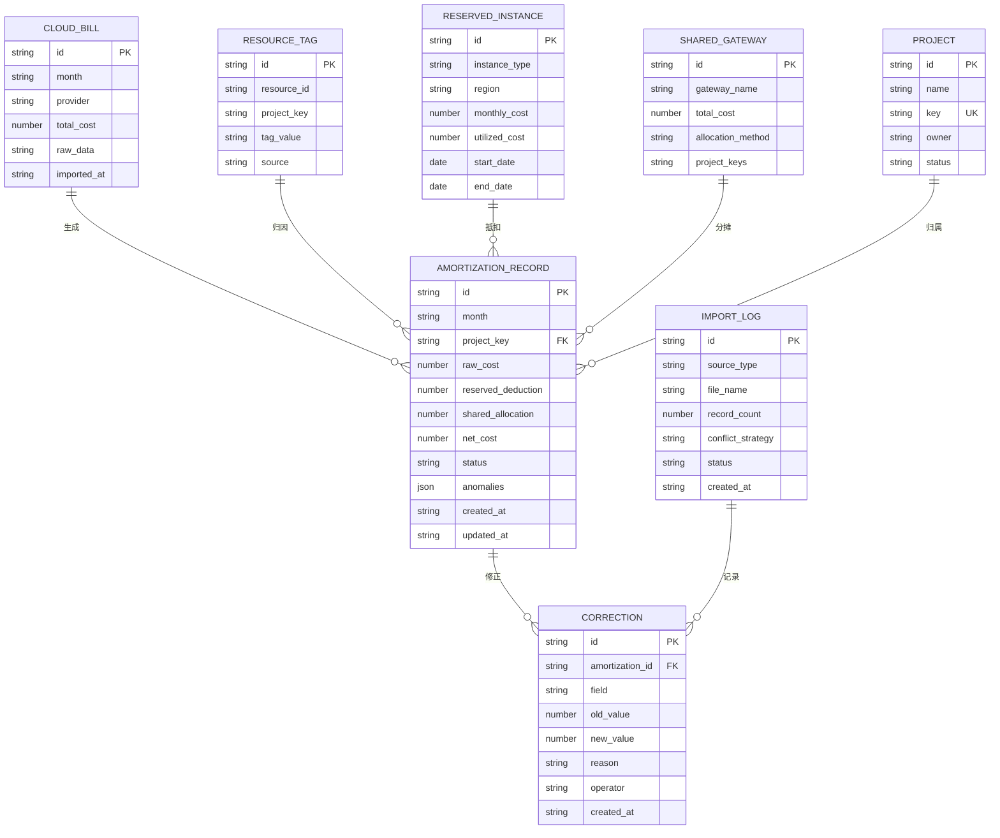

## 1. 架构设计



## 2. 技术说明

- **前端框架**: React@18 + TypeScript
- **构建工具**: Vite@5
- **样式方案**: TailwindCSS@3
- **状态管理**: Zustand（轻量、支持持久化）
- **图表库**: Recharts（轻量、React 友好）
- **图标库**: Lucide React
- **路由**: React Router@6
- **日期处理**: date-fns
- **后端**: 无（纯前端应用，数据持久化到 LocalStorage，支持导入导出 JSON/CSV）
- **数据库**: 无（Mock 数据 + LocalStorage）

## 3. 路由定义

| 路由 | 用途 |
|------|------|
| `/` | 仪表盘 - 成本趋势、异常提醒、待处理事项 |
| `/amortization` | 摊销列表 - 按月/项目查看摊销记录 |
| `/amortization/:id` | 摊销详情 - 来源追溯、修正历史、异常标注 |
| `/amortization/:id/edit` | 摊销编辑 - 调整规则、修正异常 |
| `/history` | 历史记录 - 全量操作审计日志 |
| `/import` | 数据导入 - 多来源导入、冲突处理 |
| `/export` | 导出报告 - 格式选择、范围选择 |

## 4. 数据模型

### 4.1 数据模型定义



### 4.2 数据定义语言

```typescript
interface CloudBill {
  id: string;
  month: string;
  provider: 'aliyun' | 'aws' | 'tencent' | 'huawei';
  totalCost: number;
  rawData: Record<string, unknown>;
  importedAt: string;
}

interface ResourceTag {
  id: string;
  resourceId: string;
  projectKey: string;
  tagValue: string;
  source: 'manual' | 'auto' | 'import';
}

interface ReservedInstance {
  id: string;
  instanceType: string;
  region: string;
  monthlyCost: number;
  utilizedCost: number;
  startDate: string;
  endDate: string;
}

interface SharedGateway {
  id: string;
  gatewayName: string;
  totalCost: number;
  allocationMethod: 'equal' | 'weighted' | 'custom';
  projectKeys: string[];
}

interface Project {
  id: string;
  name: string;
  key: string;
  owner: string;
  status: 'active' | 'archived';
}

interface Anomaly {
  type: 'missing_tag' | 'duplicate_allocation' | 'deduction_error' | 'peak_cost';
  severity: 'warning' | 'error' | 'info';
  message: string;
  details?: Record<string, unknown>;
}

interface AmortizationRecord {
  id: string;
  month: string;
  projectKey: string;
  rawCost: number;
  reservedDeduction: number;
  sharedAllocation: number;
  netCost: number;
  status: 'normal' | 'anomaly' | 'pending';
  anomalies: Anomaly[];
  sources: {
    cloudBillIds: string[];
    tagIds: string[];
    reservedInstanceIds: string[];
    gatewayIds: string[];
  };
  createdAt: string;
  updatedAt: string;
}

interface Correction {
  id: string;
  amortizationId: string;
  field: 'reservedDeduction' | 'sharedAllocation' | 'rawCost';
  oldValue: number;
  newValue: number;
  reason: string;
  operator: string;
  createdAt: string;
}

interface ImportLog {
  id: string;
  sourceType: 'cloud_bill' | 'resource_tag' | 'reserved_instance' | 'shared_gateway' | 'project';
  fileName: string;
  recordCount: number;
  conflictStrategy: 'ignore' | 'overwrite' | 'append';
  status: 'success' | 'partial' | 'failed';
  createdAt: string;
}
```
