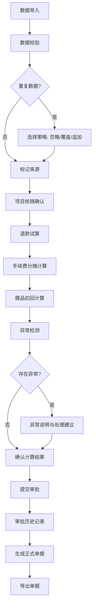

## 1. 产品概述
医美分期退款计算器是为医美门店店长设计的专业工具，用于在客户取消疗程时精确计算已做项目、分期手续费和赠品扣回金额。
- 解决核心痛点：退款计算复杂易出错、异常情况（赠品未扣/手续费变更/部分完成）难以追溯
- 目标用户：医美门店店长、财务人员、咨询师

## 2. 核心功能

### 2.1 用户角色
| 角色 | 注册方式 | 核心权限 |
|------|----------|----------|
| 门店店长 | 系统登录 | 数据导入、退款计算、审批、导出单据 |
| 财务人员 | 系统登录 | 查看计算结果、导出结算单、对账 |

### 2.2 功能模块
1. **数据导入面板**：疗程合同、分期账单、已做项目、赠品、退款申请、结算单导入
2. **退款计算工作台**：项目核销、退款试算、手续费分摊、实时计算
3. **异常监控中心**：异常检测、异常说明、风险提示
4. **审批历史追踪**：审批记录、版本对比、操作痕迹
5. **单据导出中心**：退款单、结算单、审批单导出
6. **数据可视化**：图表联动、金额分布、对比分析

### 2.3 页面详情
| 页面名称 | 模块名称 | 功能描述 |
|---------|---------|----------|
| 数据导入面板 | 批量导入模块 | 支持6类数据导入，重复导入时选择忽略/覆盖/追加，显示来源标记 |
| 数据导入面板 | 数据校验模块 | 导入数据实时校验，异常数据高亮提示 |
| 退款计算工作台 | 项目核销模块 | 已做项目核销记录，支持手动调整核销状态 |
| 退款计算工作台 | 退款试算模块 | 实时计算退款金额，支持多方案对比 |
| 退款计算工作台 | 手续费分摊模块 | 按承担方（客户/门店/机构）自动分摊手续费 |
| 退款计算工作台 | 赠品扣回模块 | 赠品价值计算，未扣回赠品异常告警 |
| 异常监控中心 | 异常检测模块 | 自动检测赠品未扣、手续费变更、疗程部分完成等异常 |
| 异常监控中心 | 异常追溯模块 | 异常原因说明、影响范围、处理建议 |
| 审批历史追踪 | 版本管理模块 | 每次修改保存版本，支持版本对比和回滚 |
| 审批历史追踪 | 操作日志模块 | 完整记录操作人、时间、修改内容 |
| 单据导出中心 | 单据生成模块 | 自动生成退款单、结算单、审批单 |
| 数据可视化 | 图表联动模块 | 金额构成饼图、退款趋势折线图、对比柱状图 |

## 3. 核心流程

用户导入6类数据源 → 系统自动校验数据完整性 → 用户选择重复数据处理策略（忽略/覆盖/追加）→ 系统标记数据来源 → 进入退款计算工作台 → 确认已核销项目 → 系统自动计算退款金额（含手续费分摊、赠品扣回）→ 异常监控中心实时检测异常并提示 → 用户确认或调整计算结果 → 提交审批 → 审批通过后生成正式单据 → 导出结算单和退款单

## 4. 用户界面设计

### 4.1 设计风格
- 主色调：专业深蓝 #165DFF（信任、专业）
- 辅助色：警示橙 #FF7D00（异常提示）、成功绿 #00B42A（正常状态）
- 按钮风格：圆角矩形 8px，悬停微放大效果
- 字体：主字体 Noto Sans SC，标题加粗，数字使用等宽字体
- 布局风格：左右分栏，左侧导航 + 右侧内容卡片式布局
- 图标风格：线性图标，统一 24px 尺寸

### 4.2 页面设计概述
| 页面名称 | 模块名称 | UI 元素 |
|---------|---------|---------|
| 数据导入面板 | 批量导入模块 | 拖拽上传区、文件列表、策略选择下拉框、来源标签 |
| 退款计算工作台 | 核心计算区 | 金额卡片组、实时计算结果、异常提示徽章、操作按钮组 |
| 异常监控中心 | 异常列表 | 异常卡片、严重程度色标、展开详情箭头、处理按钮 |
| 审批历史追踪 | 时间线 | 垂直时间线、版本对比按钮、操作人头像、修改内容 diff |
| 数据可视化 | 图表区 | 可交互饼图/柱状图、点击联动数据表格、图例筛选 |

### 4.3 响应性
- 桌面端优先设计（1920px）
- 平板端（1024px）：导航折叠为侧边栏，卡片自适应排列
- 移动端（768px）：底部导航，单列布局，图表简化显示

### 4.4 交互细节
- 金额数字动画：计算结果变化时数字滚动动画
- 异常提示：红色边框闪烁 +  tooltip 详细说明
- 版本对比：左右分栏 diff 显示，高亮修改部分
- 图表联动：点击图表区域自动筛选对应数据行
