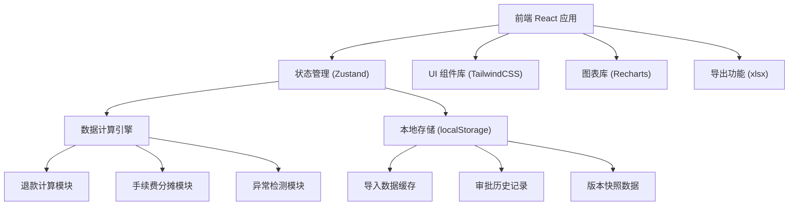
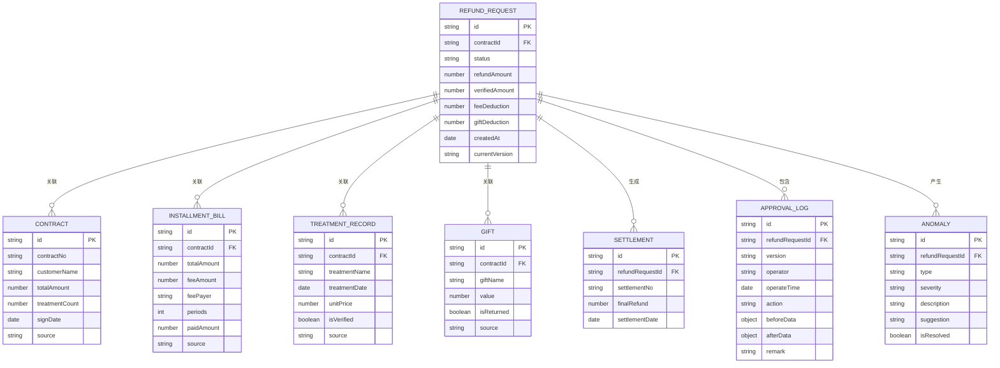

## 1. 架构设计



## 2. 技术描述

- **前端框架**: React@18 + TypeScript
- **构建工具**: Vite@5
- **样式方案**: TailwindCSS@3
- **状态管理**: Zustand@4
- **图表库**: Recharts@2
- **导出功能**: xlsx (SheetJS)
- **数据持久化**: localStorage (IndexedDB 备选)
- **后端**: 无后端服务，纯前端计算
- **数据库**: 无，数据存储在浏览器本地

## 3. 路由定义

| 路由 | 页面 | 目的 |
|------|------|------|
| / | 仪表盘 | 概览统计、快速入口 |
| /import | 数据导入 | 6类数据导入与管理 |
| /calculator | 退款计算 | 核心计算工作台 |
| /anomalies | 异常监控 | 异常列表与处理 |
| /history | 审批历史 | 版本管理与操作日志 |
| /export | 单据导出 | 生成与导出各类单据 |

## 4. 数据模型

### 4.1 数据实体关系



### 4.2 核心数据类型定义

```typescript
// 数据源类型
type DataSource = 'contract' | 'installment' | 'treatment' | 'gift' | 'refund' | 'settlement';

// 重复数据处理策略
type DuplicateStrategy = 'ignore' | 'overwrite' | 'append';

// 异常类型
type AnomalyType = 'gift_not_returned' | 'fee_payer_changed' | 'partial_treatment' | 'data_mismatch';

// 异常严重程度
type AnomalySeverity = 'critical' | 'warning' | 'info';

// 退款计算结果
interface RefundCalculation {
  contractTotal: number;
  verifiedTotal: number;
  unverifiedTotal: number;
  totalFee: number;
  customerFeeShare: number;
  storeFeeShare: number;
  giftTotalValue: number;
  giftReturnedValue: number;
  giftDeduction: number;
  baseRefund: number;
  feeDeduction: number;
  finalRefund: number;
  anomalies: Anomaly[];
}

// 版本快照
interface VersionSnapshot {
  version: string;
  timestamp: number;
  operator: string;
  calculation: RefundCalculation;
  remark: string;
}
```

## 5. 核心模块设计

### 5.1 数据导入模块
- 支持 Excel/CSV 文件解析
- 数据校验与格式化
- 重复数据检测与策略处理
- 数据源标记与追溯

### 5.2 退款计算引擎
- 项目核销金额计算
- 分期手续费分摊算法
- 赠品价值扣回计算
- 实时计算响应

### 5.3 异常检测引擎
- 规则引擎配置
- 实时异常检测
- 异常分级与提示
- 处理建议生成

### 5.4 版本管理模块
- 自动版本快照
- 版本对比 diff
- 历史回滚功能
- 操作日志记录

### 5.5 导出模块
- 退款单生成
- 结算单生成
- Excel 导出
- PDF 导出（备选）
