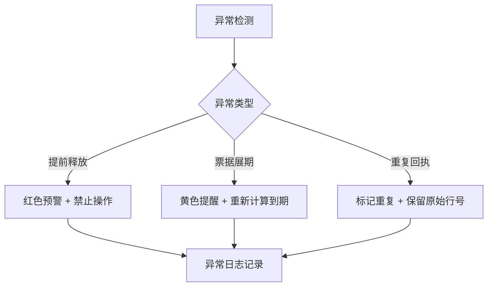

## 1. 产品概述

银行承兑保证金管理系统，解决企业财务开银承时的保证金占用核算问题，处理票据到期与保证金释放的时间差管理，防止释放提前、票据展期、回执重复等异常情况。

- 核心目标：准确追踪保证金占用状态，提供到期提醒，确保回执去重，生成规范的占用报告
- 目标用户：企业财务人员、票据管理人员

## 2. 核心功能

### 2.1 用户角色
| 角色 | 注册方式 | 核心权限 |
|------|----------|----------|
| 财务用户 | 本地系统登录 | 票据管理、保证金操作、报告导出、系统配置 |

### 2.2 功能模块
1. **票据管理**：票据申请录入、编辑、展期处理、状态追踪
2. **保证金管理**：保证金账户管理、占用锁定、释放申请、银行回执处理
3. **到期提醒**：到期票据预警、提前释放检测
4. **报告中心**：占用报告生成、导出、历史查询
5. **操作审计**：修改痕迹留存、来源记录、操作日志

### 2.3 页面详情
| 页面名称 | 模块名称 | 功能描述 |
|----------|----------|----------|
| 首页仪表盘 | 数据概览 | 保证金总览、到期提醒、异常预警、快捷操作 |
| 票据管理 | 票据列表 | 票据查询、新增、编辑、展期、状态查看 |
| 票据管理 | 票据详情 | 完整票据信息、修改历史、关联保证金、操作记录 |
| 保证金管理 | 保证金账户 | 账户信息、余额、占用明细 |
| 保证金管理 | 释放申请 | 释放申请提交、审核、回执上传 |
| 保证金管理 | 银行回执 | 回执去重校验、状态同步 |
| 报告中心 | 占用报告 | 按条件筛选、预览、导出Excel/PDF |
| 异常中心 | 异常处理 | 提前释放检测、展期提醒、重复回执预警 |

## 3. 核心流程

### 3.1 票据开立流程
票据申请录入 → 核保证金占用 → 锁定保证金 → 生成票据信息 → 记录操作来源

### 3.2 保证金释放流程
票据到期检查 → 提交释放申请 → 银行回执上传 → 回执去重校验 → 保证金释放 → 更新状态

### 3.3 异常处理流程

## 4. 用户界面设计

### 4.1 设计风格
- 主色调：深蓝色（#165DFF）- 体现专业、稳重的金融属性
- 辅助色：红色（#F53F3F）用于错误预警，橙色（#FF7D00）用于提醒，绿色（#00B42A）用于正常状态
- 字体：使用 Inter 字体，清晰易读
- 布局：侧边导航 + 卡片式内容布局，层次分明
- 图标风格：线性图标，简洁专业

### 4.2 页面设计概述
| 页面名称 | 模块名称 | UI 元素 |
|----------|----------|----------|
| 首页仪表盘 | 数据概览 | 统计卡片、环形进度图、预警列表、快捷按钮 |
| 票据管理 | 列表页 | 搜索过滤、数据表格、操作列、状态标签 |
| 票据管理 | 详情页 | 信息分组卡片、时间线修改历史、关联数据 |
| 异常中心 | 异常列表 | 高亮异常行、原始行号显示、处理按钮 |

### 4.3 响应式设计
- 桌面端优先，支持 1440px+ 分辨率
- 侧边栏固定宽度，内容区域自适应
- 表格支持横向滚动，确保数据完整性

### 4.4 特殊交互设计
- 错误提示显示原始行号：如"第23行数据异常：回执编号重复"
- 修改痕迹时间线展示，清晰显示每次修改的来源和内容
- 异常数据行高亮显示，鼠标悬浮显示详细异常信息
