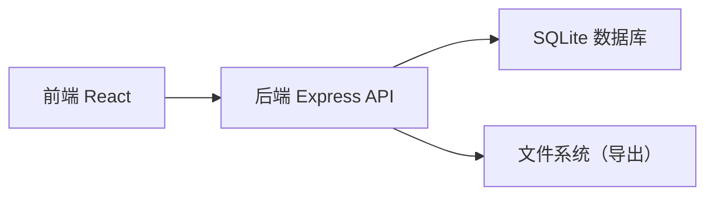
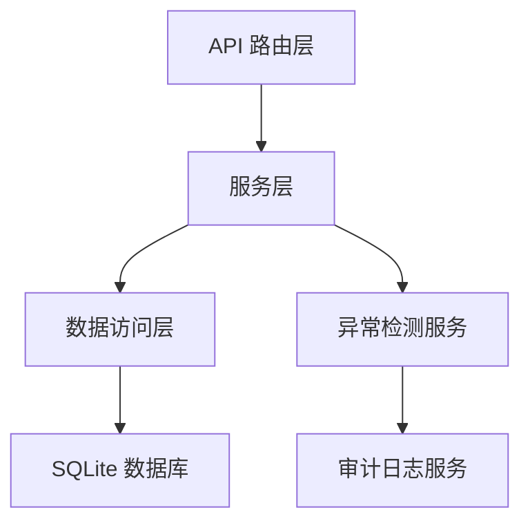
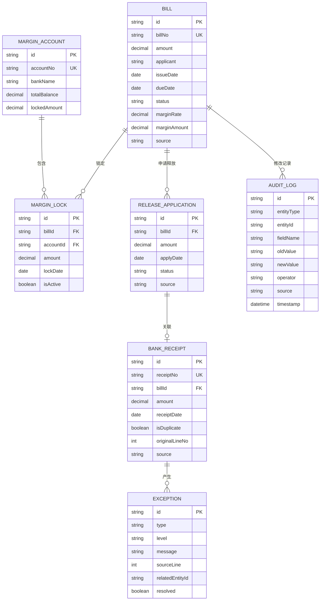

## 1. 架构设计



## 2. 技术描述

- **前端**：React@18 + TypeScript + TailwindCSS@3 + Vite
- **后端**：Express@4 + TypeScript
- **数据库**：SQLite（本地文件数据库，无需额外服务）
- **初始化工具**：Vite + npm
- **数据导出**：xlsx（Excel导出）

## 3. 路由定义

### 前端路由
| 路由 | 页面 | 功能 |
|------|------|------|
| / | 仪表盘 | 数据概览、预警信息 |
| /bills | 票据列表 | 票据查询、管理 |
| /bills/:id | 票据详情 | 票据信息、修改历史 |
| /margin | 保证金管理 | 账户、释放申请、回执 |
| /reports | 报告中心 | 占用报告、导出 |
| /exceptions | 异常中心 | 异常处理、日志 |

### 后端 API 路由
| 方法 | 路由 | 功能 |
|------|------|------|
| GET | /api/bills | 获取票据列表 |
| POST | /api/bills | 创建票据 |
| PUT | /api/bills/:id | 更新票据 |
| GET | /api/bills/:id/history | 获取票据修改历史 |
| GET | /api/margin/accounts | 获取保证金账户 |
| POST | /api/margin/release | 提交释放申请 |
| POST | /api/margin/receipt | 上传银行回执 |
| GET | /api/reports/occupation | 生成占用报告 |
| GET | /api/exceptions | 获取异常列表 |

## 4. API 定义

```typescript
// 票据类型
interface Bill {
  id: string;
  billNo: string;
  amount: number;
  applicant: string;
  beneficiary: string;
  issueDate: string;
  dueDate: string;
  status: 'draft' | 'issued' | 'extended' | 'matured' | 'released';
  marginRate: number;
  marginAmount: number;
  source: string;
  createdAt: string;
  updatedAt: string;
}

// 保证金账户
interface MarginAccount {
  id: string;
  accountNo: string;
  bankName: string;
  totalBalance: number;
  lockedAmount: number;
  availableAmount: number;
}

// 释放申请
interface ReleaseApplication {
  id: string;
  billId: string;
  billNo: string;
  amount: number;
  applyDate: string;
  status: 'pending' | 'approved' | 'rejected' | 'processed';
  receiptNo?: string;
  source: string;
}

// 银行回执
interface BankReceipt {
  id: string;
  receiptNo: string;
  billId: string;
  amount: number;
  receiptDate: string;
  isDuplicate: boolean;
  originalLineNo?: number;
  source: string;
}

// 修改历史
interface AuditLog {
  id: string;
  entityType: 'bill' | 'margin' | 'release';
  entityId: string;
  fieldName: string;
  oldValue: string;
  newValue: string;
  operator: string;
  source: string;
  timestamp: string;
}

// 异常记录
interface ExceptionRecord {
  id: string;
  type: 'early_release' | 'bill_extension' | 'duplicate_receipt';
  level: 'warning' | 'error';
  message: string;
  sourceLine?: number;
  relatedEntityId: string;
  resolved: boolean;
  createdAt: string;
}
```

## 5. 服务端架构



## 6. 数据模型

### 6.1 ER 图



### 6.2 DDL 语句

```sql
-- 票据表
CREATE TABLE bills (
  id TEXT PRIMARY KEY,
  bill_no TEXT UNIQUE NOT NULL,
  amount DECIMAL(18,2) NOT NULL,
  applicant TEXT NOT NULL,
  beneficiary TEXT NOT NULL,
  issue_date TEXT NOT NULL,
  due_date TEXT NOT NULL,
  status TEXT NOT NULL DEFAULT 'draft',
  margin_rate DECIMAL(5,4) NOT NULL,
  margin_amount DECIMAL(18,2) NOT NULL,
  source TEXT NOT NULL,
  created_at TEXT DEFAULT CURRENT_TIMESTAMP,
  updated_at TEXT DEFAULT CURRENT_TIMESTAMP
);

-- 保证金账户表
CREATE TABLE margin_accounts (
  id TEXT PRIMARY KEY,
  account_no TEXT UNIQUE NOT NULL,
  bank_name TEXT NOT NULL,
  total_balance DECIMAL(18,2) NOT NULL DEFAULT 0,
  locked_amount DECIMAL(18,2) NOT NULL DEFAULT 0,
  available_amount DECIMAL(18,2) NOT NULL DEFAULT 0,
  created_at TEXT DEFAULT CURRENT_TIMESTAMP
);

-- 保证金锁定表
CREATE TABLE margin_locks (
  id TEXT PRIMARY KEY,
  bill_id TEXT NOT NULL,
  account_id TEXT NOT NULL,
  amount DECIMAL(18,2) NOT NULL,
  lock_date TEXT NOT NULL,
  is_active INTEGER NOT NULL DEFAULT 1,
  created_at TEXT DEFAULT CURRENT_TIMESTAMP,
  FOREIGN KEY (bill_id) REFERENCES bills(id),
  FOREIGN KEY (account_id) REFERENCES margin_accounts(id)
);

-- 释放申请表
CREATE TABLE release_applications (
  id TEXT PRIMARY KEY,
  bill_id TEXT NOT NULL,
  bill_no TEXT NOT NULL,
  amount DECIMAL(18,2) NOT NULL,
  apply_date TEXT NOT NULL,
  status TEXT NOT NULL DEFAULT 'pending',
  receipt_no TEXT,
  source TEXT NOT NULL,
  created_at TEXT DEFAULT CURRENT_TIMESTAMP,
  FOREIGN KEY (bill_id) REFERENCES bills(id)
);

-- 银行回执表
CREATE TABLE bank_receipts (
  id TEXT PRIMARY KEY,
  receipt_no TEXT UNIQUE NOT NULL,
  bill_id TEXT NOT NULL,
  amount DECIMAL(18,2) NOT NULL,
  receipt_date TEXT NOT NULL,
  is_duplicate INTEGER NOT NULL DEFAULT 0,
  original_line_no INTEGER,
  source TEXT NOT NULL,
  created_at TEXT DEFAULT CURRENT_TIMESTAMP,
  FOREIGN KEY (bill_id) REFERENCES bills(id)
);

-- 审计日志表
CREATE TABLE audit_logs (
  id TEXT PRIMARY KEY,
  entity_type TEXT NOT NULL,
  entity_id TEXT NOT NULL,
  field_name TEXT NOT NULL,
  old_value TEXT,
  new_value TEXT,
  operator TEXT NOT NULL,
  source TEXT NOT NULL,
  timestamp TEXT DEFAULT CURRENT_TIMESTAMP
);

-- 异常记录表
CREATE TABLE exceptions (
  id TEXT PRIMARY KEY,
  type TEXT NOT NULL,
  level TEXT NOT NULL,
  message TEXT NOT NULL,
  source_line INTEGER,
  related_entity_id TEXT,
  resolved INTEGER NOT NULL DEFAULT 0,
  created_at TEXT DEFAULT CURRENT_TIMESTAMP
);

-- 索引
CREATE INDEX idx_bills_due_date ON bills(due_date);
CREATE INDEX idx_bills_status ON bills(status);
CREATE INDEX idx_audit_logs_entity ON audit_logs(entity_type, entity_id);
CREATE INDEX idx_exceptions_resolved ON exceptions(resolved);
CREATE INDEX idx_bank_receipts_receipt_no ON bank_receipts(receipt_no);
```
