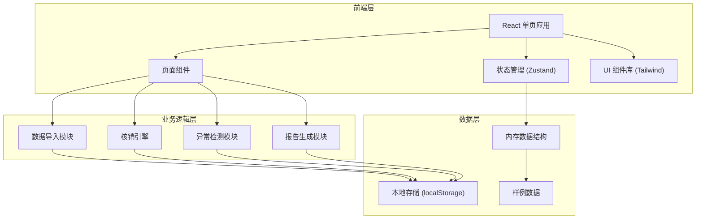
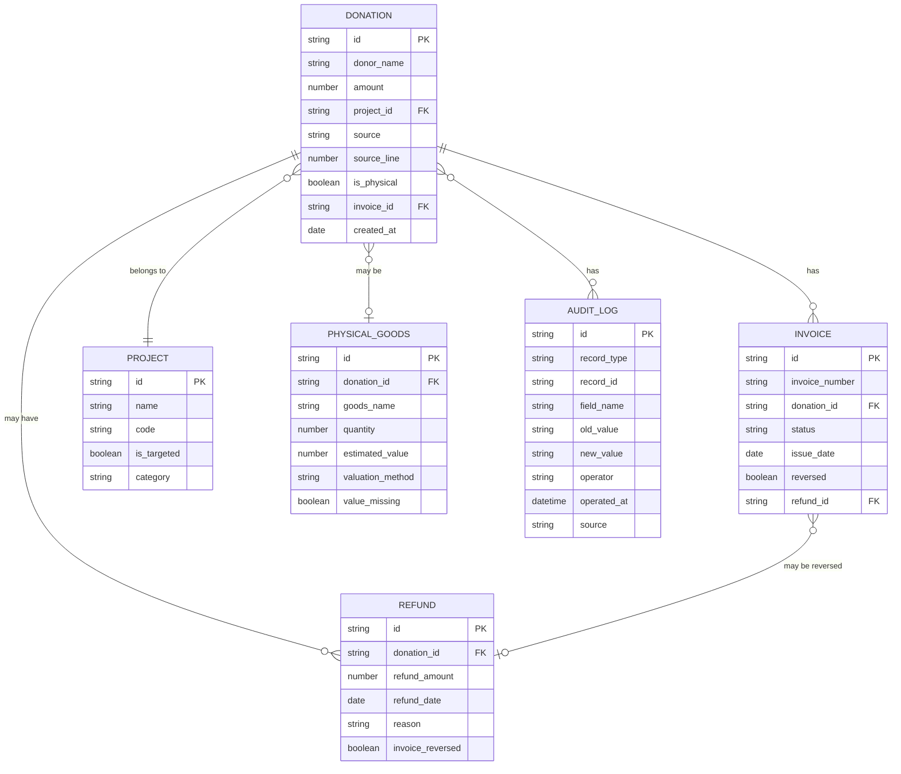

# 慈善捐赠票据核销系统 技术架构文档

## 1. 架构设计



## 2. 技术选型

- **前端框架**：React@18 + TypeScript
- **构建工具**：Vite@5
- **样式方案**：TailwindCSS@3
- **状态管理**：Zustand（轻量级状态管理）
- **路由**：React Router@6
- **数据导出**：xlsx（Excel 导出）、papaparse（CSV 解析）
- **图标**：Lucide React
- **后端**：无（纯前端应用，数据存储在 localStorage）
- **数据库**：localStorage（浏览器本地存储）

## 3. 路由定义

| 路由 | 页面 | 说明 |
|------|------|------|
| / | 数据导入页 | 首页，多来源数据导入和样例加载 |
| /workbench | 核销工作台 | 票据状态管理、项目归集、退款冲销 |
| /exceptions | 异常清单 | 异常分类展示和处理 |
| /report | 报告导出 | 核销报告预览和下载 |
| /history | 修正痕迹 | 修改历史记录和数据溯源 |

## 4. 数据模型

### 4.1 ER 图



### 4.2 核心数据类型定义

```typescript
// 来源类型
type DataSource = 
  | 'donation_flow'      // 捐赠流水
  | 'project_tag'        // 项目标签
  | 'physical_valuation' // 实物估值
  | 'refund_record'      // 退款记录
  | 'invoice_number'     // 票据号码
  | 'verification_report'; // 核销报告

// 异常类型
type ExceptionType = 
  | 'physical_value_missing'  // 实物估值缺失
  | 'project_mismatch'        // 项目错挂
  | 'refund_not_reversed'     // 退款未冲销
  | 'data_mismatch'           // 数据不一致
  | 'duplicate_invoice';      // 票据重复

// 票据状态
type InvoiceStatus = 
  | 'pending'      // 待开票
  | 'issued'       // 已开票
  | 'reversed'     // 已冲销
  | 'exception';   // 异常

// 捐赠记录
interface Donation {
  id: string;
  donorName: string;
  amount: number;
  projectId: string;
  projectName?: string;
  isPhysical: boolean;
  source: DataSource;
  sourceLine: number;
  invoiceId?: string;
  invoiceNumber?: string;
  invoiceStatus: InvoiceStatus;
  refundId?: string;
  hasRefund: boolean;
  createdAt: string;
  exceptions: ExceptionType[];
  isVerified: boolean;
}

// 项目信息
interface Project {
  id: string;
  name: string;
  code: string;
  isTargeted: boolean;
  category: string;
  totalAmount: number;
  donationCount: number;
}

// 实物信息
interface PhysicalGoods {
  id: string;
  donationId: string;
  goodsName: string;
  quantity: number;
  estimatedValue: number;
  valuationMethod: string;
  valueMissing: boolean;
  source: DataSource;
  sourceLine: number;
}

// 退款记录
interface Refund {
  id: string;
  donationId: string;
  refundAmount: number;
  refundDate: string;
  reason: string;
  invoiceReversed: boolean;
  source: DataSource;
  sourceLine: number;
}

// 票据信息
interface Invoice {
  id: string;
  invoiceNumber: string;
  donationId: string;
  status: InvoiceStatus;
  issueDate: string;
  reversed: boolean;
  refundId?: string;
  source: DataSource;
  sourceLine: number;
}

// 异常记录
interface ExceptionRecord {
  id: string;
  type: ExceptionType;
  description: string;
  suggestion: string;
  recordType: 'donation' | 'invoice' | 'refund' | 'physical';
  recordId: string;
  source: DataSource;
  sourceLine: number;
  resolved: boolean;
  createdAt: string;
}

// 审计日志
interface AuditLog {
  id: string;
  recordType: string;
  recordId: string;
  fieldName: string;
  oldValue: string;
  newValue: string;
  operator: string;
  operatedAt: string;
  source: DataSource;
}
```

## 5. 核心模块设计

### 5.1 数据导入模块

**功能**：
- 支持 CSV/Excel 文件解析
- 多来源数据合并与关联
- 样例数据生成
- 数据预览与校验

**关键函数**：
```typescript
parseCSV(content: string, source: DataSource): ParsedData
parseExcel(buffer: ArrayBuffer, source: DataSource): ParsedData
mergeData(sources: Record<DataSource, any[]>): { donations, projects, invoices, refunds, physicals }
generateSampleData(): CompleteDataset
```

### 5.2 异常检测模块

**功能**：
- 实物估值缺失检测
- 项目错挂检测
- 退款未冲销检测
- 数据一致性校验

**关键函数**：
```typescript
detectPhysicalValueMissing(physicals: PhysicalGoods[]): ExceptionRecord[]
detectProjectMismatch(donations: Donation[], projects: Project[]): ExceptionRecord[]
detectRefundNotReversed(refunds: Refund[], invoices: Invoice[]): ExceptionRecord[]
detectDataConsistency(dataset: CompleteDataset): ExceptionRecord[]
```

### 5.3 核销引擎模块

**功能**：
- 项目归集计算
- 退款冲销处理
- 票据状态更新
- 核销统计

**关键函数**：
```typescript
collectByProject(donations: Donation[]): ProjectSummary[]
processRefundReversal(refund: Refund, invoice: Invoice): Invoice
updateInvoiceStatus(donation: Donation, status: InvoiceStatus): Donation
calculateVerificationStats(dataset: CompleteDataset): VerificationStats
```

### 5.4 报告生成模块

**功能**：
- 核销汇总报告
- 异常明细报告
- 项目分类报告
- Excel/CSV 导出

**关键函数**：
```typescript
generateSummaryReport(dataset: CompleteDataset): SummaryReport
generateExceptionReport(exceptions: ExceptionRecord[]): ExceptionReport
generateProjectReport(projects: ProjectSummary[]): ProjectReport
exportToExcel(reports: ReportData[]): Blob
exportToCSV(data: any[], filename: string): void
```

### 5.5 审计日志模块

**功能**：
- 记录所有修改操作
- 支持数据溯源
- 前后值对比

**关键函数**：
```typescript
logChange(recordType: string, recordId: string, field: string, oldVal: any, newVal: any, source: DataSource): void
getAuditHistory(recordType: string, recordId?: string): AuditLog[]
```

## 6. 状态管理设计

使用 Zustand 管理全局状态：

```typescript
interface AppState {
  // 数据
  donations: Donation[];
  projects: Project[];
  invoices: Invoice[];
  refunds: Refund[];
  physicalGoods: PhysicalGoods[];
  exceptions: ExceptionRecord[];
  auditLogs: AuditLog[];
  
  // UI 状态
  activeTab: string;
  selectedRecords: string[];
  loading: boolean;
  
  // 操作
  loadSampleData: () => void;
  importData: (source: DataSource, data: any[]) => void;
  resolveException: (id: string, fix: any) => void;
  updateRecord: (type: string, id: string, updates: any) => void;
  exportReport: (format: 'excel' | 'csv') => void;
}
```
