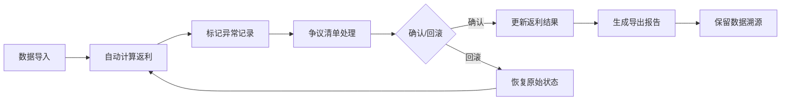

## 1. 产品概述
跨店会员返利计算工具，解决连锁健身房销售返利纠纷。核心处理转店、退课跨月、私教包拆分等复杂场景，保留数据来源和修正痕迹。
- 目标用户：销售主管、财务人员、门店经理
- 核心价值：透明化返利计算、减少争议、追溯历史变更

## 2. 核心功能

### 2.1 用户角色
| 角色 | 登录方式 | 核心权限 |
|------|----------|----------|
| 销售主管 | 本地登录 | 数据导入、返利计算、争议处理、报告导出 |

### 2.2 功能模块
1. **返利概览页**：数据统计、快速筛选、异常提示
2. **返利明细页**：记录列表、归属版本、返利重算、修正痕迹
3. **争议清单页**：异常记录、处理流程、回滚操作
4. **报告导出页**：多格式导出、数据溯源

### 2.3 页面详情
| 页面名称 | 模块名称 | 功能描述 |
|---------|----------|----------|
| 返利概览 | 数据看板 | 总返利金额、异常数量、处理进度统计 |
| 返利概览 | 快速筛选 | 按门店、时间、销售、状态筛选 |
| 返利明细 | 记录列表 | 分页展示、排序、搜索 |
| 返利明细 | 归属版本 | 查看销售归属历史变更、版本切换 |
| 返利明细 | 返利重算 | 手动触发重算、预览结果、确认应用 |
| 返利明细 | 修正痕迹 | 操作日志、修改前后对比、操作人时间 |
| 争议清单 | 异常列表 | 归属变更、退课跨月、私教包拆分标记 |
| 争议清单 | 退课回滚 | 撤销退课操作、重新计算返利 |
| 争议清单 | 争议处理 | 添加备注、标记状态、审批流程 |
| 报告导出 | 导出配置 | 选择字段、时间范围、格式(Excel/CSV) |
| 报告导出 | 数据溯源 | 导出文件包含来源标识和版本号 |

## 3. 核心流程

用户导入会员合同、销售归属、转店记录、退课流水、私教包数据 → 系统自动计算返利并标记异常 → 主管在争议清单处理异常 → 确认或回滚操作 → 导出最终返利报告。所有操作保留痕迹可追溯。

## 4. 用户界面设计

### 4.1 设计风格
- **主色调**：深蓝色 #1e3a5f（专业可信），辅助色：橙色 #f97316（异常警示），绿色 #10b981（正常）
- **按钮样式**：圆角8px，悬浮微放大效果，深色边框
- **字体**：标题使用 Playfair Display（优雅高端），正文使用 Source Sans 3（清晰易读）
- **布局风格**：左右分栏，左侧导航，右侧内容区卡片式布局
- **图标风格**：线性图标，统一粗细2px

### 4.2 页面设计概述
| 页面名称 | 模块名称 | UI 元素 |
|---------|----------|---------|
| 返利概览 | 数据看板 | 大数字统计卡片、渐变背景、微动效 |
| 返利概览 | 异常提示 | 橙色警示条、闪烁红点、hover展开详情 |
| 返利明细 | 记录列表 | 斑马纹表格、行hover高亮、异常行橙色边框 |
| 返利明细 | 版本切换 | 时间轴组件、版本对比弹窗、高亮差异 |
| 争议清单 | 异常标签 | 彩色标签、图标+文字、tooltip说明 |
| 报告导出 | 导出面板 | 步骤引导、进度条、成功动效 |

### 4.3 响应式
桌面端优先设计，1200px以上完整布局，平板(768-1200px)折叠导航，移动端(<768px)精简表格列。

### 4.4 交互细节
- 表格行悬浮显示操作按钮
- 异常记录点击展开详细说明
- 版本切换平滑过渡动画
- 修正痕迹时间轴可折叠
