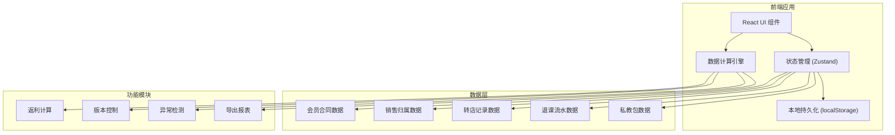
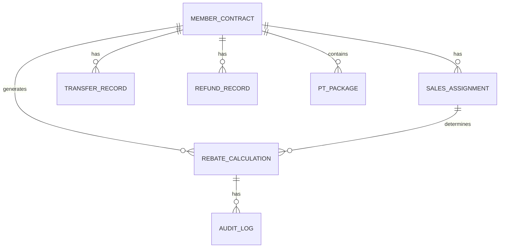

## 1. 架构设计



## 2. 技术描述
- **前端**：React@18 + TypeScript + Vite
- **样式**：TailwindCSS@3
- **状态管理**：Zustand（轻量、支持中间件持久化）
- **数据持久化**：localStorage + Zustand persist 中间件
- **图标**：Lucide React
- **导出**：xlsx (Excel导出)
- **后端**：无（纯前端应用，数据本地存储）

## 3. 路由定义
| 路由 | 页面名称 | 用途 |
|------|----------|------|
| / | 返利概览 | 数据看板、快速筛选、异常统计 |
| /details | 返利明细 | 记录列表、归属版本、返利重算 |
| /disputes | 争议清单 | 异常记录、退课回滚、争议处理 |
| /export | 报告导出 | 导出配置、数据溯源 |

## 4. 数据模型

### 4.1 数据模型定义



### 4.2 TypeScript 类型定义

```typescript
// 会员合同
interface MemberContract {
  id: string;
  memberName: string;
  memberPhone: string;
  contractDate: string;
  totalAmount: number;
  storeId: string;
  storeName: string;
  source: 'contract' | 'transfer';
  createdAt: string;
}

// 销售归属（支持版本）
interface SalesAssignment {
  id: string;
  contractId: string;
  salesId: string;
  salesName: string;
  storeId: string;
  effectiveDate: string;
  version: number;
  isActive: boolean;
  changeReason?: string;
  createdBy: string;
  createdAt: string;
}

// 转店记录
interface TransferRecord {
  id: string;
  contractId: string;
  fromStoreId: string;
  fromStoreName: string;
  toStoreId: string;
  toStoreName: string;
  transferDate: string;
  transferFee: number;
  createdBy: string;
  createdAt: string;
}

// 退课流水
interface RefundRecord {
  id: string;
  contractId: string;
  refundAmount: number;
  refundDate: string;
  refundMonth: string;
  reason: string;
  isRolledBack: boolean;
  createdBy: string;
  createdAt: string;
}

// 私教包
interface PTPackage {
  id: string;
  contractId: string;
  packageName: string;
  totalSessions: number;
  usedSessions: number;
  totalAmount: number;
  assignedSales: string[];
  splitRatio: Record<string, number>;
  isSplit: boolean;
  createdBy: string;
  createdAt: string;
}

// 返利计算结果
interface RebateCalculation {
  id: string;
  contractId: string;
  salesId: string;
  salesName: string;
  storeId: string;
  baseAmount: number;
  rebateRate: number;
  rebateAmount: number;
  adjustmentAmount: number;
  finalAmount: number;
  status: 'normal' | 'warning' | 'disputed' | 'confirmed';
  warnings: Warning[];
  calculationVersion: number;
  lastCalculatedAt: string;
  confirmedBy?: string;
  confirmedAt?: string;
}

// 异常警告
interface Warning {
  type: 'sales_change' | 'cross_month_refund' | 'pt_split' | 'transfer';
  message: string;
  severity: 'low' | 'medium' | 'high';
  details: Record<string, any>;
}

// 审计日志
interface AuditLog {
  id: string;
  entityType: string;
  entityId: string;
  action: 'create' | 'update' | 'delete' | 'recalculate' | 'confirm' | 'rollback';
  beforeValue: any;
  afterValue: any;
  operatedBy: string;
  operatedAt: string;
  remark?: string;
}
```

## 5. 核心算法

### 5.1 返利计算逻辑
1. 基础返利 = 合同金额 × 返利比例
2. 转店调整 = 按转店时间拆分，原店和新店按比例分配
3. 退课扣减 = 退课金额 × 返利比例，标记跨月退课
4. 私教包拆分 = 按 splitRatio 分配给对应销售
5. 最终返利 = 基础返利 + 转店调整 - 退课扣减 + 其他调整

### 5.2 异常检测规则
- **销售归属变更**：同一合同存在多个版本的销售归属
- **退课跨月**：退课月份与合同月份不一致
- **私教包拆分**：私教包 assignedSales 长度 > 1
- **转店记录**：合同关联了转店记录

## 6. 状态管理结构

```typescript
interface AppState {
  // 原始数据
  contracts: MemberContract[];
  salesAssignments: SalesAssignment[];
  transferRecords: TransferRecord[];
  refundRecords: RefundRecord[];
  ptPackages: PTPackage[];
  
  // 计算结果
  rebateResults: RebateCalculation[];
  auditLogs: AuditLog[];
  
  // 筛选条件
  filters: {
    storeId?: string;
    dateRange?: [string, string];
    salesId?: string;
    status?: string;
  };
  
  // 操作方法
  recalculateRebate: (contractId?: string) => void;
  rollbackRefund: (refundId: string) => void;
  confirmRebate: (rebateId: string) => void;
  addAuditLog: (log: Omit<AuditLog, 'id' | 'operatedAt'>) => void;
  exportReport: (format: 'xlsx' | 'csv') => Blob;
}
```
