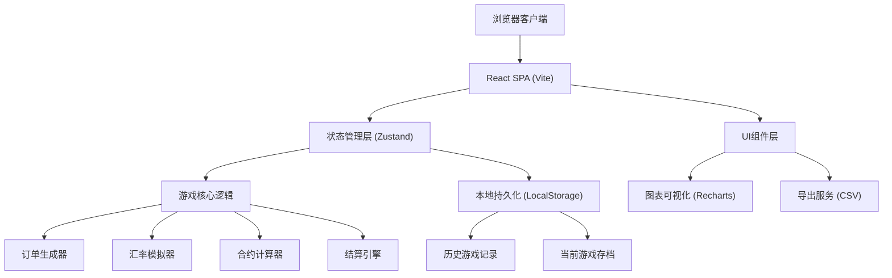

## 1. 架构设计



## 2. 技术描述

- **前端**：React 18 + TypeScript + Vite
- **状态管理**：Zustand 4.x
- **样式方案**：TailwindCSS 3.x
- **路由**：React Router DOM 6.x
- **图表库**：Recharts 2.x
- **图标库**：Lucide React
- **数据持久化**：LocalStorage（无需后端）
- **构建工具**：Vite 5.x

## 3. 路由定义

| 路由 | 页面组件 | 功能说明 |
|------|----------|----------|
| `/` | `HomePage` | 开始页面，游戏介绍与入口 |
| `/game` | `GamePage` | 游戏主界面 |
| `/report` | `ReportPage` | 经营报告与错因回放 |
| `/history` | `HistoryPage` | 历史记录列表 |
| `/history/:id` | `HistoryDetailPage` | 单局游戏详情回看 |

## 4. 数据模型

### 4.1 核心数据结构

```typescript
// 游戏状态
interface GameState {
  id: string;
  round: number;
  maxRounds: number;
  status: 'idle' | 'playing' | 'paused' | 'ended' | 'bankrupt';
  cash: number;
  inventory: number;
  exchangeRate: number;
  history: RoundRecord[];
  activeOrders: Order[];
  activeContracts: ForwardContract[];
  createdAt: number;
  updatedAt: number;
}

// 订单
interface Order {
  id: string;
  amount: number;
  currency: 'USD' | 'EUR';
  deliveryRound: number;
  unitPrice: number;
  status: 'pending' | 'accepted' | 'cancelled' | 'delivered';
  cancelProbability: number;
}

// 远期合约
interface ForwardContract {
  id: string;
  orderId: string;
  lockedRate: number;
  amount: number;
  maturityRound: number;
  feeRate: number;
  status: 'active' | 'exercised' | 'expired';
}

// 回合记录
interface RoundRecord {
  round: number;
  exchangeRate: number;
  forwardRate: number;
  orders: Order[];
  contracts: ForwardContract[];
  cashFlow: CashFlowItem[];
  events: GameEvent[];
  netProfit: number;
  endingCash: number;
  endingInventory: number;
}

// 现金流项目
interface CashFlowItem {
  category: 'revenue' | 'cost' | 'fee' | 'penalty';
  description: string;
  amount: number;
}

// 游戏事件（用于错因回放）
interface GameEvent {
  type: 'order_cancelled' | 'over_hedging' | 'cash_shortage' | 'normal';
  severity: 'info' | 'warning' | 'error';
  message: string;
  details?: Record<string, unknown>;
}

// 历史记录元数据
interface GameHistoryMeta {
  id: string;
  finalScore: number;
  finalCash: number;
  totalRounds: number;
  status: 'completed' | 'bankrupt';
  endReason?: string;
  createdAt: number;
}
```

### 4.2 游戏配置常量

```typescript
// 游戏参数配置
const GAME_CONFIG = {
  MAX_ROUNDS: 12,
  INITIAL_CASH: 1000000,
  INITIAL_INVENTORY: 100,
  BASE_EXCHANGE_RATE: 7.0,
  VOLATILITY: 0.05,
  OVER_HEDGING_PENALTY_RATE: 0.1,
  FORWARD_CONTRACT_FEE_RATE: 0.005,
  INVENTORY_HOLDING_COST_PER_UNIT: 50,
  ORDER_CANCEL_PENALTY_RATE: 0.1,
};
```

## 5. 模块划分

```
src/
├── components/
│   ├── game/
│   │   ├── StatusBar.tsx        # 顶部状态栏
│   │   ├── OrderPanel.tsx       # 订单面板
│   │   ├── ExchangePanel.tsx    # 汇率面板
│   │   ├── HedgingPanel.tsx     # 锁汇面板
│   │   ├── SettlementModal.tsx  # 结算弹窗
│   │   └── ControlBar.tsx       # 控制栏
│   ├── report/
│   │   ├── ProfitChart.tsx      # 盈亏图表
│   │   ├── Timeline.tsx         # 错因回放时间轴
│   │   └── SummaryCard.tsx      # 总结卡片
│   ├── common/
│   │   ├── Button.tsx
│   │   ├── Card.tsx
│   │   └── Modal.tsx
├── pages/
│   ├── HomePage.tsx
│   ├── GamePage.tsx
│   ├── ReportPage.tsx
│   ├── HistoryPage.tsx
│   └── HistoryDetailPage.tsx
├── store/
│   └── useGameStore.ts          # Zustand 游戏状态
├── utils/
│   ├── exchange.ts              # 汇率计算
│   ├── order.ts                 # 订单生成
│   ├── contract.ts              # 合约计算
│   ├── settlement.ts            # 结算逻辑
│   ├── storage.ts               # 本地存储
│   └── export.ts                # CSV导出
├── types/
│   └── game.ts                  # 类型定义
├── constants/
│   └── config.ts                # 游戏配置
├── App.tsx
├── main.tsx
└── index.css
```

## 6. 状态管理设计

使用 Zustand 管理全局游戏状态，核心操作包括：

```typescript
interface GameActions {
  startNewGame: () => void;
  pauseGame: () => void;
  resumeGame: () => void;
  restartGame: () => void;
  acceptOrder: (orderId: string) => void;
  rejectOrder: (orderId: string) => void;
  createForwardContract: (orderId: string, amount: number) => void;
  endRound: () => void;
  saveGame: () => void;
  loadGame: (id: string) => void;
  exportToCSV: () => string;
}
```

## 7. 异常处理机制

| 异常类型 | 触发条件 | 处理方式 |
|----------|----------|----------|
| 锁汇过量 | 锁汇金额 > 订单应收金额的120% | 警告提示 + 超额部分10%罚款 + 记录事件 |
| 现金不足 | 结算后现金 < 0 | 破产判定 + 详细原因分析 + 游戏结束 |
| 订单取消 | 按概率随机触发 | 损失收入 + 10%违约金 + 事件记录 |
| 库存不足 | 接单时库存 < 订单量 | 禁止接单 + 提示补充库存 |
