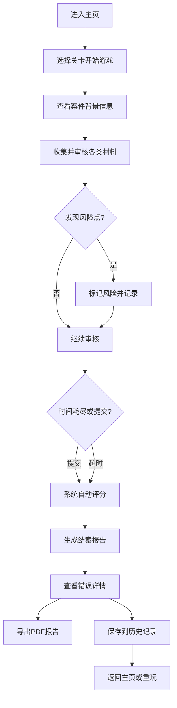

## 1. 产品概述

"保险理赔侦探局"是一款面向保险新人的培训小游戏，通过模拟理赔案件调查过程，帮助学员掌握理赔材料审核技能。游戏融合线索收集、规则判断、时间压力等要素，让学员在沉浸式体验中学习识别票据重复、保单免责、补料超时等风险点。

- **核心目标**：提升新人理赔材料审核能力，降低实际工作中的错判率
- **目标用户**：保险公司新人理赔专员、培训主管
- **产品价值**：将枯燥的规则学习转化为趣味游戏，提高培训效果和留存率

## 2. 核心功能

### 2.1 用户角色
| 角色 | 登录方式 | 核心权限 |
|------|----------|----------|
| 学员 | 直接进入 | 进行游戏、查看历史记录、导出报告 |
| 培训主管 | 直接进入 | 查看所有学员成绩、管理关卡 |

### 2.2 功能模块
1. **主页大厅**：游戏介绍、开始游戏、历史记录入口
2. **关卡游戏**：线索收集、材料审核、时间倒计时、实时反馈
3. **结案报告**：评分展示、错误详情、得分分析
4. **历史记录**：游戏回放、成绩对比、数据统计
5. **报告导出**：PDF格式结案报告导出

### 2.3 页面详情
| 页面名称 | 模块名称 | 功能描述 |
|----------|----------|----------|
| 主页大厅 | 侦探局入口 | 游戏主题展示、开始按钮、历史记录入口 |
| 关卡游戏 | 案件信息 | 案件背景、客户信息、时间倒计时 |
| 关卡游戏 | 材料收集区 | 理赔卡、票据、照片、保单规则、客户情绪、结案报告六大类材料 |
| 关卡游戏 | 判断操作区 | 材料完整/缺失判断、风险点标记、提交按钮 |
| 关卡游戏 | 实时反馈 | 错误即时提示、风险点高亮显示 |
| 结案报告 | 评分面板 | 最终得分、评级、用时统计 |
| 结案报告 | 错误详情 | 每道错题的正确答案、扣分原因 |
| 历史记录 | 记录列表 | 按时间排序的游戏记录、得分对比 |
| 历史记录 | 回放功能 | 重现游戏过程、查看每步操作 |
| 报告导出 | PDF生成 | 包含案件信息、评分、错误分析的完整报告 |

## 3. 核心流程

### 材料审核要点
- **票据重复**：相同票据编号多次出现
- **保单免责**：条款中明确不赔付的情形
- **补料超时**：客户补充材料超过规定时限
- **材料缺失**：必要理赔材料未提供

## 4. 用户界面设计

### 4.1 设计风格
- **主色调**：深蓝色(#1e3a5f)代表专业可信，搭配金色(#d4af37)凸显侦探主题
- **辅助色**：红色(#dc2626)标记错误，绿色(#16a34a)标记正确，橙色(#f59e0b)提示警告
- **按钮风格**：立体浮雕效果，圆角8px，悬停时有微妙上浮动画
- **字体**：标题使用「Noto Serif SC」衬线字体增强侦探感，正文使用「Noto Sans SC」保证可读性
- **布局风格**：卡片式布局，模拟侦探档案夹，带轻微阴影和纸张纹理
- **图标风格**：复古侦探主题图标，使用emoji增强趣味性（🔍📋📜⏱️）

### 4.2 页面设计概览
| 页面名称 | 模块名称 | UI元素 |
|----------|----------|--------|
| 主页大厅 | 侦探局入口 | 深色背景配探案灯效果、复古标题、档案卡式导航按钮、打字机动画 |
| 关卡游戏 | 案件信息 | 档案袋样式容器、客户头像、案件编号、倒计时器动画 |
| 关卡游戏 | 材料收集区 | 六宫格材料卡片、悬停放大、选中高亮、来源标签显示 |
| 关卡游戏 | 判断操作区 | 滑动开关式判断、风险点复选框、提交按钮脉冲动画 |
| 关卡游戏 | 实时反馈 | 震动动画、红/绿色闪光、扣分浮点数显示 |
| 结案报告 | 评分面板 | 大字号得分、星级评级、进度条动画、印章效果 |
| 结案报告 | 错误详情 | 时间线布局、修正痕迹对比、来源追溯 |
| 历史记录 | 记录列表 | 表格加卡片混合布局、排序筛选、颜色编码得分 |
| 报告导出 | PDF生成 | 加载动画、下载按钮、预览弹窗 |

### 4.3 响应式设计
- **桌面优先**：以1440px宽度为基准设计
- **平板适配**：材料卡片改为2列布局，调整间距
- **手机适配**：单列垂直布局，优化触控区域，简化部分动画
- **触控优化**：按钮最小48x48px，重要操作区域增加边距

## 5. 特殊规则设计

### 5.1 风险点处理
- **票据重复**：自动检测相同编号，红色边框高亮，必须标记才能继续
- **保单免责**：条款文字下划线标注，悬停显示免责说明，扣分权重2倍
- **补料超时**：时间线红色标记，显示超时时长，影响客户情绪评分

### 5.2 数据一致性保障
- 所有游戏状态实时保存到localStorage
- 历史记录使用时间戳作为唯一ID
- 导出报告包含完整数据哈希，防止篡改
- 重启项目后历史记录和导出记录保持一致
