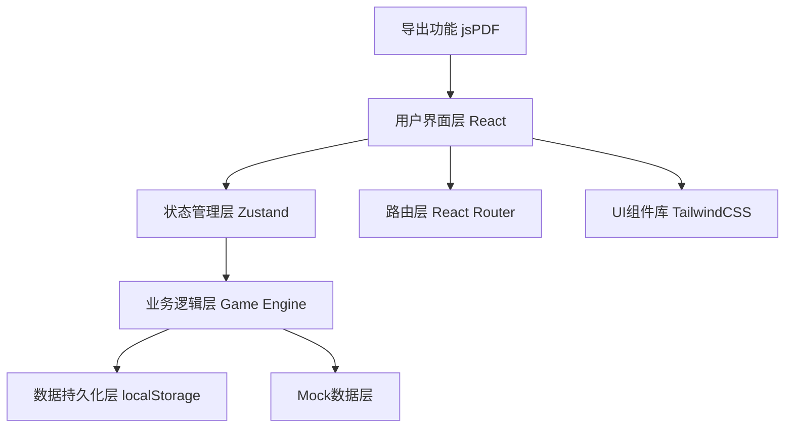

## 1. 架构设计



## 2. 技术选型

- **前端框架**：React@18 + TypeScript
- **构建工具**：Vite@5
- **样式方案**：TailwindCSS@3
- **状态管理**：Zustand（轻量级，适合游戏状态管理）
- **路由管理**：React Router DOM@6
- **PDF导出**：jsPDF + html2canvas
- **动画库**：Framer Motion
- **数据持久化**：localStorage（游戏记录、历史数据）

## 3. 目录结构

```
src/
├── assets/              # 静态资源
│   ├── images/
│   └── fonts/
├── components/          # 通用组件
│   ├── ui/             # 基础UI组件
│   │   ├── Button.tsx
│   │   ├── Card.tsx
│   │   └── Timer.tsx
│   └── game/           # 游戏相关组件
│       ├── MaterialCard.tsx
│       ├── CaseInfo.tsx
│       └── RiskMarker.tsx
├── pages/              # 页面组件
│   ├── HomePage.tsx
│   ├── GamePage.tsx
│   ├── ReportPage.tsx
│   └── HistoryPage.tsx
├── store/              # 状态管理
│   ├── gameStore.ts
│   └── historyStore.ts
├── types/              # TypeScript类型定义
│   ├── game.ts
│   └── history.ts
├── data/               # Mock数据
│   ├── cases.ts
│   └── materials.ts
├── utils/              # 工具函数
│   ├── gameEngine.ts
│   ├── pdfExport.ts
│   └── storage.ts
├── hooks/              # 自定义Hooks
│   ├── useTimer.ts
│   └── useGameLogic.ts
├── App.tsx
├── main.tsx
└── index.css
```

## 4. 路由定义

| 路由 | 页面 | 功能 |
|------|------|------|
| `/` | 主页 | 游戏介绍、开始游戏、历史记录入口 |
| `/game/:caseId` | 游戏页 | 关卡游戏、材料审核、实时反馈 |
| `/report/:gameId` | 结案报告页 | 评分展示、错误详情、导出报告 |
| `/history` | 历史记录页 | 游戏列表、回放、成绩统计 |

## 5. 数据模型

### 5.1 核心数据类型

```typescript
// 案件信息
interface Case {
  id: string;
  title: string;
  description: string;
  customer: {
    name: string;
    avatar: string;
    emotion: 'happy' | 'neutral' | 'angry';
  };
  timeLimit: number; // 秒
  difficulty: 'easy' | 'medium' | 'hard';
  materials: Material[];
  correctAnswers: AnswerKey[];
}

// 材料
interface Material {
  id: string;
  type: 'claim' | 'invoice' | 'photo' | 'policy' | 'emotion' | 'report';
  title: string;
  content: string;
  source: string;
  hasRisk: boolean;
  riskType?: 'duplicate' | 'exemption' | 'timeout' | 'missing';
  riskDescription?: string;
  isComplete: boolean;
  relatedMaterialIds?: string[];
}

// 答案要点
interface AnswerKey {
  materialId: string;
  shouldMarkRisk: boolean;
  riskType?: string;
  points: number;
  explanation: string;
}

// 游戏记录
interface GameRecord {
  id: string;
  caseId: string;
  caseTitle: string;
  startTime: number;
  endTime: number;
  totalTime: number;
  score: number;
  maxScore: number;
  grade: 'S' | 'A' | 'B' | 'C' | 'D';
  answers: UserAnswer[];
  mistakes: Mistake[];
  exported: boolean;
  exportHash?: string;
}

// 用户答案
interface UserAnswer {
  materialId: string;
  markedRisk: boolean;
  riskType?: string;
  isCorrect: boolean;
  timestamp: number;
}

// 错误记录
interface Mistake {
  materialId: string;
  materialTitle: string;
  userAnswer: boolean;
  correctAnswer: boolean;
  pointsLost: number;
  explanation: string;
  source: string;
}
```

### 5.2 状态管理结构

```typescript
// 游戏状态
interface GameState {
  currentCase: Case | null;
  currentMaterialIndex: number;
  selectedMaterials: string[];
  markedRisks: Map<string, string>;
  timeRemaining: number;
  isPlaying: boolean;
  isPaused: boolean;
  score: number;
  startGame: (caseId: string) => void;
  markRisk: (materialId: string, riskType: string) => void;
  unmarkRisk: (materialId: string) => void;
  submitGame: () => GameRecord;
  resetGame: () => void;
}

// 历史记录状态
interface HistoryState {
  records: GameRecord[];
  addRecord: (record: GameRecord) => void;
  getRecord: (id: string) => GameRecord | undefined;
  deleteRecord: (id: string) => void;
  exportToPDF: (id: string) => Promise<Blob>;
  markAsExported: (id: string, hash: string) => void;
}
```

## 6. 核心算法

### 6.1 游戏评分算法
```
总分 = 基础分 - 扣分 + 时间奖励

基础分 = 材料数量 × 10分

扣分规则：
- 漏判风险点：-15分/个
- 误判正常材料：-10分/个
- 保单免责漏判：-30分（2倍权重）

时间奖励 = max(0, 剩余时间 ÷ 总时间 × 20分)

评级标准：
- S级：得分 ≥ 90%
- A级：得分 ≥ 80%
- B级：得分 ≥ 70%
- C级：得分 ≥ 60%
- D级：得分 < 60%
```

### 6.2 票据重复检测
- 扫描所有票据材料的编号
- 相同编号出现次数 > 1 即标记为重复
- 高亮显示重复票据组

### 6.3 数据一致性保障
```typescript
// 导出哈希生成
function generateHash(record: GameRecord): string {
  const data = JSON.stringify({
    id: record.id,
    score: record.score,
    answers: record.answers,
    timestamp: record.endTime
  });
  return btoa(data).slice(0, 16);
}

// 验证哈希
function verifyRecord(record: GameRecord): boolean {
  if (!record.exportHash) return true;
  const expectedHash = generateHash(record);
  return record.exportHash === expectedHash;
}
```

## 7. 存储方案

### 7.1 localStorage键定义
- `insurance_detective_records`: 游戏历史记录数组
- `insurance_detective_settings`: 用户设置

### 7.2 数据迁移策略
- 版本号存储在每条记录中
- 应用启动时检测版本并执行迁移
- 向后兼容旧版本数据格式

## 8. 性能优化

- **组件懒加载**：使用React.lazy拆分页面组件
- **状态按需更新**：避免不必要的重渲染
- **虚拟滚动**：历史记录过多时启用
- **防抖节流**：用户输入和搜索操作
- **图片优化**：使用WebP格式，懒加载
