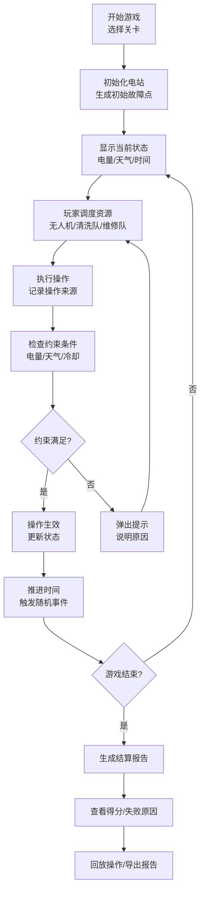
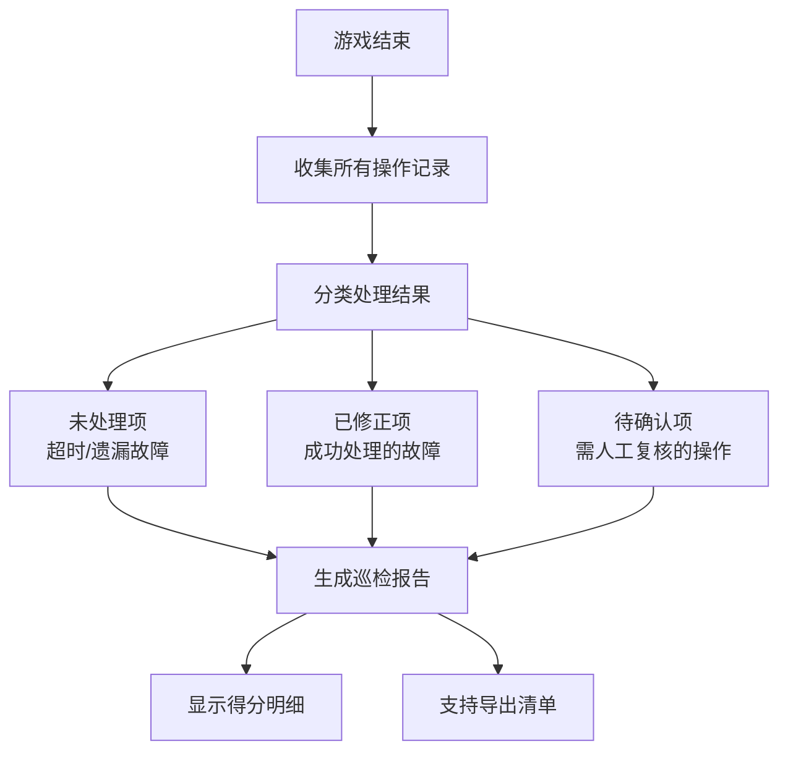

## 1. 产品概述

"光伏电站巡检赛"是一款面向新能源巡检员的培训类模拟游戏，通过调度无人机、清洗队和逆变器维修三种资源，在复杂天气和电量约束下完成光伏电站的巡检、清洁和维修任务。游戏强调流程规范性、风险识别能力和资源调度策略，所有操作均保留可追溯的来源和修正痕迹。

### 产品价值
- 培训目标：提升巡检员的风险预判能力、资源调度效率和故障处理规范
- 核心痛点解决：解决传统培训中"口径不一致"、"风险提示不明确"、"操作痕迹无保留"三大问题
- 目标用户：新能源电站巡检员、运维人员、培训学员

---

## 2. 核心功能

### 2.1 用户角色

| 角色 | 权限 | 核心功能 |
|------|------|----------|
| 巡检员玩家 | 全部游戏功能 | 调度资源、处理故障、查看报告、导出清单 |
| 培训管理员 | 关卡配置 | 设置难度、调整参数、查看学员成绩 |

### 2.2 功能模块

1. **游戏主界面**：电站地图、资源面板、状态栏、事件提示
2. **调度系统**：拖拽分配无人机/清洗队/维修队到目标区域
3. **资源冷却系统**：资源使用后进入冷却期，需等待恢复
4. **天气系统**：实时天气变化，影响无人机飞行和发电效率
5. **电量管理**：电站实时电量，影响设备可用和任务优先级
6. **故障点系统**：随机生成故障，需在时限内处理
7. **优先级评分**：根据任务紧急程度和重要性自动评分
8. **回放系统**：完整记录每轮操作，支持逐帧回看
9. **报告系统**：生成详细巡检报告，区分未处理/已修正/待确认项
10. **导出功能**：导出操作清单和报告为PDF/Excel

### 2.3 页面详情

| 页面名称 | 模块名称 | 功能描述 |
|----------|----------|----------|
| 开始界面 | 关卡选择 | 选择不同难度关卡，显示关卡目标和约束条件 |
| 游戏主界面 | 电站地图 | 可视化展示光伏组件区、故障点、资源位置 |
| 游戏主界面 | 资源面板 | 显示无人机、清洗队、维修队状态和冷却时间 |
| 游戏主界面 | 状态栏 | 实时显示电量、天气、时间、得分 |
| 游戏主界面 | 事件提示 | 弹窗提示电量不足、天气突变、故障漏查等风险 |
| 游戏主界面 | 操作记录 | 侧边栏实时显示所有操作及其来源 |
| 结算界面 | 得分详情 | 展示最终得分、扣分原因、效率评级 |
| 结算界面 | 失败分析 | 逐条列出失败原因和改进建议 |
| 回放界面 | 时间轴 | 拖动时间轴回看每一步操作和事件 |
| 报告界面 | 巡检报告 | 分栏展示未处理、已修正、需人工确认的内容 |
| 报告界面 | 导出功能 | 导出完整报告和操作清单 |

---

## 3. 核心流程

### 3.1 游戏主流程

### 3.2 报告生成流程

---

## 4. 用户界面设计

### 4.1 设计风格

- **主题色**：深蓝科技风（#0F172A）+ 能源绿（#10B981）+ 警示橙（#F59E0B）+ 危险红（#EF4444）
- **视觉风格**：工业科技感，类似SCADA监控系统，数据可视化丰富
- **字体**：标题用 Orbitron（科技感），正文用 Inter（清晰可读）
- **按钮风格**：直角边框，悬停发光效果，点击有按压反馈
- **布局风格**：
  - 左侧：资源面板 + 操作记录
  - 中央：电站地图（核心区域）
  - 右侧：状态栏 + 事件日志
  - 底部：控制栏（暂停、倍速、菜单）
- **图标风格**：线性图标，统一2px线宽，与工业监控系统风格一致

### 4.2 页面设计概览

| 页面名称 | 模块名称 | UI元素 |
|----------|----------|--------|
| 开始界面 | 关卡卡片 | 渐变背景、关卡难度标识、目标预览、开始按钮动效 |
| 游戏主界面 | 电站地图 | 网格布局的组件区、动态故障点标记、资源移动轨迹、天气效果覆盖层 |
| 游戏主界面 | 资源卡片 | 资源图标、状态指示灯（绿/黄/红）、冷却进度条、可拖拽交互 |
| 游戏主界面 | 事件弹窗 | 半透明背景、图标动画、风险等级标识、确认按钮 |
| 结算界面 | 得分面板 | 大号数字动画、进度条展示、扣分项目列表、效率评级徽章 |
| 报告界面 | 三栏布局 | 未处理（红边）、已修正（绿边）、待确认（橙边）、每项带操作来源追溯 |

### 4.3 响应式设计

- **桌面端优先**：1280px及以上为最优体验，支持1920px大屏
- **平板适配**：1024px-1279px，侧边栏可折叠
- **移动适配**：768px-1023px，简化布局，保留核心操作区域
- **触摸优化**：拖拽区域不小于48x48px，关键按钮增大点击区域

### 4.4 动效设计

- **资源调度**：拖拽时半透明跟随，放置时弹性动画
- **故障出现**：脉冲波纹动画，红色闪烁提示
- **天气变化**：渐隐切换，雨天有雨滴粒子效果
- **电量警告**：电量低于30%时状态栏呼吸灯效果
- **操作成功**：绿色对勾缩放动画
- **操作失败**：红色叉号抖动动画
- **页面切换**：滑动过渡，新内容从右侧滑入

---

## 5. 核心规则

### 5.1 资源系统

| 资源类型 | 功能 | 冷却时间 | 电量消耗 | 适用场景 |
|----------|------|----------|----------|----------|
| 无人机 | 巡检大片区域，发现故障点 | 30秒 | 5%/次 | 初步巡检、大面积排查 |
| 清洗队 | 清洁光伏板，提升发电效率 | 60秒 | 10%/次 | 积灰严重区域 |
| 维修队 | 修复逆变器故障 | 90秒 | 15%/次 | 逆变器故障、线路问题 |

### 5.2 评分规则

- **基础分**：1000分
- **故障处理**：及时处理 +50分/个，超时处理 +20分/个，漏查 -100分/个
- **效率加成**：资源利用率>80% +200分，<50% -100分
- **电量管理**：结束时电量>50% +150分，<20% -150分
- **天气应对**：恶劣天气下正确决策 +100分，错误决策 -80分

### 5.3 风险提示规则

- **电量不足**：电量<30%时弹出警告，<15%时强制限制高耗电操作
- **天气突变**：天气变化前10秒预警，变化时弹窗提示影响范围
- **故障漏查**：故障存在超过60秒未处理时红色高亮闪烁，记录为漏查
