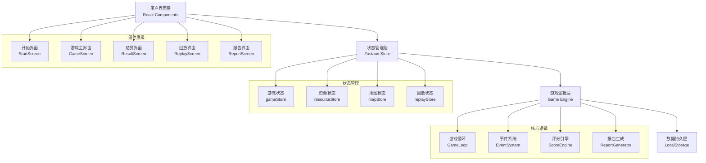

## 1. 架构设计



---

## 2. 技术选型

### 2.1 核心技术栈

| 技术 | 版本 | 用途 |
|------|------|------|
| React | 18.x | 前端框架，组件化开发 |
| TypeScript | 5.x | 类型安全，提升代码质量 |
| Vite | 5.x | 构建工具，快速开发 |
| TailwindCSS | 3.x | 原子化CSS，快速构建UI |
| Zustand | 4.x | 轻量级状态管理 |
| Framer Motion | 11.x | 动画库，实现流畅动效 |
| html2canvas | 1.x | 截图导出 |
| Lucide React | 0.x | 图标库 |

### 2.2 项目结构

```
src/
├── components/          # 通用组件
│   ├── ui/             # 基础UI组件（按钮、卡片、弹窗等）
│   ├── game/           # 游戏相关组件
│   │   ├── Map.tsx     # 电站地图
│   │   ├── ResourcePanel.tsx  # 资源面板
│   │   ├── StatusBar.tsx      # 状态栏
│   │   ├── EventLog.tsx       # 事件日志
│   │   └── OperationRecord.tsx # 操作记录
│   └── layout/         # 布局组件
├── pages/              # 页面组件
│   ├── StartScreen.tsx
│   ├── GameScreen.tsx
│   ├── ResultScreen.tsx
│   ├── ReplayScreen.tsx
│   └── ReportScreen.tsx
├── store/              # 状态管理
│   ├── gameStore.ts
│   ├── resourceStore.ts
│   ├── mapStore.ts
│   └── replayStore.ts
├── engine/             # 游戏引擎
│   ├── GameLoop.ts
│   ├── EventSystem.ts
│   ├── ScoreEngine.ts
│   └── ReportGenerator.ts
├── types/              # TypeScript类型定义
│   ├── game.ts
│   ├── resource.ts
│   └── report.ts
├── data/               # 静态数据和配置
│   ├── levels.ts       # 关卡配置
│   ├── constants.ts    # 游戏常量
│   └── mockData.ts     # 模拟数据
├── hooks/              # 自定义Hooks
│   ├── useGameLoop.ts
│   ├── useDragDrop.ts
│   └── useTimer.ts
├── utils/              # 工具函数
│   ├── export.ts       # 导出功能
│   └── helpers.ts
├── App.tsx
├── main.tsx
└── index.css
```

---

## 3. 路由定义

| 路由路径 | 页面名称 | 描述 |
|----------|----------|------|
| `/` | 开始界面 | 关卡选择、游戏说明 |
| `/game` | 游戏主界面 | 核心游戏玩法 |
| `/result` | 结算界面 | 得分详情、失败分析 |
| `/replay` | 回放界面 | 操作回放、时间轴控制 |
| `/report` | 报告界面 | 巡检报告、导出功能 |

---

## 4. 数据模型

### 4.1 核心类型定义

```typescript
// 游戏状态
interface GameState {
  status: 'idle' | 'playing' | 'paused' | 'finished';
  level: Level;
  currentTime: number;  // 游戏内时间（秒）
  totalTime: number;    // 总时长
  score: number;
  battery: number;      // 电量 0-100
  weather: WeatherType;
  weatherForecast: WeatherType[];  // 未来天气预测
  faults: Fault[];
  operations: Operation[];
  events: GameEvent[];
}

// 资源类型
type ResourceType = 'drone' | 'cleaner' | 'repair';

interface Resource {
  id: string;
  type: ResourceType;
  name: string;
  status: 'available' | 'cooling' | 'working';
  cooldownTime: number;  // 剩余冷却时间
  totalCooldown: number; // 总冷却时间
  batteryCost: number;
  currentTarget?: string; // 当前目标区域ID
}

// 故障点
interface Fault {
  id: string;
  areaId: string;
  type: 'panel_dirty' | 'inverter_fault' | 'wire_damage' | 'unknown';
  priority: 'low' | 'medium' | 'high' | 'critical';
  discoveredAt: number;
  deadline: number;      // 处理时限
  status: 'pending' | 'processing' | 'fixed' | 'missed';
  handledBy?: string;    // 处理者资源ID
  handledAt?: number;
  source: string;        // 来源（无人机巡检/人工报告/系统警报）
}

// 操作记录
interface Operation {
  id: string;
  timestamp: number;
  resourceId: string;
  resourceType: ResourceType;
  targetAreaId: string;
  action: 'inspect' | 'clean' | 'repair';
  result: 'success' | 'failed' | 'pending';
  source: string;        // 操作来源（玩家/系统）
  remarks?: string;      // 修正痕迹
  corrections?: Correction[];
}

// 修正记录
interface Correction {
  id: string;
  timestamp: number;
  operator: string;
  reason: string;
  content: string;
}

// 游戏事件
interface GameEvent {
  id: string;
  timestamp: number;
  type: 'weather_change' | 'battery_warning' | 'fault_missed' | 'info';
  level: 'info' | 'warning' | 'danger';
  title: string;
  message: string;
  acknowledged: boolean;
}

// 巡检报告
interface InspectionReport {
  gameId: string;
  levelName: string;
  startTime: number;
  endTime: number;
  totalScore: number;
  scoreBreakdown: ScoreItem[];
  unhandledItems: ReportItem[];      // 未处理
  correctedItems: ReportItem[];      // 已修正
  needConfirmItems: ReportItem[];    // 需人工确认
  efficiency: number;                // 资源利用率
  batteryManagement: number;         // 电量管理评分
  operationLogs: Operation[];
}

interface ReportItem {
  id: string;
  type: string;
  description: string;
  areaId: string;
  discoveredAt: number;
  priority: string;
  source: string;
  handler?: string;
  remarks?: string;
}
```

### 4.2 关卡配置

```typescript
interface Level {
  id: string;
  name: string;
  difficulty: 'easy' | 'medium' | 'hard';
  description: string;
  totalTime: number;           // 游戏时长（秒）
  initialBattery: number;      // 初始电量
  batteryDecayRate: number;    // 电量自然消耗速率
  faultFrequency: number;      // 故障生成频率
  weatherChangeRate: number;   // 天气变化频率
  mapLayout: Area[];           // 地图布局
  initialFaults: Fault[];      // 初始故障
  objectives: Objective[];     // 关卡目标
}

interface Area {
  id: string;
  name: string;
  type: 'panel' | 'inverter' | 'substation' | 'road';
  position: { x: number; y: number };
  size: { width: number; height: number };
  status: 'normal' | 'warning' | 'danger';
  cleanliness: number;  // 清洁度 0-100
}
```

---

## 5. 核心模块设计

### 5.1 游戏循环引擎

```typescript
class GameLoop {
  private tickRate: number = 1000;  // 每秒1 tick
  private lastTick: number = 0;
  private accumulator: number = 0;
  
  start(): void;
  pause(): void;
  resume(): void;
  stop(): void;
  
  // 每tick执行的逻辑
  private tick(deltaTime: number): void {
    // 1. 更新电量
    this.updateBattery();
    // 2. 检查天气变化
    this.checkWeatherChange();
    // 3. 生成新故障
    this.generateFaults();
    // 4. 更新资源冷却
    this.updateResourceCooldowns();
    // 5. 检查故障超时
    this.checkFaultDeadlines();
    // 6. 推进游戏时间
    this.advanceTime();
    // 7. 检查游戏结束
    this.checkGameEnd();
  }
}
```

### 5.2 评分引擎

```typescript
class ScoreEngine {
  calculateScore(gameState: GameState): ScoreResult {
    let score = 1000;  // 基础分
    const breakdown: ScoreItem[] = [];
    
    // 故障处理得分
    const fixedFaults = gameState.faults.filter(f => f.status === 'fixed');
    const missedFaults = gameState.faults.filter(f => f.status === 'missed');
    
    fixedFaults.forEach(fault => {
      const isOnTime = fault.handledAt! <= fault.deadline;
      const points = isOnTime ? 50 : 20;
      score += points;
      breakdown.push({
        category: '故障处理',
        description: `${fault.type} ${isOnTime ? '及时' : '超时'}处理`,
        points
      });
    });
    
    missedFaults.forEach(fault => {
      score -= 100;
      breakdown.push({
        category: '漏查故障',
        description: `${fault.type} 未及时处理`,
        points: -100
      });
    });
    
    // 效率加成
    const efficiency = this.calculateEfficiency(gameState);
    if (efficiency > 0.8) {
      score += 200;
      breakdown.push({ category: '效率加成', description: '资源利用率>80%', points: 200 });
    } else if (efficiency < 0.5) {
      score -= 100;
      breakdown.push({ category: '效率惩罚', description: '资源利用率<50%', points: -100 });
    }
    
    return { totalScore: score, breakdown };
  }
}
```

### 5.3 报告生成器

```typescript
class ReportGenerator {
  generateReport(gameState: GameState): InspectionReport {
    const unhandledItems = this.getUnhandledItems(gameState);
    const correctedItems = this.getCorrectedItems(gameState);
    const needConfirmItems = this.getNeedConfirmItems(gameState);
    
    return {
      gameId: generateId(),
      levelName: gameState.level.name,
      startTime: gameState.operations[0]?.timestamp || 0,
      endTime: gameState.currentTime,
      totalScore: gameState.score,
      scoreBreakdown: this.getScoreBreakdown(gameState),
      unhandledItems,
      correctedItems,
      needConfirmItems,
      efficiency: this.calculateEfficiency(gameState),
      batteryManagement: this.evaluateBatteryManagement(gameState),
      operationLogs: gameState.operations
    };
  }
  
  private getUnhandledItems(state: GameState): ReportItem[] {
    return state.faults
      .filter(f => f.status === 'missed' || f.status === 'pending')
      .map(f => ({
        id: f.id,
        type: f.type,
        description: this.getFaultDescription(f),
        areaId: f.areaId,
        discoveredAt: f.discoveredAt,
        priority: f.priority,
        source: f.source
      }));
  }
  
  private getCorrectedItems(state: GameState): ReportItem[] {
    return state.faults
      .filter(f => f.status === 'fixed')
      .map(f => ({
        id: f.id,
        type: f.type,
        description: this.getFaultDescription(f),
        areaId: f.areaId,
        discoveredAt: f.discoveredAt,
        priority: f.priority,
        source: f.source,
        handler: f.handledBy,
        remarks: `于 ${formatTime(f.handledAt!)} 处理完成`
      }));
  }
  
  private getNeedConfirmItems(state: GameState): ReportItem[] {
    // 需要人工确认的：处理结果存疑、来源不明确、有修正记录的操作
    return state.operations
      .filter(op => op.corrections && op.corrections.length > 0)
      .map(op => ({
        id: op.id,
        type: op.action,
        description: `${op.resourceType} 执行 ${op.action}`,
        areaId: op.targetAreaId,
        discoveredAt: op.timestamp,
        priority: 'medium',
        source: op.source,
        handler: op.resourceId,
        remarks: `存在 ${op.corrections!.length} 条修正记录，需人工复核`
      }));
  }
}
```

---

## 6. 导出功能

### 6.1 支持格式

| 格式 | 内容 | 用途 |
|------|------|------|
| JSON | 完整游戏数据 | 数据归档、导入回放 |
| CSV | 操作清单、故障列表 | 表格分析 |
| PDF | 格式化巡检报告 | 打印存档 |

### 6.2 导出接口

```typescript
// 导出为JSON
export function exportToJSON(report: InspectionReport): string;

// 导出为CSV
export function exportToCSV(report: InspectionReport): string;

// 导出为PDF（使用html2canvas + jspdf）
export async function exportToPDF(reportElement: HTMLElement): Promise<void>;
```

---

## 7. 性能优化

### 7.1 优化策略

1. **状态管理优化**：使用Zustand的selectors避免不必要的重渲染
2. **地图渲染优化**：使用CSS transform而非top/left定位，减少重排
3. **动画优化**：使用will-change和transform开启GPU加速
4. **列表虚拟化**：操作记录和事件日志使用虚拟滚动
5. **内存管理**：游戏结束后及时清理定时器和事件监听器

### 7.2 浏览器兼容性

- 支持Chrome 90+、Firefox 88+、Safari 14+
- 使用CSS变量和Grid布局
- 不依赖过时的API
