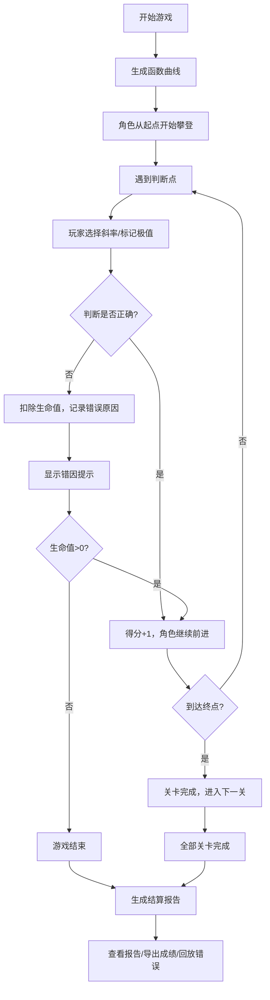

## 1. 产品概述

数学函数攀岩是一款数学教育类闯关游戏，玩家通过判断函数曲线的斜率和极值点，操控角色沿曲线攀登。游戏旨在帮助学生直观理解微积分概念，在互动中掌握导数、极值点、不可导点等核心知识。

- 核心目标：让玩家在游戏中学习和巩固微积分基础知识
- 目标用户：高中生、大学生及数学爱好者
- 产品价值：将抽象的数学概念转化为可视化、互动化的游戏体验

## 2. 核心功能

### 2.1 用户角色
| 角色 | 注册方式 | 核心权限 |
|------|----------|----------|
| 玩家 | 无需注册，本地游玩 | 进行游戏、查看历史记录、导出成绩报告 |

### 2.2 功能模块
1. **游戏主界面**：函数曲线展示、角色移动、实时交互
2. **关卡系统**：曲线生成、难度递增、多关卡挑战
3. **判断系统**：斜率判定、极值点识别、特殊点检测
4. **反馈系统**：即时提示、错误回放、关卡评价
5. **报告系统**：成绩统计、错误分类、导出功能
6. **记录系统**：闯关记录、修正痕迹、来源追踪

### 2.3 页面详情
| 页面名称 | 模块名称 | 功能描述 |
|---------|----------|----------|
| 开始页面 | 游戏入口 | 游戏介绍、开始按钮、历史记录入口 |
| 游戏页面 | 曲线画布 | 动态绘制函数曲线、角色攀登动画 |
| 游戏页面 | 交互面板 | 斜率选择、极值点标记、提交判断 |
| 游戏页面 | 状态显示 | 当前得分、关卡进度、生命值、提示信息 |
| 结算页面 | 成绩展示 | 总得分、正确率、详细错误列表 |
| 结算页面 | 报告导出 | 分类展示未处理/已修正/需人工确认内容、支持导出 |
| 历史页面 | 记录列表 | 历史闯关记录、错因回放、修正痕迹查看 |

## 3. 核心流程

## 4. 用户界面设计

### 4.1 设计风格
- **主色调**：深靛蓝 (#1e3a5f) 作为背景，搭配科技感的青色 (#00d4ff) 作为强调色
- **辅助色**：警告红 (#ff6b6b)、成功绿 (#51cf66)、提示黄 (#ffd43b)
- **按钮风格**：圆角矩形，带有微妙的阴影和悬停动画
- **字体**：使用 JetBrains Mono 作为数字和公式字体，Noto Sans SC 作为中文界面字体
- **布局风格**：左侧为曲线画布，右侧为交互面板，底部为状态栏
- **视觉元素**：函数曲线使用渐变描边，角色使用攀岩小人图标，特殊点（不可导点、极值点）使用不同形状标记

### 4.2 页面设计概述
| 页面名称 | 模块名称 | UI 元素 |
|---------|----------|----------|
| 开始页面 | 主标题区 | 大字体游戏名称、数学公式装饰、渐变背景 |
| 开始页面 | 功能入口 | 开始游戏按钮、历史记录按钮、游戏说明卡片 |
| 游戏页面 | 曲线画布 | Canvas 绘制区域、坐标系、函数曲线、角色精灵 |
| 游戏页面 | 交互面板 | 斜率选择器、极值点开关、提交按钮、提示按钮 |
| 游戏页面 | 状态栏 | 得分显示、关卡进度条、生命值心形图标、当前函数表达式 |
| 结算页面 | 成绩概览 | 总分圆环图、正确率进度条、关卡完成列表 |
| 结算页面 | 错误详情 | 分类标签页（未处理/已修正/需人工确认）、错误卡片列表 |
| 结算页面 | 操作区 | 回放按钮、导出报告按钮、重新开始按钮 |

### 4.3 响应式设计
- 桌面端：左右分栏布局，左侧画布占 70%，右侧面板占 30%
- 平板端：保持左右布局，调整比例为 60%/40%
- 移动端：上下布局，画布在上，面板在下，优化触摸交互区域

### 4.4 交互与动画
- 角色移动：沿曲线平滑滑动，带有弹跳效果
- 判断反馈：正确时显示绿色光晕并播放上升动画，错误时红色闪烁并播放震动效果
- 曲线生成：从左到右逐步绘制，带有流光效果
- 特殊点提示：不可导点显示警示图标，极值点显示星标，悬停显示详细说明
- 页面切换：使用淡入淡出和滑动过渡动画
