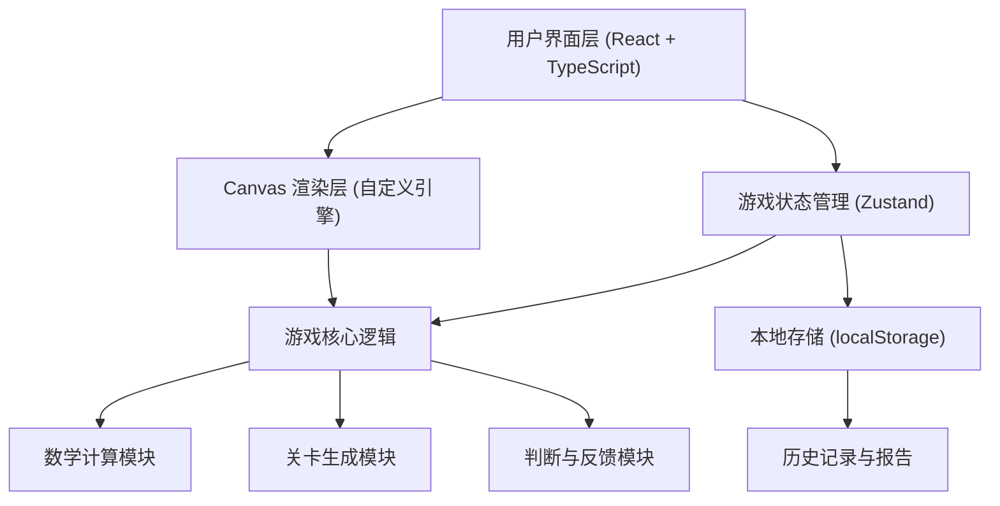

## 1. 架构设计



## 2. 技术描述

- **前端框架**：React 18 + TypeScript 5
- **构建工具**：Vite 5
- **样式方案**：Tailwind CSS 3 + CSS Variables
- **状态管理**：Zustand（轻量级，适合游戏状态管理）
- **渲染引擎**：HTML5 Canvas 2D（自定义游戏循环）
- **数学计算**：math.js（函数解析、求导、极值计算）
- **图标方案**：Lucide React
- **数据存储**：localStorage（本地存储游戏记录）
- **后端**：无（纯前端应用，所有计算在客户端完成）

## 3. 核心模块与文件结构

```
src/
├── components/          # React 组件
│   ├── game/           # 游戏相关组件
│   │   ├── GameCanvas.tsx      # 游戏画布
│   │   ├── ControlPanel.tsx    # 交互控制面板
│   │   ├── StatusBar.tsx       # 状态栏
│   │   └── Character.tsx       # 角色组件
│   ├── ui/             # 通用UI组件
│   │   ├── Button.tsx
│   │   ├── ProgressBar.tsx
│   │   └── Modal.tsx
│   ├── pages/          # 页面组件
│   │   ├── StartPage.tsx
│   │   ├── GamePage.tsx
│   │   ├── ResultPage.tsx
│   │   └── HistoryPage.tsx
│   └── report/         # 报告相关组件
│       ├── ScoreOverview.tsx
│       ├── ErrorList.tsx
│       └── ExportButton.tsx
├── store/              # 状态管理
│   └── useGameStore.ts
├── engine/             # 游戏引擎
│   ├── GameLoop.ts          # 游戏循环
│   ├── CurveRenderer.ts     # 曲线渲染
│   └── CharacterController.ts # 角色控制
├── math/               # 数学模块
│   ├── FunctionGenerator.ts  # 函数生成
│   ├── DerivativeCalculator.ts # 导数计算
│   ├── ExtremumDetector.ts   # 极值检测
│   └── SpecialPointHandler.ts # 特殊点处理
├── types/              # TypeScript 类型定义
│   └── index.ts
├── utils/              # 工具函数
│   ├── storage.ts      # 本地存储
│   ├── export.ts       # 导出功能
│   └── animation.ts    # 动画工具
├── data/               # 数据配置
│   ├── levels.ts       # 关卡配置
│   └── functions.ts    # 函数库
├── App.tsx
├── main.tsx
└── index.css
```

## 4. 核心数据结构定义

### 4.1 游戏状态

```typescript
interface GameState {
  currentLevel: number;
  score: number;
  lives: number;
  status: 'idle' | 'playing' | 'paused' | 'gameOver' | 'levelComplete';
  currentFunction: MathFunction;
  characterPosition: Point;
  judgementPoints: JudgementPoint[];
  currentJudgementIndex: number;
  gameHistory: GameRecord[];
  errors: ErrorRecord[];
}
```

### 4.2 数学函数

```typescript
interface MathFunction {
  id: string;
  expression: string;
  displayExpression: string;
  domain: [number, number];
  range: [number, number];
  derivative?: string;
  specialPoints: SpecialPoint[];
  difficulty: 'easy' | 'medium' | 'hard';
}

interface SpecialPoint {
  x: number;
  y: number;
  type: 'extremum_max' | 'extremum_min' | 'non_differentiable' | 'discontinuity';
  description: string;
}
```

### 4.3 判断点

```typescript
interface JudgementPoint {
  id: string;
  x: number;
  y: number;
  type: 'slope' | 'extremum';
  correctAnswer: SlopeType | boolean;
  playerAnswer?: SlopeType | boolean;
  isCorrect?: boolean;
  timestamp?: number;
  errorReason?: string;
}

type SlopeType = 'positive' | 'negative' | 'zero' | 'undefined';
```

### 4.4 错误记录

```typescript
interface ErrorRecord {
  id: string;
  levelId: number;
  functionId: string;
  point: Point;
  judgementType: 'slope' | 'extremum';
  playerAnswer: string;
  correctAnswer: string;
  reason: string;
  correctionStatus: 'unprocessed' | 'corrected' | 'needs_manual_review';
  correctionNote?: string;
  timestamp: number;
}
```

### 4.5 游戏记录

```typescript
interface GameRecord {
  id: string;
  startTime: number;
  endTime: number;
  totalScore: number;
  levelsCompleted: number;
  totalJudgements: number;
  correctJudgements: number;
  errors: ErrorRecord[];
  functionHistory: string[];
}
```

## 5. 关键技术实现

### 5.1 函数曲线渲染
- 使用 math.js 解析函数表达式并计算坐标点
- Canvas 2D 绘制平滑曲线，使用贝塞尔曲线优化
- 实现坐标系统映射：数学坐标 → 画布坐标

### 5.2 角色沿曲线移动
- 预计算曲线上的点序列
- 根据进度索引获取当前位置
- 使用线性插值实现平滑移动动画

### 5.3 导数与斜率计算
- 使用 math.js 的 derivative 函数计算导函数
- 在判断点计算导数值，判断斜率类型
- 处理不可导点的特殊逻辑

### 5.4 极值点检测
- 分析导函数的零点和符号变化
- 区分极大值、极小值
- 检测不可导点是否为极值点

### 5.5 特殊点处理
- 不可导点：绝对值函数、分段函数的尖点
- 间断点：函数不连续的位置
- 这些点需要特殊标记和提示，不进行正常斜率判断

### 5.6 报告生成与导出
- 按修正状态分类错误记录
- 生成 JSON 和 CSV 格式的报告
- 支持下载报告文件

## 6. 关卡设计

| 关卡 | 难度 | 函数类型 | 特点 |
|------|------|----------|------|
| 1 | 简单 | 一次函数 (y = kx + b) | 学习基础斜率判断 |
| 2 | 简单 | 二次函数 (y = ax² + bx + c) | 引入极值点概念 |
| 3 | 中等 | 三次函数 | 多个极值点 |
| 4 | 中等 | 三角函数 (sin, cos) | 周期性极值 |
| 5 | 中等 | 绝对值函数 | 引入不可导点 |
| 6 | 困难 | 复合函数 | 复杂导数计算 |
| 7 | 困难 | 分段函数 | 多段曲线，间断点 |
| 8 | 困难 | 高次多项式 | 多个极值点和拐点 |
