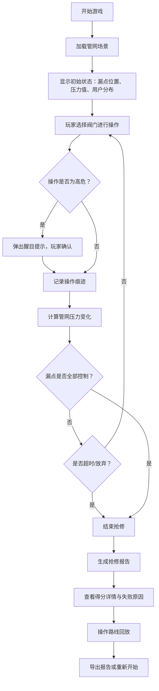

## 1. 产品概述

"流体管路抢修局"是一款面向水务从业人员的培训类交互式游戏原型。玩家在模拟管网抢修场景中，通过选择关闭阀门来控制漏点，需要在"止漏效果"与"居民影响"之间找到最佳平衡，理解管网拓扑与压力传导的工程逻辑。

- 核心目标：通过游戏化方式教授管网抢修策略，避免常见操作失误
- 目标用户：水务培训师、管网运维人员、新入职技术人员
- 产品价值：将抽象的管网知识转化为可交互、可回放、可复盘的实操训练

---

## 2. 核心功能

### 2.1 用户角色

| 角色 | 注册方式 | 核心权限 |
|------|----------|----------|
| 培训学员 | 无需注册，直接进入 | 进行抢修演练、查看报告、回放操作 |
| 培训讲师 | 无需注册 | 可切换不同难度场景、导出学员报告 |

### 2.2 功能模块

1. **游戏主界面**：管网可视化画布、实时状态面板、操作控制区
2. **压力反馈系统**：实时压力监测、异常压力预警、压力变化趋势
3. **评分系统**：止漏得分、影响扣分、操作合规性评分、综合评级
4. **操作回放**：步骤逐帧回放、关键节点标注、失误点高亮
5. **抢修报告**：未处理项、已修正项、人工确认项分类统计，支持导出
6. **异常提示**：误关主阀、压力过低、影响区重复等高危操作醒目提示

### 2.3 页面详情

| 页面名称 | 模块名称 | 功能描述 |
|---------|---------|----------|
| 游戏主界面 | 管网画布 | SVG绘制管网拓扑，支持阀门点击开关、漏点高亮、用户区标注 |
| 游戏主界面 | 状态面板 | 实时压力值、漏点状态、受影响用户数、已用时间 |
| 游戏主界面 | 操作控制 | 阀门开关确认、撤销上一步、结束抢修、重置关卡 |
| 游戏主界面 | 异常提示条 | 高危操作发生时顶部弹出红色警示，需确认后继续 |
| 操作回放 | 时间轴 | 拖动时间滑块查看每一步操作，支持播放/暂停/倍速 |
| 操作回放 | 节点标注 | 关键决策点、失误点在时间轴上用不同颜色标记 |
| 抢修报告 | 分类统计 | 未处理漏点、已修复漏点、影响区域、异常操作分类列表 |
| 抢修报告 | 得分详情 | 各项得分明细、扣分原因、最终评级 |
| 抢修报告 | 导出功能 | 支持导出JSON格式报告，保留完整操作痕迹 |

---

## 3. 核心流程

---

## 4. 用户界面设计

### 4.1 设计风格

- **主色调**：工业蓝 (#1E3A5F) 作为主色，代表水务与专业感
- **辅助色**：警示红 (#E53935) 用于异常提示，安全绿 (#43A047) 用于正常状态，警告橙 (#FB8C00) 用于压力警告
- **字体**：JetBrains Mono 作为数字和代码显示，Noto Sans SC 作为中文主体
- **视觉风格**：工业控制面板风格，深色背景配合霓虹色高亮，模拟真实SCADA系统
- **图标风格**：线性图标配合填充状态，阀门用圆形图标，漏点用水滴闪烁动画

### 4.2 页面设计概述

| 页面名称 | 模块名称 | UI元素 |
|---------|---------|--------|
| 游戏主界面 | 管网画布 | 深色背景，管线用渐变线条，阀门可点击，漏点脉冲动画，用户区色块 |
| 游戏主界面 | 状态面板 | 左侧固定面板，卡片式布局，数据大号字体显示，异常值变红闪烁 |
| 游戏主界面 | 操作控制 | 底部控制栏，按钮立体效果，高危操作按钮带红色边框 |
| 操作回放 | 时间轴 | 底部横向时间轴，节点标记，播放控制按钮组 |
| 抢修报告 | 报告内容 | 三栏布局（未处理/已修正/待确认），每项带来源追溯链接 |

### 4.3 响应式

- 桌面端优先设计，最小支持1280px宽度
- 管网画布自适应缩放，保持比例
- 移动端简化为垂直布局，状态面板移至顶部

### 4.4 交互细节

- 阀门悬停：放大1.2倍，显示阀门编号和当前状态
- 阀门点击：0.3s旋转动画，颜色从绿变红（关）或红变绿（开）
- 压力异常：数值红色闪烁，面板边框呼吸灯效果
- 漏点控制：水滴图标停止闪烁，变为灰色打勾状态
- 报告导出：按钮点击后有生成进度动画，完成后显示下载链接
