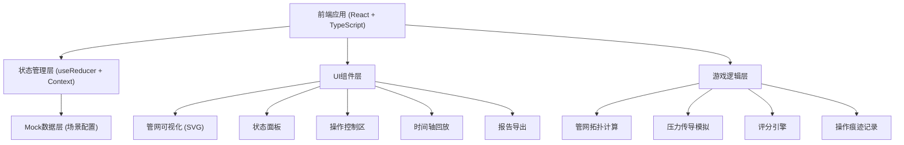

## 1. 架构设计



## 2. 技术描述

- **前端框架**: React@18 + TypeScript
- **构建工具**: Vite@5
- **样式方案**: TailwindCSS@3 + CSS变量
- **状态管理**: React useReducer + Context API (轻量方案，无需Redux)
- **可视化**: 原生SVG + CSS动画 (管网绘制、压力变化、漏点动画)
- **图标**: Lucide React
- **后端**: 无后端，纯前端实现，数据本地存储
- **数据持久化**: LocalStorage 保存游戏进度和报告

## 3. 核心目录结构

```
src/
├── components/
│   ├── PipeNetwork/       # 管网可视化组件
│   ├── StatusPanel/       # 状态面板组件
│   ├── ControlBar/        # 操作控制栏
│   ├── AlertModal/        # 异常提示弹窗
│   ├── Timeline/          # 回放时间轴
│   └── Report/            # 报告组件
├── game/
│   ├── types.ts           # 类型定义
│   ├── config.ts          # 场景配置
│   ├── engine.ts          # 游戏引擎核心
│   ├── pressure.ts        # 压力计算
│   ├── scoring.ts         # 评分逻辑
│   └── history.ts         # 操作历史管理
├── context/
│   └── GameContext.tsx    # 游戏状态上下文
├── hooks/
│   └── useGameEngine.ts   # 游戏引擎Hook
├── utils/
│   └── export.ts          # 报告导出工具
└── App.tsx
```

## 4. 核心数据模型

### 4.1 管网元素类型定义

```typescript
// 管网节点类型
type NodeType = 'source' | 'junction' | 'valve' | 'user' | 'leak';

// 管网节点
interface PipeNode {
  id: string;
  type: NodeType;
  x: number;
  y: number;
  name: string;
  isMainValve?: boolean;  // 是否为主阀
  pressure?: number;      // 当前压力
  basePressure?: number;  // 基准压力
}

// 管线连接
interface PipeConnection {
  id: string;
  from: string;      // 起点节点ID
  to: string;        // 终点节点ID
  diameter: number;  // 管径
  isActive: boolean; // 是否通水（两端阀门都开）
}

// 阀门状态
interface ValveState {
  nodeId: string;
  isOpen: boolean;
  operatedAt: number;
  operator: 'player' | 'system';
}

// 漏点状态
interface LeakState {
  nodeId: string;
  isControlled: boolean;
  flowRate: number;  // 漏水速率
}

// 用户区域
interface UserZone {
  id: string;
  nodeIds: string[];   // 关联的节点
  name: string;
  population: number;  // 影响人数
  hasWater: boolean;   // 是否有水
}
```

### 4.2 游戏状态类型

```typescript
// 单步操作记录
interface OperationStep {
  id: string;
  timestamp: number;
  type: 'valve_toggle';
  valveId: string;
  previousState: boolean;
  newState: boolean;
  isHighRisk: boolean;
  warningType?: 'main_valve' | 'low_pressure' | 'duplicate_zone';
  confirmed?: boolean;
}

// 游戏状态
interface GameState {
  status: 'idle' | 'playing' | 'paused' | 'finished';
  startTime: number | null;
  endTime: number | null;
  currentStep: number;
  nodes: PipeNode[];
  connections: PipeConnection[];
  valves: Map<string, ValveState>;
  leaks: Map<string, LeakState>;
  userZones: UserZone[];
  operations: OperationStep[];
  alerts: Alert[];
  score: Score;
}

// 评分详情
interface Score {
  total: number;
  leakControl: number;       // 止漏得分
  userImpact: number;        // 用户影响扣分
  operationEfficiency: number; // 操作效率分
  compliance: number;        // 合规性评分
  level: 'S' | 'A' | 'B' | 'C' | 'D';
}

// 抢修报告
interface RepairReport {
  gameId: string;
  generatedAt: number;
  duration: number;
  totalScore: Score;
  unhandled: ReportItem[];      // 未处理
  corrected: ReportItem[];      // 已修正
  needConfirmation: ReportItem[]; // 需人工确认
  operationTrail: OperationStep[];
  failureAnalysis: string[];
}

interface ReportItem {
  id: string;
  type: string;
  description: string;
  source: string;  // 来源追溯
  timestamp: number;
}
```

## 5. 核心算法

### 5.1 管网连通性计算

使用BFS/DFS算法，从水源节点出发，计算当前阀门状态下的管网连通分支，判断哪些区域有水、哪些区域被隔离。

### 5.2 压力传导模拟

基于简化的流体力学模型：
- 压力随距离衰减
- 支管压力低于干管
- 漏点会导致局部压力下降
- 阀门关闭会阻断压力传导

### 5.3 评分引擎

```
总分 = 止漏得分 - 用户影响扣分 + 操作效率分 + 合规性分

- 止漏得分：每个受控漏点 +20分，未受控 -10分
- 用户影响：每个受影响用户 -0.1分，重复影响区域额外 -5分
- 操作效率：基础100分，每步操作 -2分
- 合规性分：误关主阀 -50分，压力过低 -30分
```

## 6. 报告导出

支持导出JSON格式报告，包含：
- 完整操作痕迹（含时间戳、确认状态）
- 每项得分明细与扣分原因
- 未处理/已修正/待确认分类清单
- 失败原因分析（基于规则引擎生成）
