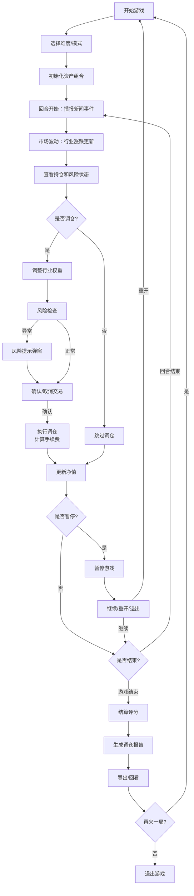

## 1. 产品概述

"基金经理调仓赛"是一款面向投资者教育的浏览器端策略游戏，通过模拟行业轮动、风险预算管理、调仓决策等真实投资场景，帮助用户建立正确的投资理念和风险管理意识。

- 核心目标：通过游戏化方式教授资产配置、风险控制、行业轮动等投资知识
- 目标用户：个人投资者、理财新手、投教平台学员
- 产品价值：寓教于乐，在实践中学习投资知识，规避常见投资误区

## 2. 核心功能

### 2.1 用户角色
| 角色 | 注册方式 | 核心权限 |
|------|----------|----------|
| 玩家 | 无需注册，直接进入 | 完整游戏体验、报告导出、历史记录查看 |

### 2.2 功能模块
1. **游戏主界面**：行业卡片展示、持仓面板、风险仪表盘、净值曲线
2. **调仓操作区**：权重调整、买入/卖出、手续费计算、风险提示
3. **回合事件系统**：新闻事件播报、市场波动、行业涨跌
4. **结算报告系统**：得分计算、失败原因分析、调仓历史回放
5. **报告导出**：完整调仓报告、操作痕迹、净值曲线导出

### 2.3 页面详情
| 页面名称 | 模块名称 | 功能描述 |
|---------|----------|----------|
| 游戏开始页 | 开始面板 | 游戏规则说明、难度选择、开始按钮 |
| 游戏主界面 | 行业卡片区 | 展示各行业板块、实时涨跌幅、PE/PB估值 |
| 游戏主界面 | 持仓面板 | 当前持仓权重、市值变化、盈亏统计 |
| 游戏主界面 | 风险仪表盘 | 风险预算使用情况、集中度警告、杠杆率 |
| 游戏主界面 | 调仓操作区 | 滑块调整权重、确认交易、手续费预览 |
| 游戏主界面 | 新闻事件区 | 回合事件播报、市场影响分析 |
| 游戏主界面 | 净值曲线区 | 实时净值走势、基准对比、最大回撤 |
| 结算报告页 | 得分面板 | 最终收益率、风险调整后收益、综合得分 |
| 结算报告页 | 失败原因 | 单行业过重、追涨杀跌、手续费侵蚀等问题分析 |
| 结算报告页 | 历史回放 | 逐回合调仓记录、净值变化回放 |
| 结算报告页 | 报告导出 | PDF/图片格式报告下载、操作痕迹完整记录 |

## 3. 核心流程

## 4. 用户界面设计

### 4.1 设计风格
- **设计主题**：专业金融风 x 游戏化趣味性
- **主色调**：深蓝 (#165DFF) 代表专业信任，搭配深灰背景营造高端感
- **强调色**：
  - 上涨：翠绿 (#00B42A)
  - 下跌：赤红 (#F53F3F)
  - 警告：暖橙 (#FF7D00)
  - 风险：紫红 (#EB2F96)
- **字体方案**：
  - 标题：Playfair Display（衬线字体，彰显专业金融感）
  - 正文：Inter（清晰易读的无衬线字体）
  - 数字：JetBrains Mono（等宽字体，便于数字对比）
- **按钮风格**：圆角 8px，轻微悬浮效果，点击反馈动画
- **布局风格**：卡片式布局，分区明确，信息层次清晰
- **视觉元素**：微妙的网格背景、渐变面板、发光效果点缀

### 4.2 页面设计概述
| 页面名称 | 模块名称 | UI 元素 |
|---------|----------|----------|
| 游戏开始页 | 开始面板 | 大标题、游戏简介、难度选择卡片、开始按钮、规则折叠面板 |
| 游戏主界面 | 行业卡片区 | 网格布局卡片、行业图标、涨跌幅数字、估值指标、悬浮放大效果 |
| 游戏主界面 | 持仓面板 | 饼图可视化、持仓列表、权重条、盈亏数字动画 |
| 游戏主界面 | 风险仪表盘 | 半圆仪表盘动画、风险等级指示、异常项高亮闪烁 |
| 游戏主界面 | 调仓操作区 | 滑块组件、实时预览、手续费计算、确认/取消按钮 |
| 游戏主界面 | 新闻事件区 | 时间线布局、新消息入场动画、分类标签 |
| 游戏主界面 | 净值曲线区 | 交互式折线图、悬停数据点、基准线对比 |
| 结算报告页 | 得分面板 | 大号数字、星级评定、分项得分雷达图 |
| 结算报告页 | 失败原因 | 问题卡片、严重程度标记、改进建议 |
| 结算报告页 | 历史回放 | 回合选择器、步进播放、数据同步高亮 |

### 4.3 响应式
- **设计策略**：桌面端优先，移动端自适应
- **断点设置**：1200px（桌面）、768px（平板）、480px（手机）
- **移动端优化**：
  - 行业卡片改为单列滚动
  - 调仓区改为底部浮层
  - 净值曲线支持手势缩放
  - 触摸区域放大至 48px 以上

### 4.4 动画与交互
- **入场动画**：页面加载时元素错落出现（staggered reveal）
- **数据更新**：数字跳动动画、曲线平滑过渡
- **风险警告**：边框发光、图标抖动
- **调仓确认**：确认时的涟漪扩散效果
- **回合切换**：新闻卡片滑入、市场波动闪烁提示
