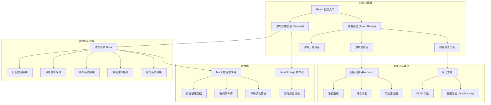

## 1. 架构设计



## 2. 技术描述

- **前端框架**：React@18 + TypeScript
- **构建工具**：Vite@5
- **样式方案**：TailwindCSS@3 + CSS Variables
- **状态管理**：Zustand（轻量级，适合游戏状态）
- **路由管理**：React Router@6
- **图表库**：Recharts（净值曲线、持仓饼图、雷达图）
- **导出工具**：html2canvas（截图导出）
- **代码规范**：ESLint + Prettier
- **后端**：无（纯前端游戏，数据本地生成）
- **数据库**：LocalStorage（存储历史记录）

## 3. 目录结构

```
src/
├── components/          # 组件目录
│   ├── game/           # 游戏核心组件
│   │   ├── IndustryCard.tsx       # 行业卡片
│   │   ├── PortfolioPanel.tsx     # 持仓面板
│   │   ├── RiskDashboard.tsx      # 风险仪表盘
│   │   ├── TradePanel.tsx         # 调仓操作区
│   │   ├── NewsTimeline.tsx       # 新闻时间线
│   │   └── NetValueChart.tsx      # 净值曲线
│   ├── layout/         # 布局组件
│   └── ui/             # 通用UI组件
├── hooks/              # 自定义Hooks
│   ├── useGameEngine.ts          # 游戏引擎
│   ├── useRiskCalculator.ts      # 风险计算
│   └── useTradeExecutor.ts       # 交易执行
├── store/              # 状态管理
│   └── useGameStore.ts
├── types/              # TypeScript类型定义
│   └── game.types.ts
├── data/               # 数据和配置
│   ├── industries.ts    # 行业基础数据
│   ├── events.ts        # 新闻事件库
│   └── marketData.ts    # 市场波动配置
├── utils/              # 工具函数
│   ├── calculator.ts    # 计算工具
│   ├── exporter.ts      # 导出工具
│   └── validator.ts     # 风险验证
├── pages/              # 页面组件
│   ├── StartPage.tsx
│   ├── GamePage.tsx
│   └── ReportPage.tsx
└── App.tsx
```

## 4. 核心数据模型

```typescript
// 行业数据
interface Industry {
  id: string;
  name: string;
  icon: string;
  description: string;
  basePE: number;
  basePB: number;
  volatility: number;
  beta: number;
  currentPrice: number;
  priceHistory: number[];
  dailyChange: number;
}

// 持仓项
interface Position {
  industryId: string;
  weight: number;
  costPrice: number;
  currentPrice: number;
  shares: number;
  marketValue: number;
  profit: number;
  profitRate: number;
}

// 交易记录
interface TradeRecord {
  round: number;
  timestamp: Date;
  industryId: string;
  action: 'buy' | 'sell';
  weightChange: number;
  price: number;
  fee: number;
  reason?: string;
}

// 新闻事件
interface NewsEvent {
  id: string;
  round: number;
  title: string;
  content: string;
  type: 'positive' | 'negative' | 'neutral';
  industryAffected: string[];
  impact: { [industryId: string]: number };
  source: string;
}

// 风险警告
interface RiskWarning {
  id: string;
  type: 'concentration' | 'chasing' | 'fee_erosion' | 'leverage';
  severity: 'low' | 'medium' | 'high';
  message: string;
  details: any;
  timestamp: Date;
}

// 游戏状态
interface GameState {
  status: 'idle' | 'playing' | 'paused' | 'ended';
  round: number;
  maxRounds: number;
  totalAssets: number;
  netValue: number;
  netValueHistory: number[];
  positions: Position[];
  industries: Industry[];
  currentEvent: NewsEvent | null;
  eventHistory: NewsEvent[];
  tradeHistory: TradeRecord[];
  riskWarnings: RiskWarning[];
  riskBudget: number;
  riskUsed: number;
  totalFees: number;
  score: GameScore | null;
}

// 游戏评分
interface GameScore {
  totalReturn: number;
  riskAdjustedReturn: number;
  maxDrawdown: number;
  diversificationScore: number;
  feeEfficiency: number;
  eventResponseScore: number;
  totalScore: number;
  grade: string;
  failureReasons: string[];
  suggestions: string[];
}
```

## 5. 核心算法与规则

### 5.1 风险计算
- **行业集中度风险**：单个行业权重超过30%触发警告，超过40%扣分
- **追涨杀跌检测**：连续3个回合在行业上涨后加仓/下跌后减仓，标记追涨杀跌
- **手续费侵蚀**：累计手续费超过总收益15%触发警告
- **风险预算**：基于持仓波动率和集中度计算，超预算扣分

### 5.2 评分公式
```
综合得分 = 风险调整后收益(40%) + 分散化得分(25%) + 手续费效率(15%) + 事件响应得分(20%)
```

### 5.3 调仓规则
- 每次调仓权重调整幅度不限，但需满足权重和为100%
- 交易手续费 = 成交金额 × 0.15%（买入卖出双向收取）
- 调仓后立即更新持仓成本和市值

## 6. 路由定义

| 路由 | 页面 | 功能 |
|------|------|------|
| `/` | 开始页面 | 游戏介绍、规则说明、难度选择 |
| `/game` | 游戏主界面 | 核心游戏体验 |
| `/report/:gameId` | 结算报告页 | 查看游戏结果和历史记录 |

## 7. 游戏启动与造数说明

### 7.1 启动流程
1. 访问 `/` 进入开始页面
2. 选择游戏难度（影响波动率、事件频率、风险阈值）
3. 点击「开始游戏」初始化游戏状态
4. 自动跳转到 `/game` 开始第一回合

### 7.2 造数机制
- **行业数据**：基于真实A股行业板块特征，生成8-10个行业
- **市场波动**：每回合基于行业beta和波动率生成随机涨跌
- **新闻事件**：预设事件库 + 随机触发机制，每1-3回合触发一个事件
- **事件影响**：事件对相关行业产生 ±5% ~ ±15% 的价格影响

### 7.3 主要操作路径
1. 查看本回合新闻事件
2. 观察各行业涨跌和估值
3. 点击「调仓」进入交易模式
4. 拖动滑块调整各行业权重
5. 查看手续费预览和风险提示
6. 确认调仓或取消
7. 点击「下一回合」进入新回合

### 7.4 异常路径处理
- **权重失衡**：调仓后权重和 ≠ 100%，自动提示并阻止确认
- **风险超限**：触发高风险警告时弹出二次确认
- **游戏暂停**：刷新页面时自动保存进度，可继续游戏
- **数据导出失败**：降级为JSON文本导出
