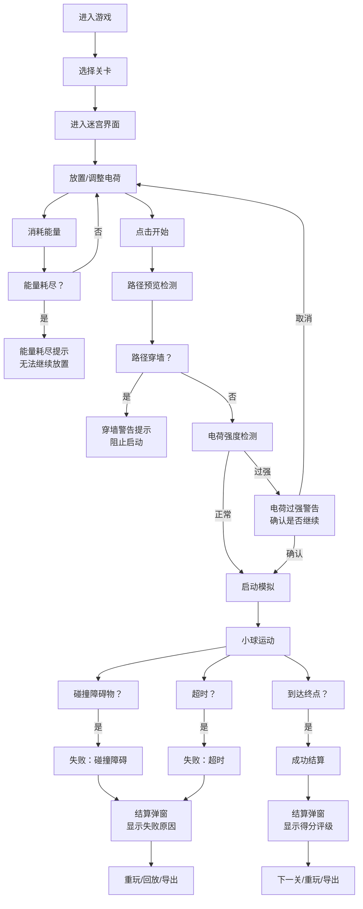

## 1. 产品概述

电磁迷宫逃脱是一款基于物理电场模拟的益智迷宫游戏，玩家通过在迷宫中放置正/负电荷来改变带电小球的运动路径，引导小球从起点到达终点。游戏面向物理兴趣小组学生，将抽象的电场概念转化为直观的互动体验，同时提供完整的游戏流程和学习反馈。

- 核心价值：通过游戏化方式学习电场叠加原理，培养物理思维和问题解决能力
- 目标用户：中学物理兴趣小组学生及教师

## 2. 核心功能

### 2.1 用户角色

| 角色 | 登录方式 | 核心权限 |
|------|----------|----------|
| 玩家 | 无需登录，本地存储 | 游戏游玩、成绩导出、记录查看 |

### 2.2 功能模块

1. **游戏主界面**：迷宫画布、电荷工具栏、能量显示、控制面板
2. **物理模拟系统**：电场计算、小球运动、碰撞检测
3. **路径预览系统**：实时预测小球轨迹，穿墙警告
4. **关卡系统**：多难度迷宫预设、关卡评分
5. **游戏流程控制**：开始、暂停、重开、结算
6. **异常处理系统**：电荷过强、路径穿墙、能量耗尽提示
7. **记录回放系统**：失败回放、成绩回看、逃脱报告
8. **数据导出**：游戏成绩、参数配置导出为报告

### 2.3 页面详情

| 页面名称 | 模块名称 | 功能描述 |
|---------|----------|----------|
| 游戏主页面 | 迷宫画布 | 渲染迷宫地图、障碍物、小球、电荷、电场线可视化 |
| 游戏主页面 | 电荷工具栏 | 选择正电荷/负电荷、放置/删除电荷、调节电荷强度 |
| 游戏主页面 | 状态面板 | 能量值、当前关卡、用时、电荷数量显示 |
| 游戏主页面 | 控制面板 | 开始/暂停/重开按钮、路径预览开关、结算按钮 |
| 关卡选择页 | 关卡列表 | 展示所有关卡、难度、最佳成绩、解锁状态 |
| 结算弹窗 | 得分面板 | 关卡评分、用时、消耗能量、失败原因（如失败） |
| 结算弹窗 | 操作按钮 | 重玩、下一关、导出成绩、查看回放 |
| 历史记录页 | 记录列表 | 历史游戏记录、得分、失败原因回看 |
| 帮助说明页 | 操作指南 | 启动方法、造数说明、主要操作、异常路径说明 |

## 3. 核心流程

## 4. 用户界面设计

### 4.1 设计风格

**赛博朋克物理实验室风格**
- 主色调：深空蓝 #0a0e27、霓虹青 #00f5d4、霓虹紫 #7b2cbf、警告红 #ff006e
- 按钮风格：圆角矩形、霓虹发光边框、悬停时亮度增强
- 字体：使用 Orbitron（科技感标题）+ JetBrains Mono（数据显示）
- 布局：左侧迷宫画布（占70%宽度）、右侧控制面板（占30%宽度）
- 图标：使用线条风格的科技感图标，带发光效果
- 背景：深色渐变 + 网格底纹 + 轻微噪点纹理

### 4.2 页面设计概述

| 页面名称 | 模块名称 | UI 元素 |
|---------|----------|---------|
| 游戏主页面 | 迷宫画布 | Canvas 渲染、网格背景、动态电场线、发光电荷、轨迹残影 |
| 游戏主页面 | 电荷工具栏 | 拖拽式电荷选择器、强度滑块、删除按钮 |
| 游戏主页面 | 状态面板 | 发光数字显示、进度条、状态指示器 |
| 游戏主页面 | 控制面板 | 玻璃拟态面板、发光按钮、开关控件 |
| 结算弹窗 | 得分面板 | 大字号评分、动画计数、星级显示、失败原因高亮 |
| 历史记录页 | 记录列表 | 卡片式布局、时间线、可展开详情 |

### 4.3 响应式

- 桌面端优先（1280px+），左侧画布右侧面板的双栏布局
- 平板端（768px-1279px）：保持双栏布局，调整比例为6:4
- 移动端（<768px）：改为上下布局，画布在上控制面板在下
- 触摸优化：电荷放置支持触摸拖拽，按钮最小尺寸48px

### 4.4 视觉特效

- 电荷放置：粒子爆炸效果 + 波纹扩散
- 小球运动：轨迹残影 + 速度线
- 电场线：动态流动的发光线条
- 异常警告：屏幕边缘红色脉冲 + 震动效果
- 成功结算：金色粒子雨 + 星级弹出动画
