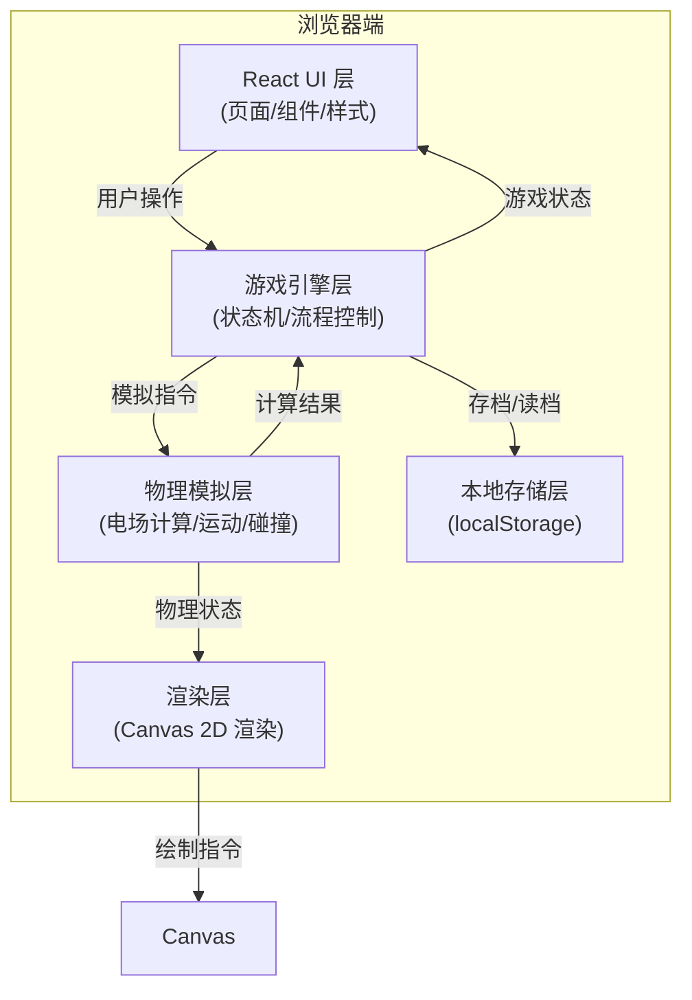

## 1. 架构设计



## 2. 技术描述

- **前端框架**: React@18 + TypeScript + Vite
- **样式方案**: TailwindCSS@3 + CSS 变量（主题系统）
- **物理引擎**: 自研 2D 电场物理模拟（基于库仑定律）
- **渲染方案**: HTML5 Canvas 2D API
- **状态管理**: React useState/useReducer（轻量级场景）
- **数据存储**: localStorage（本地游戏记录、设置）
- **动画方案**: requestAnimationFrame + CSS Transitions
- **图标方案**: Lucide React（科技感线条图标）

## 3. 核心技术选型理由

| 技术 | 选型理由 |
|------|----------|
| React + TypeScript | 组件化开发、类型安全、适合复杂交互游戏 |
| Vite | 快速开发体验、热更新、构建优化 |
| TailwindCSS | 快速实现赛博朋克风格、响应式布局 |
| Canvas 2D | 高性能实时渲染电场线、粒子效果、小球轨迹 |
| 自研物理引擎 | 精确控制电场模拟逻辑、支持教学演示需求 |
| localStorage | 无需后端、本地保存游戏进度和成绩 |

## 4. 目录结构

```
src/
├── components/          # React 组件
│   ├── GameCanvas.tsx   # 游戏画布组件
│   ├── Toolbar.tsx      # 电荷工具栏
│   ├── StatusPanel.tsx  # 状态面板
│   ├── ControlPanel.tsx # 控制面板
│   ├── LevelSelect.tsx  # 关卡选择
│   ├── ResultModal.tsx  # 结算弹窗
│   ├── HistoryPage.tsx  # 历史记录
│   └── HelpPage.tsx     # 帮助说明
├── game/                # 游戏核心逻辑
│   ├── types.ts         # 类型定义
│   ├── config.ts        # 游戏配置常量
│   ├── physics.ts       # 物理模拟引擎
│   ├── engine.ts        # 游戏状态机
│   ├── levels.ts        # 关卡数据
│   └── recorder.ts      # 回放记录器
├── hooks/               # 自定义 Hooks
│   ├── useGameLoop.ts   # 游戏循环 Hook
│   └── useLocalStorage.ts # 本地存储 Hook
├── utils/               # 工具函数
│   ├── export.ts        # 成绩导出
│   └── math.ts          # 数学计算工具
├── App.tsx              # 应用入口
├── main.tsx             # React 入口
└── index.css            # 全局样式和主题
```

## 5. 核心数据模型

### 5.1 类型定义

```typescript
// 向量
interface Vector2 {
  x: number;
  y: number;
}

// 电荷
interface Charge {
  id: string;
  position: Vector2;
  magnitude: number; // 正值为正电荷，负值为负电荷
  strength: number;  // 强度 1-5
}

// 小球
interface Ball {
  position: Vector2;
  velocity: Vector2;
  charge: number;    // 小球带电量
  radius: number;
}

// 迷宫格子类型
type CellType = 'empty' | 'wall' | 'start' | 'end' | 'obstacle';

// 迷宫
interface Maze {
  width: number;
  height: number;
  cellSize: number;
  grid: CellType[][];
  startPos: Vector2;
  endPos: Vector2;
}

// 关卡
interface Level {
  id: number;
  name: string;
  difficulty: 'easy' | 'medium' | 'hard';
  maze: Maze;
  initialEnergy: number;
  timeLimit: number;
  ballCharge: number;
  obstacles: Obstacle[];
}

// 障碍物
interface Obstacle {
  position: Vector2;
  width: number;
  height: number;
  type: 'repel' | 'attract' | 'neutral';
}

// 游戏状态
type GameState = 'idle' | 'placing' | 'previewing' | 'running' | 'paused' | 'success' | 'failed';

// 失败原因
type FailReason = 'collision' | 'timeout' | 'no_energy' | 'path_wall' | null;

// 游戏记录
interface GameRecord {
  id: string;
  levelId: number;
  levelName: string;
  timestamp: number;
  duration: number;
  energyUsed: number;
  chargesPlaced: number;
  success: boolean;
  failReason: FailReason;
  score: number;
  stars: number;
  charges: Charge[];
  replayData: ReplayFrame[];
}

// 回放帧
interface ReplayFrame {
  time: number;
  ballPosition: Vector2;
  ballVelocity: Vector2;
}
```

### 5.2 电场计算核心算法

```typescript
// 库仑定律计算单个电荷在某点产生的电场强度
function calculateFieldFromCharge(
  point: Vector2,
  charge: Charge
): Vector2 {
  const k = 8.99e9; // 库仑常数（游戏中可缩放）
  const dx = point.x - charge.position.x;
  const dy = point.y - charge.position.y;
  const r2 = dx * dx + dy * dy;
  const r = Math.sqrt(r2);
  
  if (r < 10) return { x: 0, y: 0 }; // 避免奇点
  
  const magnitude = (k * charge.magnitude * charge.strength) / r2;
  return {
    x: magnitude * (dx / r),
    y: magnitude * (dy / r)
  };
}

// 计算所有电荷在某点的合电场
function calculateTotalField(
  point: Vector2,
  charges: Charge[]
): Vector2 {
  return charges.reduce(
    (total, charge) => {
      const field = calculateFieldFromCharge(point, charge);
      return {
        x: total.x + field.x,
        y: total.y + field.y
      };
    },
    { x: 0, y: 0 }
  );
}
```

### 5.3 评分算法

```typescript
function calculateScore(
  duration: number,
  energyUsed: number,
  chargesPlaced: number,
  timeLimit: number,
  initialEnergy: number
): { score: number; stars: number } {
  const timeScore = Math.max(0, (1 - duration / timeLimit) * 40);
  const energyScore = Math.max(0, (1 - energyUsed / initialEnergy) * 30);
  const efficiencyScore = Math.max(0, (1 - chargesPlaced / 10) * 30);
  
  const score = Math.round(timeScore + energyScore + efficiencyScore);
  
  let stars = 1;
  if (score >= 60) stars = 2;
  if (score >= 80) stars = 3;
  
  return { score, stars };
}
```

## 6. 路由定义

| 路由 | 页面 | 说明 |
|------|------|------|
| `/` | 关卡选择页 | 游戏入口，展示所有关卡 |
| `/game/:levelId` | 游戏主页面 | 核心游戏界面 |
| `/history` | 历史记录页 | 查看历史游戏记录 |
| `/help` | 帮助说明页 | 操作指南和异常说明 |

## 7. 异常处理机制

### 7.1 电荷过强检测
- 检测条件：任意点电场强度超过阈值 `MAX_FIELD_STRENGTH`
- 处理方式：弹出警告对话框，确认后仍可继续（但可能导致不稳定）
- 视觉提示：过强区域显示红色闪烁

### 7.2 路径穿墙检测
- 检测时机：路径预览阶段
- 检测方式：沿预测路径采样，检查是否穿过墙壁
- 处理方式：阻止游戏启动，高亮穿墙位置
- 提示信息："预测路径将穿过迷宫墙壁，请调整电荷位置"

### 7.3 能量耗尽
- 检测时机：放置电荷前
- 处理方式：禁用放置功能，能量条变红
- 提示信息："能量已耗尽，请移除部分电荷或重新开始"

### 7.4 碰撞检测
- 检测方式：每帧检查小球与墙壁、障碍物的碰撞
- 处理方式：游戏结束，结算时显示碰撞点和原因
