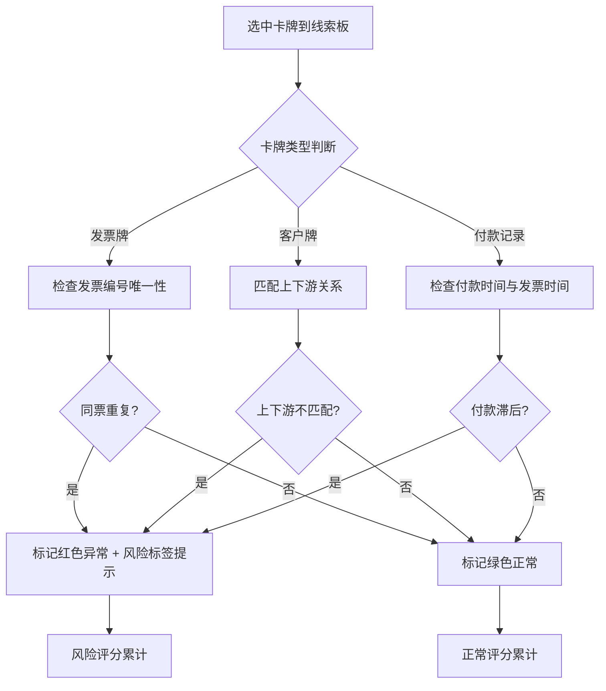
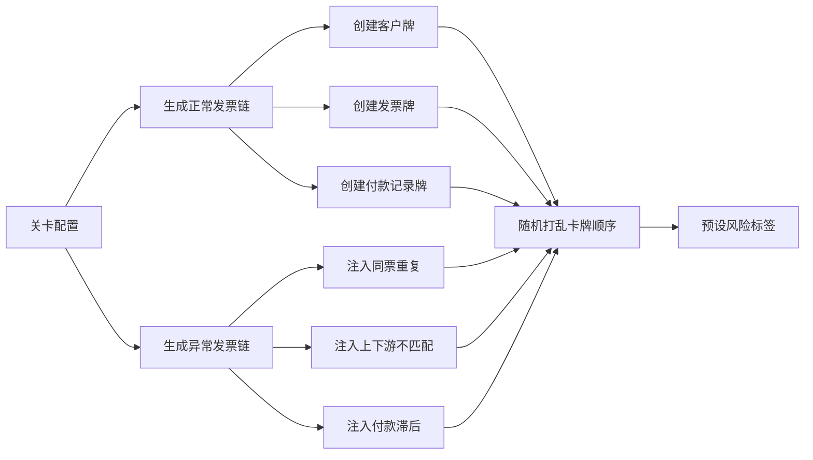
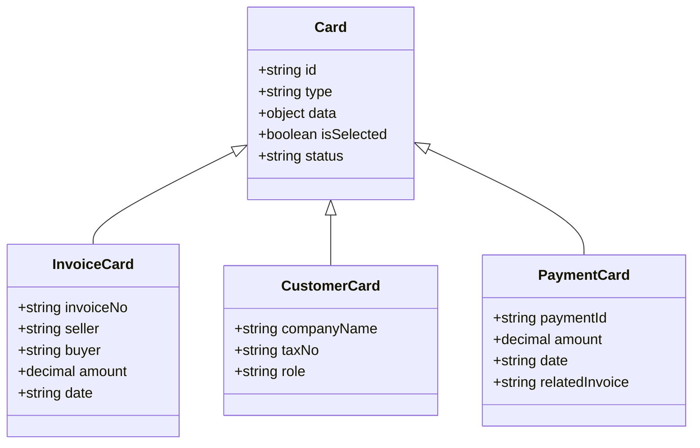
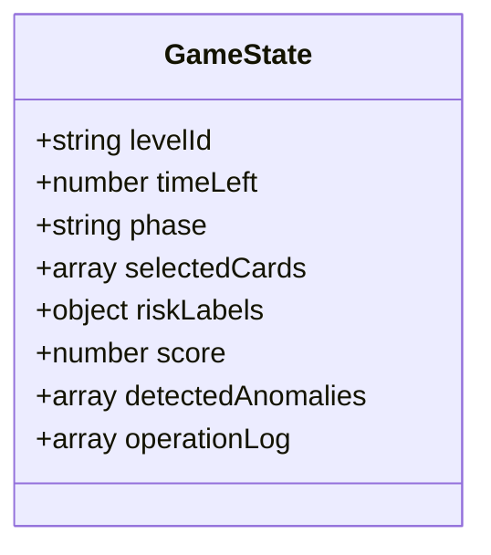

## 1. 产品概述
财税培训卡牌小游戏，通过模拟发票稽核场景训练学员识别异常链路。学员在限定时间内操作发票牌、客户牌、付款记录牌，通过线索关联找出"同票重复""上下游不匹配""付款滞后"等风险，形成稽核报告并可回看推理过程。

## 2. 核心功能

### 2.1 用户角色
| 角色 | 注册方式 | 核心权限 |
|------|---------|---------|
| 财税学员 | 无需注册，直接进入 | 开始游戏、查看线索、提交稽核、查看报告、回看历史 |

### 2.2 功能模块
1. **启动页**：游戏标题、简介、关卡选择、历史记录入口
2. **游戏面板**：卡牌展示区、线索板、计时器、风险标签、提交按钮
3. **线索板**：已选卡牌、关联推理、异常标记、风险评分
4. **结果页**：稽核报告、得分明细、失败原因分析、异常路径高亮
5. **回放页**：操作时间线、卡牌选择历史、每步推理说明
6. **报告导出**：PDF格式导出稽核报告

### 2.3 页面详情
| 页面名称 | 模块名称 | 功能描述 |
|---------|---------|---------|
| 启动页 | 游戏标题 | 大标题"税务稽核线索牌"、副标题、游戏简介 |
| 启动页 | 关卡选择 | 显示3个预设关卡，难度递增 |
| 启动页 | 历史记录 | 显示最近5次游戏得分，点击可进入回放 |
| 游戏面板 | 卡牌区 | 按类型分组展示发票牌、客户牌、付款记录牌，支持点击选中 |
| 游戏面板 | 线索板 | 显示已选卡牌、自动检测关联、标记异常 |
| 游戏面板 | 操作栏 | 计时器、风险标签勾选、提交稽核按钮 |
| 游戏面板 | 风险标签 | 预设标签：同票重复、上下游不匹配、付款滞后、金额异常、时间异常 |
| 结果页 | 稽核报告 | 显示发现的风险点、每条的证据链、评分 |
| 结果页 | 失败分析 | 高亮未发现的风险、错误标记的正常项 |
| 结果页 | 导出 | 点击导出PDF报告 |
| 回放页 | 时间线 | 按时间顺序展示玩家操作，点击可跳转 |
| 回放页 | 操作详情 | 每步的卡牌选择、标签勾选、关联推理说明 |

## 3. 核心流程

### 3.1 游戏流程
玩家从启动页选择关卡进入游戏，在限定时间内浏览卡牌并选中可疑卡牌到线索板。线索板自动检测已选卡牌之间的关联关系并提示可能的异常。玩家可勾选风险标签标记异常，提交后进入结果页。结果页展示稽核报告、得分和失败分析，支持导出和回放。

### 3.2 异常检测流程

### 3.3 关卡数据生成

## 4. 用户界面设计

### 4.1 设计风格
- **主色调**：深墨蓝 #1a2942 为主，金色 #d4a84b 为强调色，红色 #c0392b 为风险提示
- **辅助色**：青蓝 #3498db 为操作，翠绿 #27ae60 为正常，橙色 #e67e22 为警告
- **按钮风格**：圆角4px、实心填充、悬停阴影，危险按钮红色边框
- **字体**：Noto Serif SC 为标题字体（宋体风格），Noto Sans SC 为正文字体
- **布局风格**：卡牌式网格布局 + 侧边线索板
- **图标/emoji**：使用 lucide-react 图标，卡牌用 emoji 装饰

### 4.2 页面设计概览
| 页面名称 | 模块名称 | UI元素 |
|---------|---------|--------|
| 启动页 | 游戏标题 | 居中大标题、金色下划线、墨蓝背景、网格纹理 |
| 启动页 | 关卡卡片 | 三列卡片、悬停上浮、金色边框高亮 |
| 游戏面板 | 卡牌区 | 三列网格（发票/客户/付款）、卡牌圆角8px、选中金色边框 |
| 游戏面板 | 线索板 | 右侧固定面板、已选卡牌列表、异常红色标注 |
| 游戏面板 | 操作栏 | 底部固定、计时器左对齐、风险标签组、提交按钮右对齐 |
| 结果页 | 报告区域 | 卡片式报告、风险项红色图标、评分图表 |
| 回放页 | 时间线 | 垂直时间轴、节点可点击、当前位置高亮 |

### 4.3 响应式
桌面优先设计，最小支持1280px宽度。平板适配双列布局，手机适配单列堆叠。触屏优化卡牌点击区域至少44px。

## 5. 数据模型

### 5.1 卡牌数据结构

### 5.2 游戏状态

