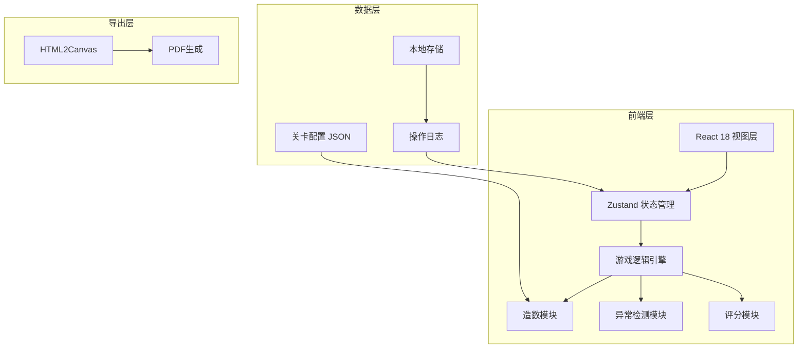

## 1. 架构设计


## 2. 技术说明
- **前端**：React@18 + TypeScript + Tailwind CSS@3 + Vite
- **初始化工具**：vite-init
- **后端**：无，纯前端应用
- **数据库**：无，使用 localStorage 存储历史记录
- **状态管理**：Zustand
- **路由**：React Router DOM
- **PDF导出**：html2canvas + jsPDF
- **图标**：lucide-react

## 3. 路由定义
| 路由 | 用途 |
|------|------|
| / | 启动页，游戏标题和关卡选择 |
| /game/:levelId | 游戏面板，核心游戏界面 |
| /result/:gameId | 结果页，稽核报告和评分 |
| /replay/:gameId | 回放页，操作时间线和推理回放 |
| /history | 历史记录页，所有游戏记录 |

## 4. 数据模型

### 4.1 卡牌类型定义
```typescript
type CardType = 'invoice' | 'customer' | 'payment';

interface BaseCard {
  id: string;
  type: CardType;
  isSelected: boolean;
  status: 'normal' | 'warning' | 'danger' | 'unknown';
}

interface InvoiceCard extends BaseCard {
  type: 'invoice';
  data: {
    invoiceNo: string;
    seller: string;
    buyer: string;
    amount: number;
    date: string;
    taxRate: number;
    remark?: string;
  };
}

interface CustomerCard extends BaseCard {
  type: 'customer';
  data: {
    companyName: string;
    taxNo: string;
    role: 'seller' | 'buyer';
    industry?: string;
  };
}

interface PaymentCard extends BaseCard {
  type: 'payment';
  data: {
    paymentId: string;
    amount: number;
    date: string;
    relatedInvoice: string;
    method: 'bank' | 'cash' | 'transfer';
  };
}

type Card = InvoiceCard | CustomerCard | PaymentCard;
```

### 4.2 游戏状态定义
```typescript
type GamePhase = 'idle' | 'playing' | 'submitted' | 'ended';

interface RiskLabel {
  id: string;
  name: string;
  description: string;
  isChecked: boolean;
}

interface Anomaly {
  id: string;
  type: 'duplicate_invoice' | 'mismatch_chain' | 'delayed_payment' | 'amount_anomaly';
  severity: 'high' | 'medium' | 'low';
  cards: string[];
  description: string;
  scoreDelta: number;
}

interface OperationLog {
  timestamp: number;
  action: 'select' | 'deselect' | 'check_label' | 'uncheck_label' | 'submit';
  cardId?: string;
  labelId?: string;
  details?: string;
}

interface GameState {
  levelId: string;
  timeLeft: number;
  phase: GamePhase;
  cards: Card[];
  selectedCardIds: string[];
  riskLabels: RiskLabel[];
  score: number;
  detectedAnomalies: Anomaly[];
  operationLog: OperationLog[];
  startedAt: number;
}
```

### 4.3 关卡配置定义
```typescript
interface LevelConfig {
  id: string;
  name: string;
  description: string;
  timeLimit: number;
  difficulty: 'easy' | 'medium' | 'hard';
  cardCount: {
    invoice: number;
    customer: number;
    payment: number;
  };
  anomalies: {
    duplicateInvoices: number;
    mismatchChains: number;
    delayedPayments: number;
  };
}
```

## 5. 核心模块设计

### 5.1 造数模块 (dataGenerator.ts)
- 根据关卡配置生成正常发票链
- 注入指定数量的异常（同票重复、上下游不匹配、付款滞后）
- 随机打乱卡牌顺序
- 预设风险标签

### 5.2 异常检测模块 (anomalyDetector.ts)
- `checkDuplicateInvoice(invoices)` — 检查发票编号唯一性
- `checkChainConsistency(invoice, seller, buyer)` — 检查上下游匹配
- `checkPaymentDelay(payment, invoice)` — 检查付款时间是否滞后
- `detectAllAnomalies(selectedCards, allCards)` — 综合检测所有异常

### 5.3 评分模块 (scoringEngine.ts)
- 正确标记异常：+20分/项
- 错误标记正常：-15分/项
- 未发现异常：0分（静默记录在报告中）
- 时间奖励：剩余时间每10秒 +5分
- 最终评级：S/A/B/C/D 五档

### 5.4 回放模块 (replayEngine.ts)
- 记录每步操作的时间戳和详情
- 按时间顺序渲染操作时间线
- 支持点击任意节点查看该时刻游戏状态快照

## 6. 目录结构
```
src/
├── components/
│   ├── game/
│   │   ├── Card.tsx
│   │   ├── CardGrid.tsx
│   │   ├── ClueBoard.tsx
│   │   ├── RiskLabelGroup.tsx
│   │   ├── Timer.tsx
│   │   └── OperationBar.tsx
│   ├── result/
│   │   ├── ReportCard.tsx
│   │   ├── ScoreBreakdown.tsx
│   │   └── ExportButton.tsx
│   ├── replay/
│   │   ├── Timeline.tsx
│   │   └── TimelineNode.tsx
│   └── common/
│       ├── Header.tsx
│       └── Container.tsx
├── pages/
│   ├── StartPage.tsx
│   ├── GamePage.tsx
│   ├── ResultPage.tsx
│   ├── ReplayPage.tsx
│   └── HistoryPage.tsx
├── hooks/
│   ├── useGameEngine.ts
│   ├── useAnomalyDetector.ts
│   ├── useScoring.ts
│   └── useReplay.ts
├── utils/
│   ├── dataGenerator.ts
│   ├── anomalyDetector.ts
│   ├── scoringEngine.ts
│   ├── replayEngine.ts
│   ├── exportReport.ts
│   └── storage.ts
├── store/
│   └── gameStore.ts
├── types/
│   └── index.ts
├── config/
│   └── levels.ts
└── App.tsx
```
