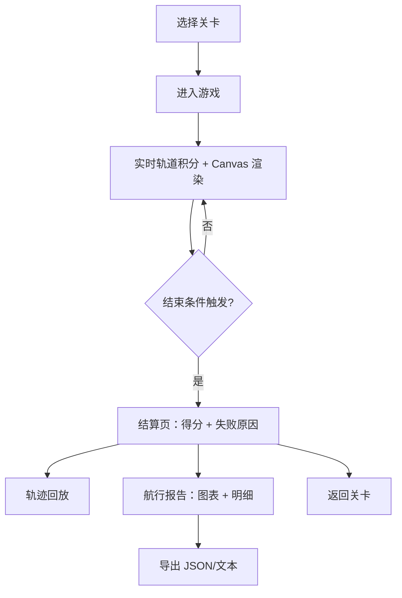

# 引力弹弓航行赛 — 产品需求文档（PRD）

## 1. 产品概述
面向航天兴趣课学生与老师的浏览器小游戏，玩家操控探测器利用行星引力弹弓节省燃料并完成目标轨道。
- 主要目的：让学生在操作中直观理解轨道积分、引力辅助、燃料优化；同时为老师提供可解释的得分、失败原因与航行报告。
- 目标用户：中小学/大学兴趣课学生、航天兴趣课老师、航天爱好者。
- 价值：将抽象的航天力学可视化、可操作化，并以数据与图表可解释地评价每次尝试。

## 2. 核心功能

### 2.1 功能模块
1. **开始/关卡选择页**：课程关卡列表、关卡简介（行星布局、目标轨道、燃料预算）、历史最高分。
2. **游戏页（核心）**：实时渲染的二维轨道画布、探测器/行星/目标轨道、速度矢量、燃料条、控制面板。
3. **结算与分析页**：得分明细（引力辅助、燃料评分、完成度）、失败原因（轨道逃逸、燃料耗尽、碰撞行星）、轨迹回放。
4. **航行报告页**：完整航行数据（时间轴、速度、高度、燃料消耗）、图表、可导出 JSON/文本报告。
5. **历史与回放库**：保存本地航行记录，支持随时回看、重新播放。

### 2.2 页面详情
| 页面 | 模块 | 功能描述 |
|------|------|---------|
| 开始页 | 关卡卡片列表 | 显示关卡名称、难度、最高得分、上次成绩，点击进入 |
| 开始页 | 关卡预览 | 点击后展示关卡简介、行星与目标轨道示意图 |
| 游戏页 | 轨道画布 | Canvas 实时渲染探测器轨迹、行星、目标轨道、预测虚线 |
| 游戏页 | HUD | 实时速度、高度、燃料剩余、当前时间、是否在引力范围 |
| 游戏页 | 操作控制 | 点火按钮/节流、方向调节、暂停/继续、重启、显示/隐藏预测轨迹 |
| 游戏页 | 事件提示 | 进入/离开行星影响范围、燃料告警、接近目标提示 |
| 结算页 | 得分卡片 | 基础分、燃料加分、引力辅助加分、扣分项、总分 |
| 结算页 | 失败原因面板 | 轨道逃逸/燃料耗尽/碰撞行星的明确说明与发生时间 |
| 结算页 | 轨迹回放 | 可拖动进度条回放轨迹，显示每帧数据 |
| 报告页 | 数据图表 | 速度-时间、高度-时间、燃料-时间、加速度-时间折线图 |
| 报告页 | 导出 | 导出 JSON 航行日志、导出文本航行报告 |

## 3. 核心流程
用户从关卡页选择关卡 → 进入游戏页操控探测器 → 实时轨道积分并在画布渲染 → 触发结束条件（到达目标轨道/轨道逃逸/燃料耗尽/碰撞行星） → 进入结算页查看得分明细与失败原因 → 可回放轨迹或进入报告页查看完整数据与图表 → 可导出报告或返回关卡选择。

## 4. 用户界面设计

### 4.1 设计风格
- 主题色：深空蓝 `#0a1a33`、星尘紫 `#6c5ce7`、引擎橙 `#ff7a29`、警告红 `#ff4757`、成功绿 `#2ecc71`。
- 背景：深空渐变 + 星点噪声，呈现宇宙深邃感。
- 按钮：圆角、渐变发光、悬浮抬升、点击微缩。
- 字体：展示用未来感字体（如 Orbitron），正文用思源黑体/Inter 增强可读度。
- 布局：左侧 Canvas 主舞台，右侧半透明控制面板（HUD + 操作按钮 + 事件日志），底部可折叠数据面板。
- 图标：线性 SVG 图标搭配发射、行星、目标、回放等语义。

### 4.2 页面设计概览
| 页面 | 模块 | UI 元素 |
|------|------|--------|
| 开始页 | 关卡卡片 | 深空卡片、微光投影、最高分徽章、悬停放大 |
| 游戏页 | 主舞台 | Canvas 全屏、行星与轨道发光、轨迹留痕、预测虚线 |
| 游戏页 | HUD 面板 | 半透明玻璃感面板、数字跳动、燃料条渐变 |
| 结算页 | 得分明细 | 卡片列表、加分项绿色、扣分项红色、总分高亮 |
| 结算页 | 回放条 | 可拖动时间轴、播放/暂停按钮、实时数据悬浮层 |
| 报告页 | 图表 | 深色底折线图、多图并列、图例切换 |
| 报告页 | 导出 | 两个按钮（JSON / 文本），点击后生成下载 |

### 4.3 响应式
- 桌面优先（≥1024px），保留主舞台 + 侧栏布局。
- 平板（768–1024px）：控制面板折叠为抽屉。
- 移动端：堆叠布局，Canvas 占满视口，HUD 悬浮于顶部。

### 4.4 2D 画布指引
- 背景：线性渐变 + 噪声点模拟星空。
- 行星：径向渐变 + 光晕，按质量呈现大小与颜色。
- 探测器：三角形飞船 + 尾焰粒子特效。
- 轨迹：留痕淡出、预测轨迹用虚线并在接近行星时变细。
- 交互反馈：点火时尾焰变长；进入引力范围时行星光环脉冲；燃料告警时 HUD 红色闪烁。
