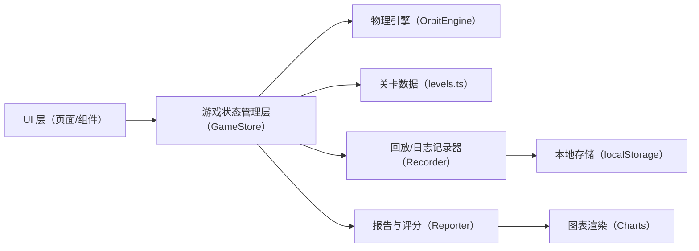
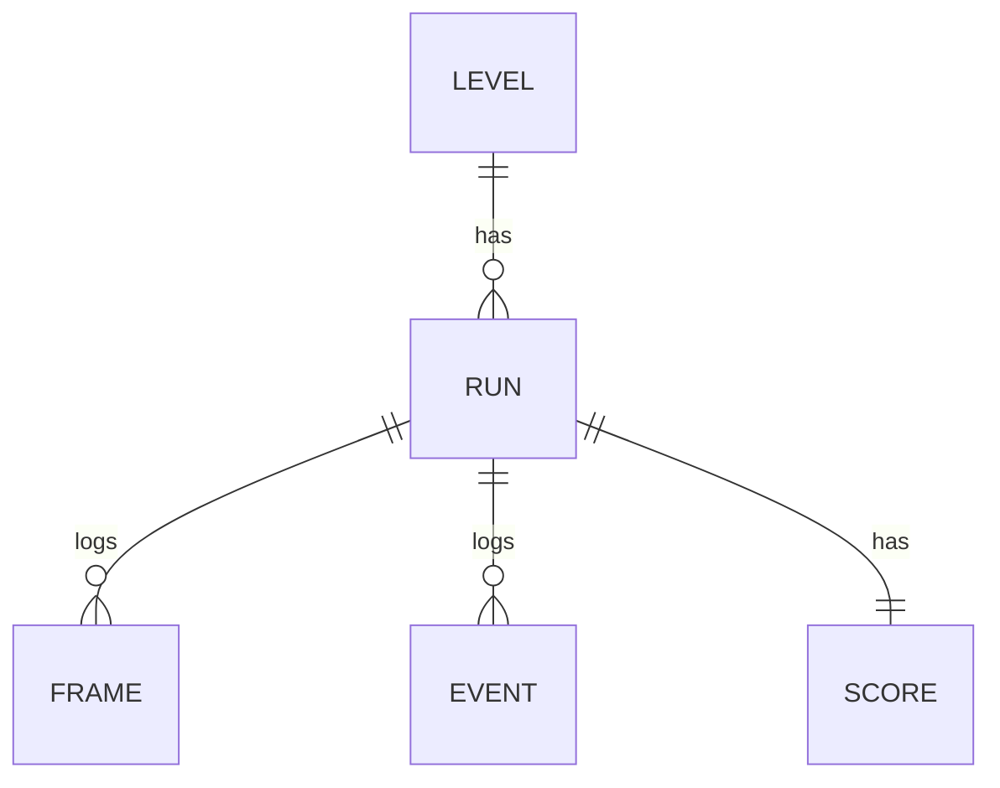

# 引力弹弓航行赛 — 技术架构文档

## 1. 架构设计
纯前端单页应用（SPA），无后端依赖；数据通过浏览器 `localStorage` 持久化；图表使用原生 Canvas 绘制避免引入重型库。



## 2. 技术说明
- 前端：React@18 + TypeScript + Vite
- 样式：Tailwind CSS 3 + 自定义 CSS 变量（深空主题）
- 初始化工具：`npm create vite@latest . -- --template react-ts`
- 路由：`react-router-dom`
- 后端：无
- 数据库：`localStorage`（本地持久化航行记录）
- 图表：自研 Canvas 折线图组件（零依赖）
- 动画：`requestAnimationFrame` + 游戏循环（固定步长轨道积分）

## 3. 路由定义
| 路由 | 页面 | 用途 |
|------|------|------|
| `/` | 首页/关卡选择 | 展示关卡卡片、最高分、入口 |
| `/play/:levelId` | 游戏页 | 运行轨道模拟、渲染、用户交互 |
| `/result/:runId` | 结算页 | 显示得分、失败原因、轨迹回放 |
| `/report/:runId` | 航行报告页 | 图表、明细、导出 |
| `/history` | 历史记录 | 本地航行记录库 |

## 4. 数据模型

### 4.1 核心数据结构


### 4.2 TypeScript 类型定义
```ts
interface Planet {
  id: string;
  name: string;
  mass: number;        // 相对质量
  radius: number;      // 碰撞半径
  x: number; y: number;
  color: string;
  influence: number;   // 引力影响范围
}

interface TargetOrbit {
  centerX: number; centerY: number;
  radius: number;
  tolerance: number;   // 进入容差
  requiredSpeedRange: [number, number];
}

interface Level {
  id: string;
  name: string;
  description: string;
  planets: Planet[];
  target: TargetOrbit;
  start: { x: number; y: number; vx: number; vy: number };
  fuelBudget: number;
  timeLimit: number;
}

interface Frame {
  t: number;
  x: number; y: number;
  vx: number; vy: number;
  fuel: number;
  thrust: number;       // 0~1
  angle: number;
  nearestPlanet: string | null;
  altitude: number;
}

interface GameEvent {
  t: number;
  type: 'enter-influence' | 'leave-influence' | 'fuel-low' | 'collision' | 'escape' | 'target-reached';
  planet?: string;
  message: string;
}

interface ScoreBreakdown {
  base: number;
  fuelBonus: number;
  slingshotBonus: number;
  timeBonus: number;
  penalties: { label: string; value: number }[];
  total: number;
}

interface RunRecord {
  id: string;
  levelId: string;
  startTime: number;
  endTime: number;
  result: 'success' | 'escape' | 'fuel-out' | 'collision' | 'timeout';
  frames: Frame[];
  events: GameEvent[];
  score: ScoreBreakdown;
  failureReason?: string;
}
```

## 5. 物理引擎（轨道积分）要点
- 固定时间步长 `dt = 1/60`（秒，游戏内）。
- 每个行星施加牛顿引力：`a = G * M / r²`（`G` 取无量纲常量以匹配关卡尺度）。
- 推进器施加：`a_thrust = thrust * 方向矢量`，同时消耗燃料。
- 每帧累计快照到 `Frame[]`，用于回放与报告。
- 结束判定：
  - `success`: 探测器进入目标轨道容差且速度匹配范围；
  - `escape`: 距离原点超过阈值；
  - `fuel-out`: 燃料 ≤ 0 且无法维持稳定；
  - `collision`: 探测器距行星中心 < 半径；
  - `timeout`: 游戏时间超过上限。

## 6. 评分与失败原因
- 基础分：成功 +100，失败 0。
- 燃料加成：`(预算 - 消耗) / 预算 * 100`。
- 引力辅助加成：每经过一次有效弹弓（进入+离开行星影响范围且速度增益 > 阈值）+20。
- 时间加成：越快完成越高。
- 失败原因单独存入 `failureReason`，结算页以醒目红色标签展示并定位到发生时间帧。

## 7. 目录结构
```
src/
  components/
    CanvasStage.tsx       主舞台（Canvas + 渲染循环）
    HUD.tsx               HUD 面板
    ControlPanel.tsx      操作按钮 + 事件日志
    ScoreCard.tsx         得分明细卡
    ReplayBar.tsx         回放条
    ChartLine.tsx         折线图
    LevelCard.tsx         关卡卡片
  pages/
    HomePage.tsx
    PlayPage.tsx
    ResultPage.tsx
    ReportPage.tsx
    HistoryPage.tsx
  game/
    types.ts              数据类型
    levels.ts             关卡数据
    engine.ts             轨道积分物理引擎
    scoring.ts            评分与失败原因
    recorder.ts           帧/事件记录
    storage.ts            localStorage 封装
    report.ts             报告生成/导出
  App.tsx
  main.tsx
  index.css
```
