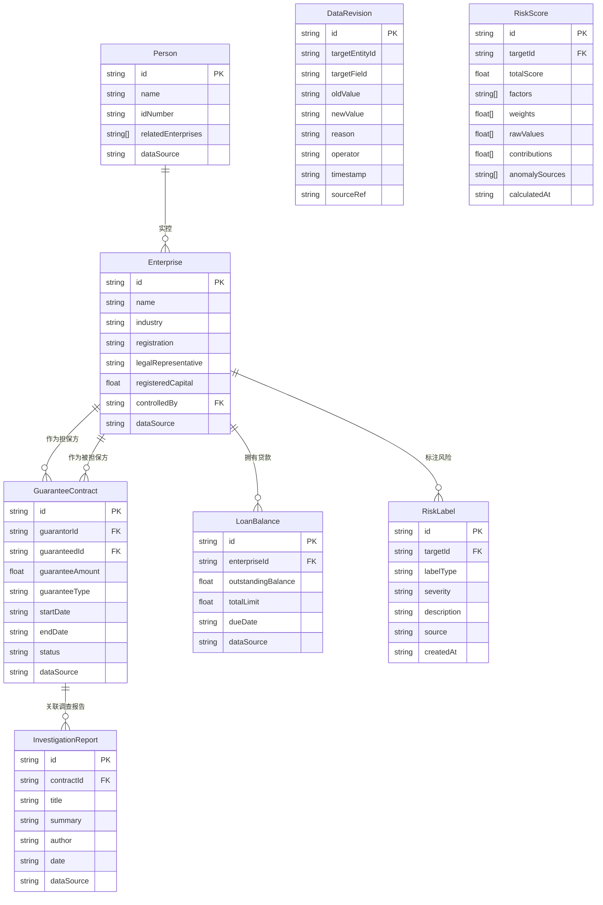

## 1. 架构设计

```mermaid
graph TB
    "前端层 React+Three.js" --> "状态管理 Zustand"
    "状态管理 Zustand" --> "数据服务层"
    "数据服务层" --> "Mock数据"
    "数据服务层" --> "本地存储 IndexedDB"
    subgraph "前端层 React+Three.js"
        "3D关系网络"
        "侧边明细面板"
        "筛选工具栏"
        "风险预警区"
        "路径展开视图"
        "数据溯源视图"
        "报告导出"
    end
    subgraph "数据服务层"
        "图数据引擎"
        "风险检测引擎"
        "溯源记录引擎"
        "评分解释引擎"
    end
```

## 2. 技术说明

- **前端框架**：React@18 + TypeScript + Vite
- **样式方案**：Tailwind CSS@3
- **3D渲染**：Three.js + @react-three/fiber + @react-three/drei + @react-three/postprocessing
- **状态管理**：Zustand
- **路由**：react-router-dom
- **图表**：@nivo/radar（雷达图展示风险评分）
- **导出**：html2canvas + jspdf（报告导出为PDF）
- **初始化工具**：vite-init
- **后端**：无（纯前端，数据使用Mock + localStorage持久化）
- **数据库**：IndexedDB（存储修正痕迹与溯源记录）

## 3. 路由定义

| 路由 | 用途 |
|------|------|
| / | 沙盘主页面：3D关系网络+侧边面板+筛选+预警 |
| /path/:nodeId | 路径展开页面：从指定节点展开担保链路 |
| /trace/:dataId | 数据溯源页面：查看数据来源与修正痕迹 |

## 4. 数据模型

### 4.1 数据模型定义



### 4.2 数据来源标注规范

每条数据必须包含 `dataSource` 字段，取值如下：
- `工商登记` — 企业基本信息
- `股权穿透` — 实控人关系
- `合同库` — 担保合同信息
- `核心系统` — 贷款余额数据
- `风控模型` — 风险标签与评分
- `尽调团队` — 调查报告

## 5. 风险检测算法

### 5.1 循环担保检测
使用深度优先搜索（DFS）在担保关系图中检测环路。当存在 A→B→C→A 的担保链时，标记为循环担保，输出环路路径与涉及金额。

### 5.2 同人多企检测
遍历实控人节点，当同一实控人关联2家及以上企业时，标记为同人多企，计算关联企业间担保金额总和。

### 5.3 风险标签遮挡检测
当高严重度风险标签的节点被低严重度节点在3D视图中遮挡（投影重叠）时，自动调整布局或提供穿透提示。

## 6. 关键组件结构

```
src/
├── components/
│   ├── Scene3D/              # 3D场景相关组件
│   │   ├── GraphScene.tsx    # 主3D场景容器
│   │   ├── EnterpriseNode.tsx # 企业节点
│   │   ├── PersonNode.tsx    # 实控人节点
│   │   ├── GuaranteeLink.tsx # 担保连线
│   │   └── RiskHighlight.tsx # 风险高亮效果
│   ├── Panels/               # 侧边面板组件
│   │   ├── DetailPanel.tsx   # 明细面板主容器
│   │   ├── EnterpriseDetail.tsx
│   │   ├── PersonDetail.tsx
│   │   ├── ContractDetail.tsx
│   │   └── ScoreExplanation.tsx
│   ├── Filters/              # 筛选工具组件
│   │   ├── FilterToolbar.tsx
│   │   ├── RiskLevelFilter.tsx
│   │   ├── IndustryFilter.tsx
│   │   └── BalanceRangeFilter.tsx
│   ├── Alerts/               # 风险预警组件
│   │   ├── AlertBanner.tsx
│   │   ├── CircularGuaranteeAlert.tsx
│   │   ├── SamePersonAlert.tsx
│   │   └── LabelOcclusionAlert.tsx
│   ├── PathExpansion/        # 路径展开组件
│   │   └── PathView.tsx
│   ├── Traceability/         # 溯源组件
│   │   ├── SourceTrace.tsx
│   │   ├── RevisionHistory.tsx
│   │   └── FactorDetail.tsx
│   └── Export/               # 导出组件
│       └── ReportExport.tsx
├── pages/
│   ├── Sandbox.tsx           # 沙盘主页
│   ├── PathExpansion.tsx     # 路径展开页
│   └── DataTrace.tsx         # 数据溯源页
├── stores/
│   ├── graphStore.ts         # 图数据状态
│   ├── selectionStore.ts     # 选中/筛选状态
│   ├── riskStore.ts          # 风险检测状态
│   └── traceStore.ts         # 溯源记录状态
├── engines/
│   ├── graphEngine.ts        # 图数据计算引擎
│   ├── riskDetector.ts       # 风险检测引擎
│   ├── layoutEngine.ts       # 3D力导向布局引擎
│   └── scoreEngine.ts        # 评分计算引擎
├── data/
│   └── mockData.ts           # Mock数据
├── types/
│   └── index.ts              # 类型定义
├── hooks/
│   └── useGraphInteraction.ts # 3D交互Hook
└── utils/
    └── exportUtils.ts        # 导出工具函数
```
