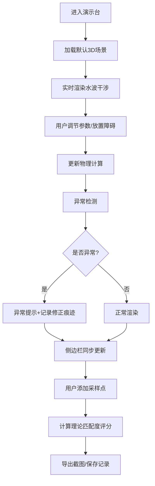

## 1. 产品概述

海浪干涉演示台是一款面向高中物理教学的Web3D交互可视化工具，帮助学生直观理解双波源干涉现象。通过实时调节波源参数、放置障碍物、观察干涉图样，让抽象的波动理论变得可感知、可探索。

- 解决问题：传统物理教学中水波干涉实验难以精确控制参数，且现象转瞬即逝，学生难以建立参数与现象的对应关系
- 目标用户：高中物理教师、学生，以及物理爱好者
- 产品价值：将抽象的波动干涉理论转化为可交互的3D可视化体验，支持参数调节、异常检测、数据记录，打造沉浸式物理实验课堂

## 2. 核心功能

### 2.1 用户角色

| 角色 | 登录方式 | 核心权限 |
|------|----------|----------|
| 教师 | 无需登录 | 完整的参数调节、截图导出、课堂演示功能 |
| 学生 | 无需登录 | 参数探索、采样测量、实验记录功能 |

### 2.2 功能模块

1. **3D海浪场景**：双波源干涉实时渲染，波面网格动态显示
2. **参数控制面板**：频率、相位、波源位置、障碍物设置
3. **干涉热力图**：用颜色映射显示波的振幅分布
4. **异常检测系统**：相位越界、波面穿障、采样卡顿实时提示
5. **侧边明细面板**：参数同步显示、修正痕迹记录、异常来源解释
6. **交互工具栏**：暂停/播放、重置、截图导出、采样测量
7. **评分系统**：根据干涉图样与理论值的匹配度给出评分

### 2.3 页面详情

| 页面名称 | 模块名称 | 功能描述 |
|----------|----------|----------|
| 主页面 | 3D海浪场景 | 实时渲染双波源干涉水波，支持鼠标拖动旋转视角 |
| 主页面 | 参数控制面板 | 滑块调节频率、相位差、波源间距，拖拽放置障碍物 |
| 主页面 | 干涉热力层 | 可切换显示波幅热力图，红色波峰、蓝色波谷 |
| 主页面 | 异常提示条 | 顶部悬浮显示当前检测到的异常，点击查看详情 |
| 主页面 | 侧边明细栏 | 实时同步参数、记录每次修改、解释异常来源、显示评分 |
| 主页面 | 工具栏 | 暂停/播放、重置场景、截图保存、添加采样点 |
| 主页面 | 采样点测量 | 点击水面添加采样点，显示该点的振幅、相位、频率 |

## 3. 核心流程

用户进入页面后，首先看到默认设置下的双波源干涉3D场景。通过调节参数滑块或拖拽障碍物，观察干涉图样的变化。系统实时检测异常并给出提示，侧边栏同步记录所有操作。用户可添加采样点进行测量，系统根据理论模型给出匹配度评分。最后可导出截图用于课堂教学。

## 4. 用户界面设计

### 4.1 设计风格

- **主色调**：深海蓝（#0A2463）作为背景，配合水波青（#3E92CC）、波峰红（#E63946）、波谷蓝（#1D3557）形成科学感配色
- **辅助色**：警告黄（#F4A261）用于异常提示，成功绿（#2A9D8F）用于正常状态
- **按钮风格**：圆角矩形按钮，带有微妙的玻璃拟态效果，悬浮时有发光反馈
- **字体**：标题使用 Orbitron（科技感字体），正文使用 Inter（清晰易读）
- **布局**：左侧3D场景占70%宽度，右侧明细面板占30%，顶部悬浮工具栏和异常提示条
- **图标风格**：线性图标配合柔和阴影，保持科技感与清晰度的平衡

### 4.2 页面设计概览

| 页面名称 | 模块名称 | UI元素 |
|----------|----------|--------|
| 主页面 | 3D场景区域 | 深色背景、水面网格、双波源发光点、障碍物半透明块、热力图颜色映射 |
| 主页面 | 参数控制面板 | 滑块带数值显示、相位调节旋钮、波源拖拽手柄、障碍物类型选择器 |
| 主页面 | 侧边明细栏 | 参数卡片分组显示、操作时间线、异常详情卡片、评分仪表盘 |
| 主页面 | 异常提示条 | 带警告图标的横幅，展开显示异常原因和修正建议 |
| 主页面 | 工具栏 | 图标按钮组，暂停/播放状态切换，导出格式选择 |

### 4.3 响应式设计

- 桌面端（>1200px）：左侧70%场景 + 右侧30%面板的双栏布局
- 平板端（768px-1200px）：上下布局，场景在上、面板在下
- 移动端（<768px）：单栏滚动布局，简化参数控制，保留核心交互
- 触摸优化：滑块增大触控区域，支持双指缩放场景

### 4.4 3D场景设计指导

- **环境与氛围**：深色实验室背景，水面带有轻微反光，营造专业物理实验氛围
- **光照设置**：顶部主光源模拟教室灯光，点光源照亮两个波源，水面接收阴影
- **相机设置**：初始45度俯视角，支持轨道控制旋转、缩放、平移
- **构图与焦点**：双波源位于水面中心偏上位置，干涉图样在中心区域最明显
- **交互与动画**：波面动画流畅（目标60fps），参数变化时水波过渡自然
- **后处理效果**：轻微泛光增强波源发光感，水面折射效果
- **性能预算**：水面网格128x128顶点，目标帧率60fps，移动端降至64x64

## 5. 数据记录与可追溯性

### 5.1 材料来源记录

- 波源参数：记录初始值、每次修改的时间和修改值
- 障碍物：记录类型、位置、尺寸的完整变更历史
- 采样点：记录每个采样点的坐标、测量时间、测量值
- 课堂截图：自动叠加水印（时间、参数摘要），保存在本地

### 5.2 修正痕迹系统

- 每次参数修改自动记录：旧值→新值、修改时间、异常状态
- 异常修正记录：异常类型、自动修正/手动修正、修正前后对比
- 评分历史：每次评分的得分、扣分原因、理论参考值
