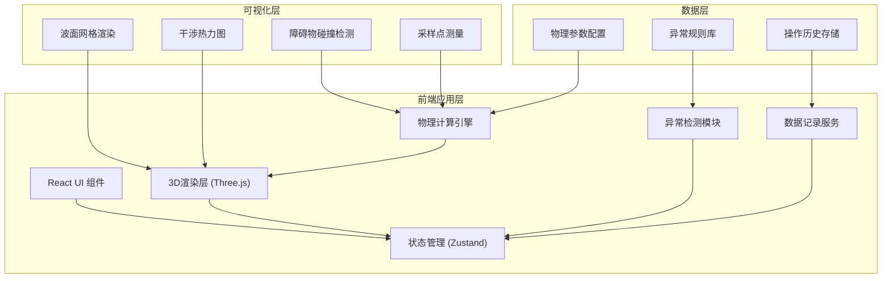

## 1. 架构设计



## 2. 技术描述

- **前端框架**：React 18 + TypeScript 5 + Vite 5
- **3D引擎**：Three.js 0.160 + @react-three/fiber 8.15 + @react-three/drei 9.92
- **物理计算**：自定义波动方程求解器，基于Huygens原理的双波源叠加
- **状态管理**：Zustand 4.4（轻量级，支持时间旅行调试）
- **样式方案**：TailwindCSS 3.4 + 自定义CSS变量
- **UI组件**：Radix UI（无障碍基础组件）+ 自定义封装
- **图表可视化**：recharts 2.10（用于采样点波形图）
- **截图导出**：html2canvas 1.4 + three.js CanvasRenderer
- **性能监控**：自定义FPS监控器，用于卡顿检测

## 3. 核心物理模型

### 3.1 波动方程

两列波的叠加遵循波动叠加原理：
```
y_total(x, y, t) = y1(x, y, t) + y2(x, y, t)
```

其中单列波的表达式为：
```
y = A * sin(k * r - ω * t + φ)
k = 2π / λ, ω = 2π * f
r = √[(x - x0)² + (y - y0)²]
```

### 3.2 干涉条件

- 相长干涉：波程差 = nλ，相位差 = 2nπ
- 相消干涉：波程差 = (n+1/2)λ，相位差 = (2n+1)π

### 3.3 障碍物模型

- 单缝衍射：障碍物中央开缝，边缘产生次级波源
- 双缝干涉：障碍物双缝，形成新的双波源
- 反射挡板：刚性边界，波的反射遵循反射定律

## 4. 异常检测系统

| 异常类型 | 检测规则 | 提示级别 | 处理方式 |
|----------|----------|----------|----------|
| 相位越界 | 相位值超出 [0, 2π] 范围 | 警告 | 自动取模修正，记录修正痕迹 |
| 频率过高 | 频率 > 5Hz 导致波长过小 | 警告 | 限制最大值，提示"波长过短，干涉条纹难以分辨" |
| 波面穿障 | 波面顶点穿透障碍物 | 错误 | 强制裁剪波面，红色高亮穿障区域 |
| 采样卡顿 | FPS < 30 持续超过1秒 | 警告 | 自动降低网格分辨率，提示性能优化建议 |
| 波源重叠 | 两波源间距 < λ/4 | 错误 | 限制最小间距，提示"波源过近，干涉现象不明显" |
| 障碍物过大 | 障碍物遮挡 > 70% 水面 | 警告 | 黄色高亮，提示"障碍物过大，干涉区域受限" |

## 5. 数据模型

### 5.1 状态定义

```typescript
interface WaveParams {
  source1: { x: number; y: number; frequency: number; phase: number; amplitude: number };
  source2: { x: number; y: number; frequency: number; phase: number; amplitude: number };
  wavelength: number;
  speed: number;
}

interface Obstacle {
  id: string;
  type: 'slit' | 'double_slit' | 'barrier' | 'reflector';
  position: { x: number; y: number };
  size: { width: number; height: number };
  rotation: number;
}

interface SamplePoint {
  id: string;
  position: { x: number; y: number };
  measurements: {
    amplitude: number;
    phase: number;
    frequency: number;
    timestamp: number;
  }[];
}

interface AnomalyRecord {
  id: string;
  type: string;
  severity: 'warning' | 'error';
  message: string;
  timestamp: number;
  paramsSnapshot: WaveParams;
  correction?: {
    action: string;
    before: any;
    after: any;
  };
}

interface ScoreRecord {
  id: string;
  timestamp: number;
  totalScore: number;
  breakdown: {
    category: string;
    score: number;
    maxScore: number;
    explanation: string;
  }[];
  paramsSnapshot: WaveParams;
}
```

### 5.2 Store 结构

```typescript
interface AppState {
  // 场景状态
  isPlaying: boolean;
  time: number;
  gridResolution: number;
  
  // 物理参数
  waveParams: WaveParams;
  obstacles: Obstacle[];
  samplePoints: SamplePoint[];
  
  // 显示选项
  showMesh: boolean;
  showHeatmap: boolean;
  showWaveSources: boolean;
  
  // 记录数据
  history: HistoryRecord[];
  anomalies: AnomalyRecord[];
  scores: ScoreRecord[];
  
  // 性能
  fps: number;
  isPerformanceMode: boolean;
  
  // 操作
  setWaveParams: (params: Partial<WaveParams>) => void;
  addObstacle: (obstacle: Omit<Obstacle, 'id'>) => void;
  removeObstacle: (id: string) => void;
  addSamplePoint: (position: { x: number; y: number }) => void;
  togglePlay: () => void;
  reset: () => void;
  takeScreenshot: () => string;
  calculateScore: () => ScoreRecord;
}
```

## 6. 评分系统算法

### 6.1 评分维度

1. **干涉清晰度（40分）**：干涉条纹的对比度
   - 计算公式：(A_max - A_min) / (A_max + A_min) * 40
   - 越接近1表示条纹越清晰

2. **参数合理性（30分）**：
   - 频率在合理范围（1-3Hz）：10分
   - 相位差在有效范围：10分
   - 波源间距合适（> λ/2）：10分

3. **无异常状态（20分）**：
   - 无警告：10分
   - 无错误：10分

4. **采样点匹配度（10分）**：
   - 采样点测量值与理论值的误差 < 5%：10分
   - 5%-15%：5分
   - >15%：0分

## 7. 性能优化策略

1. **LOD（细节层次）**：根据距离自动调整水面网格分辨率
2. **Web Worker**：物理计算在Web Worker中进行，不阻塞主线程
3. **增量更新**：仅更新变化的顶点，减少CPU-GPU数据传输
4. **Shader优化**：将波动计算移至GPU Vertex Shader
5. **自适应降级**：检测到性能不足时自动降低渲染质量
