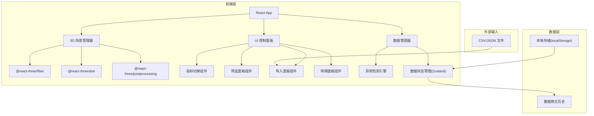
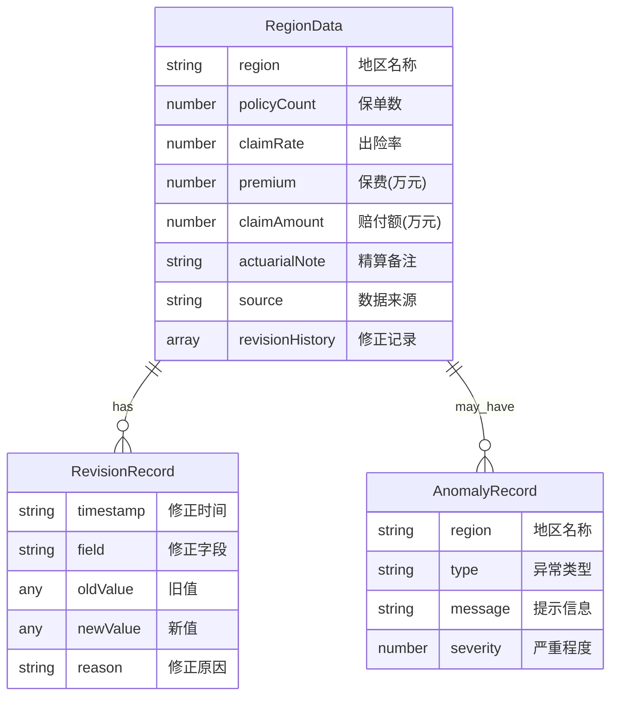

## 1. 架构设计



## 2. 技术说明

- **前端框架**：React@18 + TypeScript + Vite
- **样式方案**：Tailwind CSS@3
- **3D 渲染**：three.js + @react-three/fiber + @react-three/drei + @react-three/postprocessing
- **状态管理**：Zustand（轻量，适合单一页面复杂状态）
- **数据解析**：Papaparse（CSV 解析）
- **截图导出**：html2canvas + Three.js renderer.domElement.toDataURL
- **初始化工具**：Vite
- **后端**：无（纯前端应用，数据本地存储）
- **数据库**：无（使用 localStorage 持久化 + 内存状态管理）

## 3. 路由定义

| 路由 | 用途 |
|------|------|
| / | 3D 地图柱图主页（单页应用） |

## 4. 数据模型

### 4.1 数据模型定义



### 4.2 核心类型定义

```typescript
interface RegionData {
  id: string;
  region: string;
  policyCount: number;
  claimRate: number;
  premium: number;
  claimAmount: number;
  actuarialNote: string;
  source: string;
  revisionHistory: RevisionRecord[];
}

interface RevisionRecord {
  timestamp: string;
  field: string;
  oldValue: number | string;
  newValue: number | string;
  reason: string;
}

interface AnomalyRecord {
  region: string;
  type: 'region_merge' | 'extreme_claim' | 'ratio_mismatch';
  message: string;
  severity: 'warning' | 'critical';
}

type ImportMode = 'ignore' | 'overwrite' | 'append';
type MetricType = 'claimRate' | 'premium' | 'claimAmount' | 'policyCount';

interface AppState {
  regions: RegionData[];
  anomalies: AnomalyRecord[];
  activeMetric: MetricType;
  selectedRegion: string | null;
  filterRegions: string[];
  importMode: ImportMode;
  showDetail: boolean;
}
```

## 5. 组件架构

```mermaid
graph TD
    "App" --> "Scene3D"
    "App" --> "ControlPanel"
    "App" --> "ImportDialog"
    "App" --> "DetailPanel"
    "App" --> "AnomalyBanner"
    "App" --> "ExportButton"
    "Scene3D" --> "MapFloor"
    "Scene3D" --> "BarCluster"
    "Scene3D" --> "BarLabel"
    "Scene3D" --> "HoverCard3D"
    "Scene3D" --> "StarField"
    "BarCluster" --> "SingleBar"
    "ControlPanel" --> "MetricSwitch"
    "ControlPanel" --> "RegionFilter"
    "ControlPanel" --> "MetricCompareToggle"
```

## 6. 关键实现要点

### 6.1 3D 地图布局

- 中国地图各省以经纬度映射到 3D 平面坐标（使用简化的省份中心点坐标表）
- 每个省份位置放置一根圆柱体，高度按当前选中指标的归一化值映射
- 柱体使用 MeshPhysicalMaterial 半透明材质，透射率 0.3，粗糙度 0.2

### 6.2 异常检测引擎

- 每次数据变更后自动执行异常检测
- 极端赔付：计算所有地区赔付额均值和标准差，超过均值 + 3σ 标记
- 比例误读：计算赔付率 = 赔付额 / 保费，超过 200% 或低于 10% 标记
- 地区合并：追加模式下检测 region 名称重复

### 6.3 数据修正追溯

- 所有数据变更记录 revisionHistory，包含时间戳、字段、新旧值、原因
- 导入覆盖时自动记录被覆盖的字段变更
- 明细面板底部展示修正历史时间线

### 6.4 截图导出

- 使用 Three.js renderer 的 preserveDrawingBuffer: true
- 导出时将 renderer.domElement 转为 DataURL
- 使用 Canvas API 叠加水印信息（时间、指标、筛选状态）
- 生成 PNG 供用户下载

### 6.5 导入模式处理

| 模式 | 行为 |
|------|------|
| 忽略 (ignore) | 遇到已存在的地区名称时跳过，仅导入新地区数据 |
| 覆盖 (overwrite) | 遇到已存在的地区名称时完全替换数据，旧数据记录到修订历史 |
| 追加 (append) | 遇到已存在的地区名称时合并数值（数值字段取最新，字符串字段拼接），标记为地区合并异常 |
