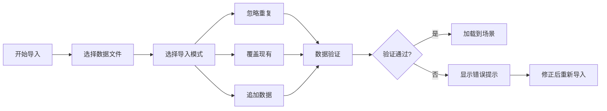

## 1. 产品概述

粒子碰撞云室是一款面向科普馆的交互式Web3D演示工具，帮助访客直观理解粒子物理中的粒子轨迹、磁场效应和衰变现象。通过动态3D可视化、实时参数调整和数据导入导出功能，将抽象的粒子物理概念转化为可交互的沉浸式体验。

- 核心目标：让访客通过视觉化方式理解粒子物理基础知识
- 解决问题：传统科普材料缺乏直观的3D演示和互动体验
- 目标用户：科普馆策展人、访客、物理教育工作者
- 产品价值：提供专业级粒子物理可视化，支持自定义数据导入和演示场景保存

## 2. 核心功能

### 2.1 用户角色

| 角色 | 使用方式 | 核心权限 |
|------|----------|----------|
| 策展人 | 浏览器访问 | 导入数据、配置磁场、导出截图、管理演示场景 |
| 访客 | 浏览器访问 | 查看粒子轨迹、调整参数、暂停事件、查看说明 |

### 2.2 功能模块

1. **3D云室场景**: 粒子轨迹渲染、磁场可视化、云室环境效果
2. **粒子控制系统**: 粒子筛选、速度调整、类型切换
3. **磁场控制面板**: 磁场强度调节、方向控制、可视化显示
4. **事件交互系统**: 事件暂停、衰变事件标记、轨迹回放
5. **信息展示面板**: 悬浮信息、粒子详情、错误提示
6. **数据管理模块**: 数据导入(忽略/覆盖/追加)、截图导出、来源记录
7. **修正痕迹系统**: 版本历史、修改记录、来源追踪

### 2.3 页面详情

| 页面名称 | 模块名称 | 功能描述 |
|---------|---------|----------|
| 主界面 | 3D云室场景 | 实时渲染粒子轨迹、磁场线、衰变事件 |
| 主界面 | 左侧控制面板 | 粒子筛选、速度控制、磁场参数调节 |
| 主界面 | 右侧信息面板 | 粒子详情、事件列表、错误提示 |
| 主界面 | 底部工具栏 | 暂停/播放、截图导出、数据导入、重置 |
| 主界面 | 修正痕迹面板 | 显示数据来源、修改历史、版本记录 |

## 3. 核心流程

### 3.1 访客浏览流程
访客进入页面 → 查看默认粒子演示 → 调整磁场/粒子参数 → 点击粒子查看详情 → 暂停观察衰变事件 → 导出感兴趣的截图

### 3.2 策展人数据导入流程
策展人点击导入 → 选择数据文件 → 选择导入模式(忽略/覆盖/追加) → 系统验证数据 → 显示验证结果和错误提示 → 确认导入 → 数据加载到场景中

## 4. 用户界面设计

### 4.1 设计风格

- **主色调**: 深空蓝 (#0a1628) - 营造物理实验室的专业感
- **辅助色**: 粒子蓝 (#3b82f6)、质子红 (#ef4444)、电子绿 (#10b981)、中子黄 (#f59e0b)
- **背景**: 深色渐变配合粒子发光效果
- **按钮风格**: 玻璃拟态效果，圆角设计，悬浮发光
- **字体**: 标题使用 Orbitron (科技感)，正文使用 JetBrains Mono (代码风格)
- **布局**: 中央3D场景为主，左右控制面板为辅，底部工具栏
- **图标**: 线性图标配合荧光效果
- **整体氛围**: 科研实验室/粒子探测器的科技美学

### 4.2 页面设计概述

| 页面名称 | 模块名称 | UI 元素 |
|---------|---------|---------|
| 主界面 | 3D云室场景 | 雾效云室、发光粒子轨迹、磁场线可视化、衰变事件闪光 |
| 主界面 | 左侧控制面板 | 粒子筛选标签页、滑块控件、开关按钮、参数数值显示 |
| 主界面 | 右侧信息面板 | 粒子属性卡片、事件时间线、错误警告提示框 |
| 主界面 | 底部工具栏 | 播放/暂停按钮、速度控制、截图按钮、导入按钮、重置按钮 |
| 主界面 | 修正痕迹面板 | 可折叠抽屉、修改记录列表、来源信息标签 |

### 4.3 响应式设计

- 桌面端优先设计 (1920×1080)
- 平板端: 控制面板转为可折叠侧边栏
- 移动端: 简化界面，保留核心3D场景和基础控制
- 触摸优化: 增大按钮尺寸，支持双指缩放旋转

### 4.4 3D场景设计

- **环境**: 云雾效果的立方体云室，内部有微弱的体积光
- **光照**: 环境光配合粒子自发光，使用Bloom后期效果
- **相机**: 透视相机，支持轨道控制，默认视角45度
- **粒子轨迹**: 使用TubeGeometry生成管状轨迹，不同粒子有不同颜色和粗细
- **磁场可视化**: 箭头指示器显示磁场方向和强度
- **交互**: 点击轨迹高亮，鼠标悬停显示信息卡片
- **后处理**: Bloom发光、轻微色差、胶片颗粒
