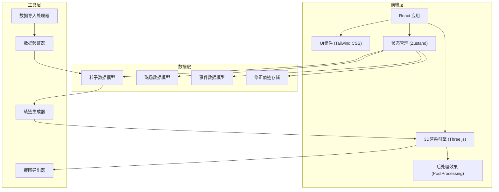
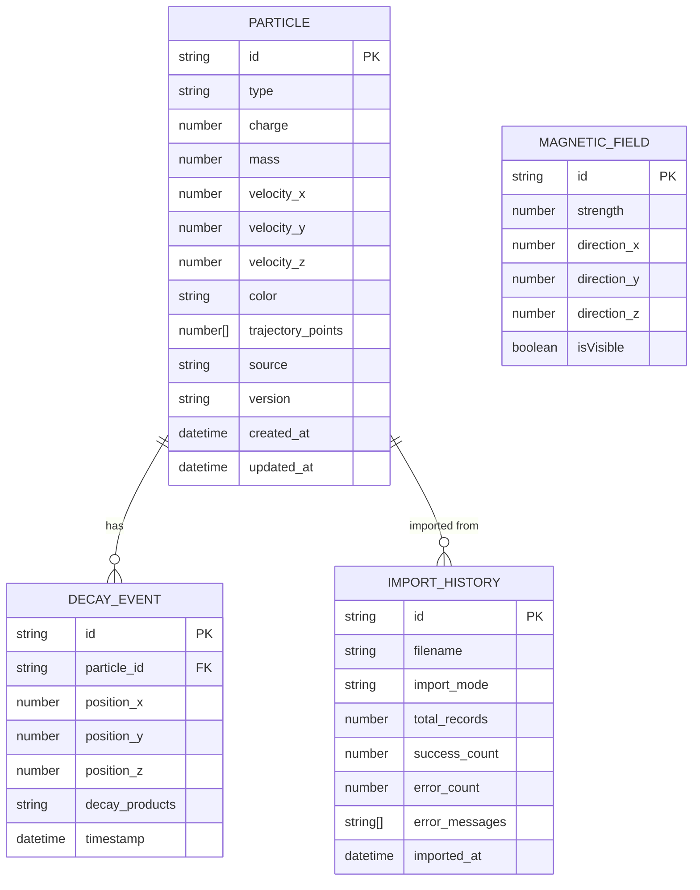

## 1. 架构设计



## 2. 技术描述

- **前端框架**: React@18 + TypeScript
- **构建工具**: Vite@5
- **3D引擎**: Three.js@0.160 + @react-three/fiber@8 + @react-three/drei@9
- **后处理**: @react-three/postprocessing@2
- **样式**: Tailwind CSS@3
- **状态管理**: Zustand@4
- **图标**: Lucide React
- **字体**: Orbitron (标题), JetBrains Mono (正文)
- **数据格式**: JSON 导入导出

## 3. 目录结构

```
src/
├── components/
│   ├── ui/                    # 基础UI组件
│   ├── CloudChamber/          # 云室3D组件
│   ├── ControlPanel/          # 左侧控制面板
│   ├── InfoPanel/             # 右侧信息面板
│   ├── Toolbar/               # 底部工具栏
│   └── TraceHistory/          # 修正痕迹面板
├── store/                     # Zustand 状态管理
│   ├── useParticleStore.ts
│   ├── useMagneticFieldStore.ts
│   └── useAppStore.ts
├── types/                     # TypeScript 类型定义
│   ├── particle.ts
│   ├── event.ts
│   └── import.ts
├── utils/                     # 工具函数
│   ├── dataValidator.ts
│   ├── trajectoryGenerator.ts
│   ├── screenshot.ts
│   └── importHandler.ts
├── data/                      # 示例数据
│   └── sampleParticles.json
├── hooks/                     # 自定义Hooks
│   ├── useParticleSelection.ts
│   └── useAnimationLoop.ts
└── App.tsx
```

## 4. 数据模型

### 4.1 粒子数据模型



### 4.2 TypeScript 类型定义

```typescript
// 粒子类型
interface Particle {
  id: string;
  type: 'electron' | 'proton' | 'neutron' | 'muon' | 'pion' | 'kaon';
  charge: number;
  mass: number;
  velocity: Vector3;
  color: string;
  trajectoryPoints: Vector3[];
  source: string;
  version: string;
  createdAt: Date;
  updatedAt: Date;
}

// 衰变事件
interface DecayEvent {
  id: string;
  particleId: string;
  position: Vector3;
  decayProducts: string[];
  timestamp: number;
}

// 磁场
interface MagneticField {
  strength: number;
  direction: Vector3;
  isVisible: boolean;
}

// 导入模式
type ImportMode = 'ignore' | 'overwrite' | 'append';

// 导入结果
interface ImportResult {
  success: boolean;
  totalRecords: number;
  successCount: number;
  errorCount: number;
  errors: ValidationError[];
  importMode: ImportMode;
}

// 验证错误
interface ValidationError {
  type: 'trajectory_break' | 'field_direction' | 'wrong_label' | 'missing_field';
  particleId?: string;
  message: string;
  severity: 'warning' | 'error';
}
```

## 5. 核心功能实现

### 5.1 轨迹生成算法

1. **洛伦兹力计算**: F = q(v × B)
2. **数值积分**: 使用欧拉法或龙格-库塔法计算粒子运动
3. **轨迹平滑**: 对轨迹点进行贝塞尔曲线平滑处理
4. **断裂检测**: 检查轨迹点间距，超过阈值标记为断裂

### 5.2 数据验证流程

1. 检查必填字段是否存在
2. 验证粒子类型标签是否正确
3. 检测轨迹断裂情况
4. 验证磁场方向向量是否有效
5. 生成错误报告和提示

### 5.3 导入模式处理

- **忽略模式**: 检查ID冲突，跳过已存在的粒子
- **覆盖模式**: 删除现有数据，导入新数据
- **追加模式**: 保留现有数据，添加新粒子（ID冲突时重命名）
