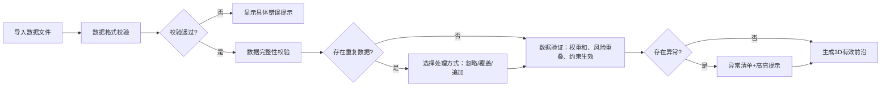
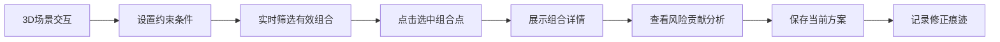

## 1. 产品概述

为投顾团队打造专业级投资组合有效前沿3D交互可视化平台，解决传统表格和截图展示效率低、交互性差的问题。通过三维空间直观展示收益、波动、回撤三者的权衡关系，支持约束筛选、方案保存与报告导出。

- 解决的核心问题：
  - 传统二维图表无法同时展示收益、波动、回撤三个维度的权衡关系
  - 权重不为一、风险点重叠、限制未生效等异常情况缺乏明确提示
  - 重复导入数据时缺乏清晰的冲突处理机制
  - 方案调整缺乏版本追溯和修正痕迹

## 2. 核心特征

### 2.1 用户角色

| 角色 | 注册方式 | 核心权限 |
|------|-----------|----------|
| 投顾团队 | 本地登录 | 数据导入、3D交互分析、方案管理、报告导出 |
| 客户查看 | 链接分享 | 只读查看3D可视化结果 |

### 2.2 功能模块

1. **3D有效前沿可视化**：三维散点曲面图、坐标轴映射、有效前沿曲面、交互式旋转缩放
2. **数据导入与验证**：多格式导入、数据校验、异常提示、冲突处理
3. **约束筛选引擎**：权重约束、风险约束、收益约束、实时筛选
4. **组合详情面板**：权重构成、风险指标、收益指标、风险贡献分析
5. **方案管理中心**：方案保存、版本追踪、修正痕迹、对比分析
6. **报告导出模块**：PDF报告、Excel数据、图表导出、自定义模板

### 2.3 页面详情

| 页面名称 | 模块名称 | 功能描述 |
|-----------|-----------|----------|
| 主工作台 | 3D场景区域 | 支持鼠标拖拽旋转、滚轮缩放、点击选中组合点 |
| 主工作台 | 左侧控制面板 | 数据导入、约束设置、筛选条件配置 |
| 主工作台 | 右侧详情面板 | 组合详情、指标计算、风险贡献分析 |
| 主工作台 | 底部操作栏 | 方案保存、对比分析、报告导出 |
| 方案管理 | 版本历史 | 展示所有方案版本、修正痕迹、来源记录 |
| 方案管理 | 方案对比 | 多方案对比、差异高亮、参数对比 |

## 3. 核心流程

### 3.1 数据导入流程

### 3.2 组合分析流程

## 4. 用户界面设计

### 4.1 设计风格

- **主色调**：深空蓝 #0a1628 为背景，搭配专业金融蓝 #1e3a5f 为主色，琥珀金 #d4af37 为强调色
- **辅助色**：收益绿 #10b981，风险红 #ef4444，中性灰 #64748b
- **按钮风格**：微立体圆角按钮，hover时有微光效果，选中状态有金边
- **字体**：标题使用 Playfair Display（衬线字体，体现专业金融感），正文使用 Inter（清晰易读）
- **布局风格**：暗色主题金融科技风格，左侧控制面板采用玻璃拟态效果，3D场景区域无边框沉浸式体验
- **图标风格**：线性细线图标，统一2px描边，选中状态填充金色

### 4.2 页面设计概述

| 页面名称 | 模块名称 | UI元素 |
|-----------|-----------|---------|
| 主工作台 | 3D场景区域 | 深空渐变背景、金色坐标轴、彩色散点（收益绿→风险红渐变、半透明有效前沿曲面、悬浮标签、选中高光 |
| 主工作台 | 左侧控制面板 | 玻璃拟态面板、分组折叠、滑块控件、多选标签、异常高亮红框 |
| 主工作台 | 右侧详情面板 | 数据卡片、进度条、雷达图、权重饼图、风险贡献条形图 |
| 主工作台 | 底部操作栏 | 固定底部、半透明背景、操作按钮组、状态指示灯 |
| 方案管理 | 版本历史 | 时间线布局、版本卡片、差异对比标签、来源备注 |

### 4.3 响应式设计

- **桌面端优先**：1920px为主设计尺寸，三栏布局（左侧280px + 中间自适应 + 右侧360px）
- **平板适配**：折叠左侧面板，右侧面板改为底部抽屉
- **移动端**：单列布局，3D场景全屏，控制面板改为浮动按钮触发抽屉

### 4.4 3D场景指导

- **环境与氛围**：深空渐变背景，顶部微弱星空粒子，底部柔和环境光，营造专业金融分析氛围
- **光照设置**：主光源从45度斜上方，暖色补光从侧面，点光源聚焦有效前沿曲面
- **相机设置**：初始视角45度俯视角，PerspectiveCamera fov=50，近远剪裁0.1-1000
- **构图与焦点**：有效前沿曲面为视觉中心，散点围绕曲面分布，选中点有金色光晕突出
- **交互与动画**：曲面生成时从下往上渐现动画，选中点有呼吸灯效果，约束筛选时有粒子消散/聚合过渡动画
- **后处理效果**：Bloom泛光效果（选中点）、SSAO环境光遮蔽、轻微抗锯齿
- **资产来源与性能**：Three.js原生几何体，1000个散点以内保持60fps，曲面细分适度

## 5. 异常处理设计

### 5.1 权重不为一提示
- 红色边框高亮权重和数值
- 显示具体权重和数值（精确到0.0001）
- 提供一键修正按钮（归一化处理）
- 异常状态持续标记，不混入正常结果

### 5.2 风险点重叠提示
- 重叠点用特殊图标标记
- 鼠标悬停显示重叠的具体组合信息
- 提供去重处理选项
- 风险重叠计数显示

### 5.3 限制未生效提示
- 黄色警告图标标记
- 显示具体哪条约束未生效
- 说明原因（如约束过严无满足条件）
- 提供约束调整建议
