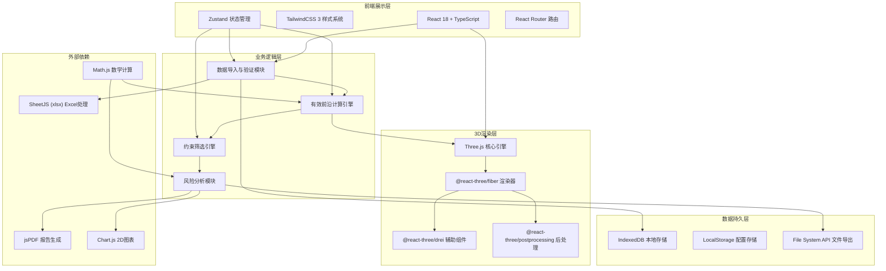
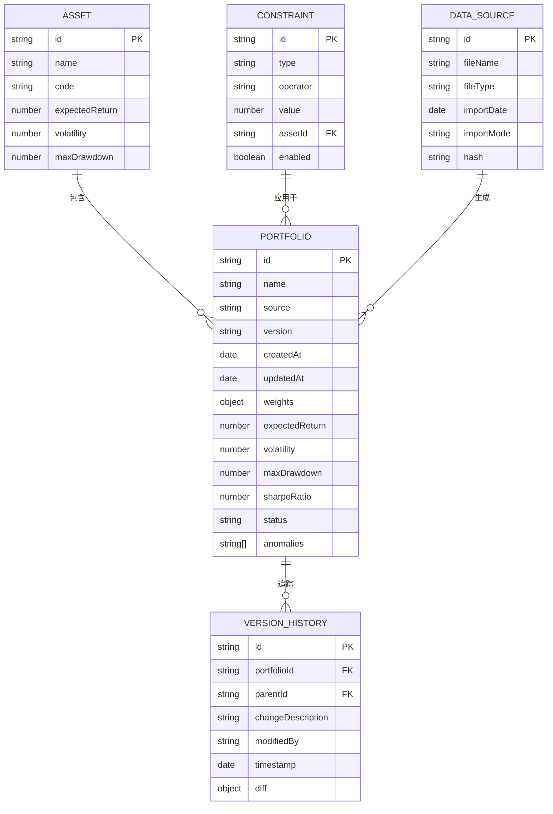

## 1. 架构设计



## 2. 技术描述

- **前端框架**: React@18.2.0 + TypeScript@5.4.0
- **构建工具**: Vite@5.2.0
- **样式系统**: TailwindCSS@3.4.0
- **状态管理**: Zustand@4.5.0
- **路由管理**: React Router@6.22.0
- **3D引擎**: Three@0.162.0
- **React Three Fiber**: @react-three/fiber@8.15.0
- **R3F辅助组件**: @react-three/drei@9.99.0
- **后处理效果**: @react-three/postprocessing@2.16.0
- **数学计算**: mathjs@12.4.0
- **Excel处理**: xlsx@0.18.5
- **PDF生成**: jspdf@2.5.1 + jspdf-autotable@3.8.2
- **2D图表**: chart.js@4.4.0 + react-chartjs-2@5.2.0
- **数据存储**: IndexedDB (idb@8.0.0)

## 3. 目录结构

```
src/
├── components/
│   ├── common/          # 通用组件
│   ├── three/           # 3D场景组件
│   │   ├── Scene3D.tsx
│   │   ├── EfficientFrontier.tsx
│   │   ├── PortfolioPoints.tsx
│   │   ├── Axis3D.tsx
│   │   └── Controls.tsx
│   ├── panels/          # 面板组件
│   │   ├── ControlPanel.tsx
│   │   ├── DetailPanel.tsx
│   │   └── BottomBar.tsx
│   └── charts/          # 2D图表组件
├── store/               # Zustand状态管理
│   ├── useDataStore.ts
│   ├── useFilterStore.ts
│   └── usePortfolioStore.ts
├── engine/              # 核心计算引擎
│   ├── efficientFrontier.ts
│   ├── constraints.ts
│   ├── riskAnalysis.ts
│   └── validation.ts
├── utils/               # 工具函数
│   ├── fileHandler.ts
│   ├── exporters.ts
│   └── formatters.ts
├── types/               # TypeScript类型定义
│   ├── portfolio.ts
│   ├── constraints.ts
│   └── report.ts
├── pages/               # 页面组件
│   ├── Workbench.tsx
│   └── PortfolioManager.tsx
└── mock/                # Mock数据
    └── sampleData.ts
```

## 4. 路由定义

| 路由 | 页面 | 功能描述 |
|-------|------|----------|
| / | 主工作台 | 3D可视化、约束筛选、组合分析 |
| /portfolios | 方案管理 | 方案列表、版本历史、对比分析 |
| /report/:id | 报告预览 | 单方案报告预览与导出 |

## 5. 数据模型

### 5.1 数据模型定义



### 5.2 核心类型定义

```typescript
// 资产类型
interface Asset {
  id: string;
  name: string;
  code: string;
  expectedReturn: number;
  volatility: number;
  maxDrawdown: number;
  category?: string;
}

// 投资组合
interface Portfolio {
  id: string;
  name: string;
  source: string;
  version: string;
  createdAt: Date;
  updatedAt: Date;
  weights: Record<string, number>;
  expectedReturn: number;
  volatility: number;
  maxDrawdown: number;
  sharpeRatio: number;
  status: 'normal' | 'warning' | 'error';
  anomalies: Anomaly[];
  riskContributions?: Record<string, number>;
}

// 异常类型
interface Anomaly {
  type: 'weight_sum' | 'risk_overlap' | 'constraint_inactive';
  severity: 'error' | 'warning';
  message: string;
  details: Record<string, any>;
}

// 约束条件
interface Constraint {
  id: string;
  type: 'weight' | 'return' | 'volatility' | 'drawdown' | 'correlation';
  operator: 'gt' | 'lt' | 'eq' | 'between';
  value: number | [number, number];
  assetId?: string;
  enabled: boolean;
}

// 数据来源
interface DataSource {
  id: string;
  fileName: string;
  fileType: 'xlsx' | 'csv' | 'json';
  importDate: Date;
  importMode: 'ignore' | 'overwrite' | 'append';
  hash: string;
  portfolioIds: string[];
}

// 版本历史
interface VersionHistory {
  id: string;
  portfolioId: string;
  parentId?: string;
  changeDescription: string;
  modifiedBy: string;
  timestamp: Date;
  diff: Record<string, any>;
}

// 有效前沿计算结果
interface EfficientFrontierResult {
  portfolios: Portfolio[];
  surfacePoints: Vector3[][];
  optimalPortfolio?: Portfolio;
  maxSharpePortfolio?: Portfolio;
  minVolatilityPortfolio?: Portfolio;
}
```

## 6. 核心算法说明

### 6.1 有效前沿计算

使用马科维茨均值-方差模型，通过二次规划求解：

```
目标函数: min w^T Σ w
约束条件:
  - w^T μ = r (目标收益)
  - Σ w_i = 1 (权重和为1)
  - w_i ≥ 0 (无卖空约束)
  - 其他用户自定义约束
```

### 6.2 最大回撤计算

```typescript
function calculateMaxDrawdown(returns: number[]): number {
  let peak = returns[0];
  let maxDrawdown = 0;
  
  for (let i = 1; i < returns.length; i++) {
    peak = Math.max(peak, returns[i]);
    const drawdown = (peak - returns[i]) / peak;
    maxDrawdown = Math.max(maxDrawdown, drawdown);
  }
  
  return maxDrawdown;
}
```

### 6.3 风险贡献度计算

```typescript
function calculateRiskContribution(
  weights: number[],
  covariance: number[][]
): number[] {
  const totalRisk = Math.sqrt(
    weights.reduce((sum, w_i, i) =>
      sum + weights.reduce((inner, w_j, j) =>
        inner + w_i * w_j * covariance[i][j], 0), 0)
  );
  
  return weights.map((w_i, i) => {
    const marginalRisk = weights.reduce((sum, w_j, j) =>
      sum + w_j * covariance[i][j], 0);
    return (w_i * marginalRisk) / totalRisk;
  });
}
```

## 7. 性能优化策略

1. **3D渲染优化**:
   - 使用InstancedMesh渲染大量散点
   - 启用Frustum Culling
   - 曲面细分自适应调整
   - 后处理效果可配置开关

2. **计算优化**:
   - Web Worker进行有效前沿计算
   - 结果缓存机制
   - 增量计算支持

3. **数据存储优化**:
   - IndexedDB分页查询
   - 数据压缩存储
   - 懒加载机制

## 8. 安全与数据隐私

1. 所有数据存储在本地IndexedDB，不上传服务器
2. 支持数据加密存储（可选）
3. 导出报告可添加水印
4. 支持数据一键清除功能
