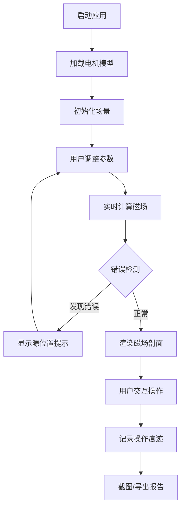

## 1. 产品概述

本产品是一款面向机电专业教学的3D交互式电机磁场剖面可视化工具。通过Three.js技术实现电机模型的实时渲染，支持线圈电流切换、磁场剖面观察、参数保存与报告导出，解决传统教学中抽象概念难以理解的问题。

- **核心目标**：让学生直观理解电机内部磁场分布与电流方向的关系
- **解决痛点**：电流方向错误、剖面丢失、颜色比例不一致等问题的可视化提示
- **目标用户**：机电专业教师与学生

## 2. 核心功能

### 2.1 用户角色

| 角色 | 注册方式 | 核心权限 |
|------|----------|----------|
| 教师用户 | 无需注册 | 完整功能使用、参数配置、报告导出 |
| 学生用户 | 无需注册 | 交互操作、参数调整、截图保存 |

### 2.2 功能模块

1. **3D电机场景**：电机模型渲染、线圈电流可视化、磁场箭头显示
2. **参数控制面板**：线圈电流方向/大小、转子角度、剖面位置调节
3. **剖面剖切系统**：任意平面剖切、颜色映射、磁场强度显示
4. **错误提示系统**：电流方向错误、剖面丢失、颜色比例不一致的源位置追踪
5. **报告导出模块**：参数记录、截图保存、PDF报告生成
6. **历史追溯**：操作来源记录、每次修正痕迹保留

### 2.3 页面详情

| 页面名称 | 模块名称 | 功能描述 |
|----------|----------|----------|
| 主界面 | 3D视口 | 电机模型渲染、视角控制、剖切交互 |
| 主界面 | 参数面板 | 电流控制、转子角度、剖面位置、颜色映射 |
| 主界面 | 错误提示栏 | 实时错误检测、源位置显示、修正建议 |
| 主界面 | 操作记录 | 操作历史、来源追踪、版本对比 |
| 报告预览 | 报告生成器 | 参数汇总、截图嵌入、说明文本、导出PDF |

## 3. 核心流程

用户打开应用后，首先看到3D电机模型，可通过控制面板调整线圈电流参数，系统实时计算并显示磁场分布。用户可进行剖切操作观察内部磁场剖面，系统自动检测常见错误并给出带源位置的提示。完成操作后可保存参数配置、截图并导出教学报告。

## 4. 用户界面设计

### 4.1 设计风格
- **主色调**：科技蓝 (#165DFF) 作为主色，搭配深灰背景 (#0F172A)
- **辅助色**：磁场强度渐变色谱（蓝→青→绿→黄→红）
- **按钮风格**：圆角直角混合设计，带轻微阴影，悬停有发光效果
- **字体**：JetBrains Mono（代码/数值） + Noto Sans SC（中文）
- **布局风格**：左侧参数面板 + 中央3D视口 + 右侧信息面板的三栏布局
- **图标风格**：线性图标，科技感强，统一24px尺寸

### 4.2 页面设计概述

| 页面名称 | 模块名称 | UI元素 |
|----------|----------|--------|
| 主界面 | 3D视口 | 暗色背景、网格地面、环境光、轨道控制器、剖切平面 |
| 主界面 | 参数面板 | 分组折叠面板、滑块控件、开关按钮、数值输入框 |
| 主界面 | 错误提示栏 | 红色警告卡片、代码行号引用、修复按钮 |
| 主界面 | 操作记录 | 时间线布局、来源标签、版本对比按钮 |
| 报告预览 | 报告生成器 | 卡片式布局、预览区域、导出按钮组 |

### 4.3 响应性
- 桌面端优先设计（1920×1080）
- 平板端自适应调整面板宽度
- 支持全屏模式切换
- 触控设备支持手势旋转/缩放

### 4.4 3D场景指引
- **环境**：深色科技风格，渐变背景，弱网格地面
- **光照**：AmbientLight + DirectionalLight + 点光源补光
- **相机**：PerspectiveCamera，初始距离10，倾角45度
- **交互**：OrbitControls，支持阻尼效果，限制缩放范围
- **动画**：线圈电流变化时的过渡动画、剖切平面滑动效果
- **后处理**：Bloom效果增强发光线圈，FXAA抗锯齿
- **性能**：模型面数控制在5万以内，磁场箭头按需渲染
