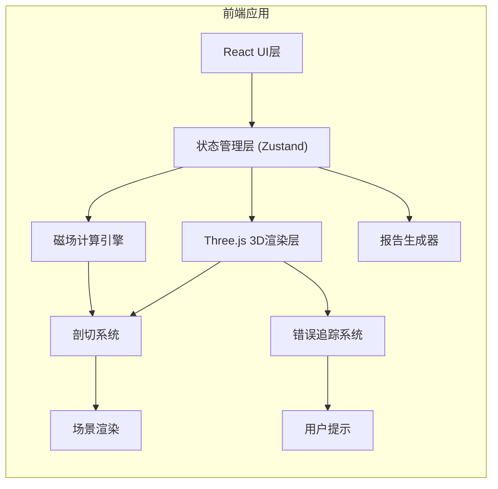

## 1. 架构设计



## 2. 技术选型

### 2.1 核心框架
- **前端框架**: React@18 + TypeScript
- **构建工具**: Vite@5
- **样式方案**: TailwindCSS@3
- **状态管理**: Zustand
- **3D渲染**: Three.js@0.160

### 2.2 3D相关库
- `three`: 3D渲染核心
- `@react-three/fiber`: React集成
- `@react-three/drei`: 常用组件库
- `@react-three/postprocessing`: 后期处理
- `three-mesh-bvh`: 加速射线检测

### 2.3 工具库
- `html2canvas`: 截图功能
- `jspdf`: PDF报告生成
- `lucide-react`: 图标库
- `clsx`: 样式类名管理

## 3. 目录结构

```
src/
├── components/
│   ├── ui/                    # 基础UI组件
│   ├── panels/                  # 面板组件
│   ├── three/                 # 3D场景组件
│   └── reports/              # 报告相关组件
├── store/                       # 状态管理
├── hooks/                       # 自定义Hooks
├── utils/                       # 工具函数
│   ├── magneticField.ts        # 磁场计算
│   ├── errorTracker.ts        # 错误追踪
│   └── reportGenerator.ts     # 报告生成
├── types/                       # TypeScript类型定义
├── assets/                      # 静态资源
└── App.tsx                     # 主应用入口
```

## 4. 核心模块设计

### 4.1 磁场计算模块
```typescript
interface CoilConfig {
  id: string;
  current: number;
  direction: 'clockwise' | 'counterclockwise';
  position: Vector3;
}

interface MagneticFieldSample {
  position: Vector3;
  fieldStrength: number;
  fieldDirection: Vector3;
  sourceRef: string;
}
```

### 4.2 错误追踪系统
```typescript
interface ErrorRecord {
  id: string;
  type: 'current_direction' | 'section_missing' | 'color_scale_mismatch;
  severity: 'warning' | 'error';
  message: string;
  sourceLocation: {
    file: string;
    line: number;
    column: number;
  };
  timestamp: number;
  suggestion: string;
}
```

### 4.3 参数配置
```typescript
interface MotorConfig {
  coils: CoilConfig[];
  rotorAngle: number;
  sectionPlane: {
    normal: Vector3;
    position: number;
  };
  colorScale: {
    min: number;
    max: number;
  };
}
```

## 5. 路由定义

| 路由 | 组件 | 功能描述 |
|------|------|----------|
| / | MainScene | 主场景页面 |
| /report | ReportPreview | 报告预览页面 |

## 6. 数据持久化

### 6.1 localStorage 存储
- `motorConfig`: 电机配置参数
- `operationHistory`: 操作历史记录
- `errorLogs`: 错误日志
- `screenshots`: 截图数据(base64)

### 6.2 操作历史记录
```typescript
interface OperationRecord {
  id: string;
  type: 'param_change' | 'section_adjust' | 'coil_current';
  timestamp: number;
  previousValue: any;
  newValue: any;
  sourceRef: string;
}
```

## 7. 性能优化策略

1. **3D渲染优化
- 使用 InstancedMesh 批量渲染磁场箭头
- LOD 多级细节控制
- WebGL 视锥体剔除
- requestAnimationFrame 帧率控制

2. **计算优化**
- Web Worker 磁场计算
- 磁场采样点缓存
- 增量更新机制

3. **内存管理**
- 几何体复用池
- 纹理资源及时释放
- 截图数据压缩存储
