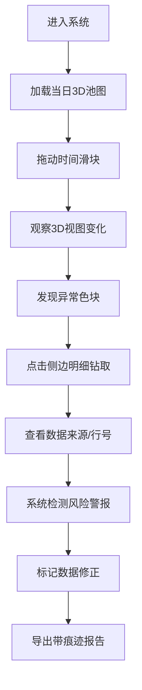

## 1. 产品概述

基金赎回流动性池3D交互可视化系统，为资管运营团队提供实时流动性风险监控能力。通过3D池图直观展示持仓流动性分层与客户赎回压力，提前预警挤兑风险。

- **核心目标**：解决赎回跨日、流动性错层、现金重复占用等隐蔽风险的可视化问题
- **目标用户**：资管运营团队、风险管理人员、基金经理
- **产品价值**：将抽象的流动性数据转化为可交互的3D可视化，支持数据钻取和风险追溯

## 2. 核心功能

### 2.1 用户角色

| 角色 | 注册方式 | 核心权限 |
|------|----------|----------|
| 资管运营 | 系统登录 | 查看3D池图、筛选数据、钻取明细、导出报告 |
| 风险经理 | 系统登录 | 查看风险警报、修正数据、查看修正痕迹 |

### 2.2 功能模块

1. **主面板**：3D流动性池图、时间滑块、压力图例
2. **侧边明细**：持仓明细、赎回明细、现金头寸、风险警报
3. **数据管理**：数据来源追溯、修正记录、行号定位
4. **报告导出**：压力测试报告、风险快照、数据修正日志

### 2.3 页面详情

| 页面名称 | 模块名称 | 功能描述 |
|----------|----------|----------|
| 主可视化页 | 3D池图渲染 | 分层展示流动性池，颜色编码压力等级，支持旋转缩放 |
| 主可视化页 | 时间轴滑块 | 拖动查看不同时间点的流动性状态，标记跨日赎回 |
| 主可视化页 | 风险警报区 | 实时显示三类风险：赎回跨日、流动性错层、现金重复占用 |
| 侧边面板 | 持仓明细 | 按流动性等级分组，点击高亮3D对应区块，显示来源行号 |
| 侧边面板 | 赎回明细 | 客户赎回请求列表，支持按日期/金额筛选 |
| 侧边面板 | 现金头寸 | 实时现金余额与占用情况，标记重复占用 |
| 导出弹窗 | 报告生成 | 导出包含修正痕迹和原始行号的PDF/Excel报告 |

## 3. 核心流程

用户进入系统后，首先查看当前交易日的3D流动性池全貌。通过时间滑块回溯历史数据，观察流动性变化趋势。当发现异常色块时，点击侧边明细进行钻取，查看具体持仓或赎回记录及其数据来源。系统自动检测三类风险并高亮显示，用户可标记修正并保留痕迹。最后导出包含完整溯源信息的风险报告。

## 4. 用户界面设计

### 4.1 设计风格

- **主色调**：深邃科技蓝(#0A1628)作为背景，营造专业金融科技氛围
- **压力颜色编码**：
  - 安全区：渐变绿(#00D4AA → #00A884)
  - 警告区：渐变黄(#FFB800 → #FF9500)
  - 危险区：渐变红(#FF3B30 → #D70015)
  - 高风险：闪烁紫红(#FF2D55)
- **字体**：Display字体使用Space Grotesk（数字展示），正文字体使用Inter（数据表格）
- **布局风格**：暗黑模式，玻璃拟态侧边栏，3D场景占据主视觉区
- **图标风格**：线性金融图标，霓虹发光效果

### 4.2 页面设计概览

| 页面名称 | 模块名称 | UI元素 |
|----------|----------|--------|
| 主可视化页 | 3D池图 | 分层立方体池、粒子效果、光晕边框、鼠标悬停高亮 |
| 主可视化页 | 时间轴 | 渐变滑块、日期标记点、风险事件锚点、播放控制 |
| 主可视化页 | 风险警报 | 卡片式警报、闪烁动画、来源行号标签、一键钻取按钮 |
| 侧边面板 | 数据表格 | 斑马纹行、悬停高亮、来源列、修正痕迹标记 |
| 导出弹窗 | 报告配置 | 复选框选项组、预览缩略图、加载动画 |

### 4.3 响应式

- **桌面优先**：针对1920×1080及以上分辨率优化
- **平板适配**：侧边栏可折叠为底部面板
- **交互优化**：3D场景支持触摸旋转缩放，关键按钮尺寸≥44px

### 4.4 3D场景指引

- **环境**：深色空间背景，微弱网格地面，顶部柔光照明
- **光照设置**：主方向光 + 环境光 + 各层级自发光，营造体积感
- **相机设置**：透视相机，初始45度俯视角，支持轨道控制
- **构图**：流动性池居中，底部现金层，中间持仓层，顶部赎回压力层
- **交互动画**：选中块上浮+发光，时间变化时平滑过渡，风险块脉冲动画
- **后处理**：Bloom光晕效果，轻微景深，抗锯齿
- **性能**：使用实例化渲染，单池≤1000个方块，目标帧率≥60fps
