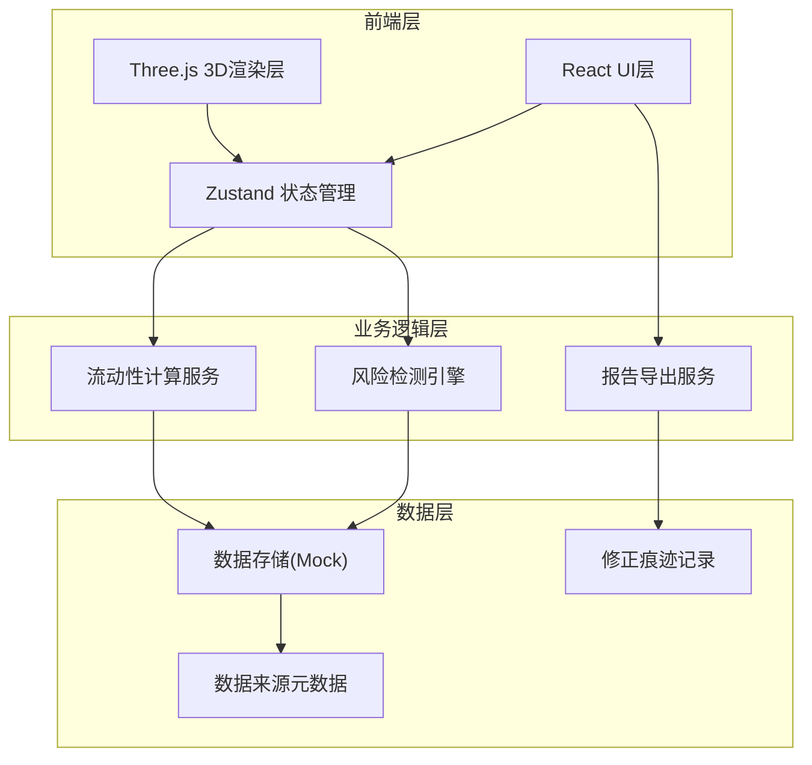
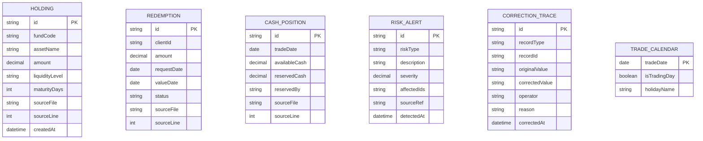

## 1. 架构设计



## 2. 技术描述

- **前端框架**: React@18 + TypeScript@5 + Vite@5
- **3D渲染**: Three@0.160 + @react-three/fiber@8 + @react-three/drei@9
- **状态管理**: Zustand@4
- **样式方案**: TailwindCSS@3 + CSS Modules
- **UI组件**: HeadlessUI + Framer Motion
- **数据处理**: Day.js + Lodash
- **图表辅助**: @react-three/postprocessing（后处理效果）
- **导出功能**: jsPDF + SheetJS (xlsx)

## 3. 目录结构

```
src/
├── components/
│   ├── Scene3D/           # 3D场景组件
│   │   ├── LiquidityPool.tsx
│   │   ├── PoolLayer.tsx
│   │   └── Block.tsx
│   ├── Timeline/          # 时间轴组件
│   ├── Sidebar/           # 侧边明细面板
│   ├── RiskAlert/         # 风险警报组件
│   └── ExportModal/       # 导出弹窗
├── store/
│   ├── useDataStore.ts    # 数据状态管理
│   └── useUIRefStore.ts   # UI引用状态
├── services/
│   ├── riskDetection.ts   # 风险检测引擎
│   ├── liquidityCalc.ts   # 流动性计算
│   └── exportReport.ts    # 报告导出
├── types/
│   └── index.ts           # TypeScript类型定义
├── data/
│   └── mockData.ts        # 模拟数据
└── utils/
    └── colorUtils.ts      # 颜色工具
```

## 4. 核心数据模型



## 5. 风险检测算法定义

### 5.1 赎回跨日检测
```typescript
// 检测逻辑：赎回申请日≠清算日且间隔超过T+1
function detectCrossDayRedemption(redemption: Redemption, calendar: TradeCalendar[]): RiskAlert | null {
  const daysDiff = calculateTradingDays(redemption.requestDate, redemption.valueDate, calendar);
  if (daysDiff > 1) {
    return {
      riskType: 'CROSS_DAY_REDEMPTION',
      severity: Math.min(daysDiff * 0.2, 1.0),
      sourceRef: `${redemption.sourceFile}#L${redemption.sourceLine}`
    };
  }
  return null;
}
```

### 5.2 流动性错层检测
```typescript
// 检测逻辑：高赎回压力资产集中在低流动性层级
function detectLiquidityMismatch(holdings: Holding[], redemptions: Redemption[]): RiskAlert | null {
  const redemptionPressure = sumRedemptionAmount(redemptions);
  const highLiquidityAssets = filterHoldingsByLevel(holdings, ['HIGH']);
  const coverageRatio = sum(highLiquidityAssets) / redemptionPressure;
  
  if (coverageRatio < 0.5) {
    return {
      riskType: 'LIQUIDITY_MISMATCH',
      severity: 1 - coverageRatio,
      sourceRef: holdings.map(h => `${h.sourceFile}#L${h.sourceLine}`).join(', ')
    };
  }
  return null;
}
```

### 5.3 现金重复占用检测
```typescript
// 检测逻辑：同一现金头寸被多笔赎回同时标记占用
function detectDuplicateCashUsage(cashPositions: CashPosition[]): RiskAlert | null {
  const usageMap = new Map<string, string[]>();
  cashPositions.forEach(pos => {
    if (pos.reservedBy) {
      const users = pos.reservedBy.split(',');
      if (users.length > 1) {
        usageMap.set(pos.id, users);
      }
    }
  });
  
  if (usageMap.size > 0) {
    return {
      riskType: 'DUPLICATE_CASH_USAGE',
      severity: 0.9,
      sourceRef: Array.from(usageMap.keys()).map(id => 
        `${cashPositions.find(p => p.id === id)?.sourceFile}#L${cashPositions.find(p => p.id === id)?.sourceLine}`
      ).join(', ')
    };
  }
  return null;
}
```

## 6. 状态管理设计

### 6.1 核心状态切片
```typescript
interface AppState {
  // 时间状态
  currentDate: Date;
  selectedDateRange: [Date, Date];
  
  // 数据状态
  holdings: Holding[];
  redemptions: Redemption[];
  cashPositions: CashPosition[];
  riskAlerts: RiskAlert[];
  correctionTraces: CorrectionTrace[];
  
  // UI状态
  selectedBlockId: string | null;
  selectedRiskType: RiskType | null;
  sidebarTab: 'holdings' | 'redemptions' | 'cash' | 'risks';
  
  // 操作方法
  setCurrentDate: (date: Date) => void;
  selectBlock: (id: string | null) => void;
  applyCorrection: (trace: CorrectionTrace) => void;
  recalculateRisks: () => void;
}
```
